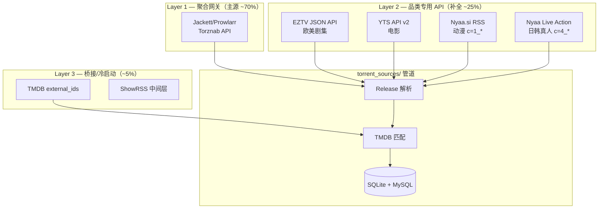

# 影视下载资源 — 数据源技术方案（详细展开）

> **版本：** v1.2  
> **创建日期：** 2026-06-29  
> **定位：** 数据获取最核心文档 — 四层数据源、接口规格、Python 实现路径、PoC 验证  
> **前置阅读：** [README.md](./README.md)、[tmdbpy/workflow/opensubtitles/README.md](../tmdbpy/workflow/opensubtitles/README.md)

**章节目录：**

| 节 | 主题 |
|----|------|
| 一 | 总架构：四层数据源 + 统一归一化 |
| 二 | 前置依赖：W004 external_ids 落库 |
| 三 | Layer 1：Jackett / Prowlarr 聚合网关 |
| 四 | Layer 2A：EZTV JSON API（欧美剧集） |
| 五 | Layer 2B：YTS API v2（电影） |
| 六 | Layer 2C：Nyaa.si RSS（动漫） |
| 七 | 日韩影视：覆盖范围与路由策略 |
| 八 | Layer 2D：Nyaa Live Action（日韩真人主源） |
| 九 | Layer 2E：Jackett 亚洲 Indexer + 多语言搜索 |
| 十 | Layer 3：本地/历史与桥接数据 |
| 十一 | 统一归一化管道 |
| 十二 | Phase 0 验证清单 |
| 十三 | 数据源选型决策表 |
| 十四 | 日韩限制与后续增强 |

---

## 一、总架构：四层数据源 + 统一归一化



**设计原则（与 opensubtitles 模块一致）：**

- 只存 **元数据**（infohash、标题、大小、做种数、magnet），**不下载、不托管视频**
- 同一 `(tmdb_id, season, episode, infohash)` 只爬一次，SQLite 缓存 + 定期刷新 seeders
- **batch** 按 `media_priority` 队列；**on-demand** 在用户访问 miss 时回源

---

## 二、前置依赖：W004 external_ids 落库（阻塞项）

当前 `tv_detail` **未写入** `imdb_id` / `tvdb_id`，但 Layer 1/2 的 ID 搜索依赖这些字段：

| 字段 | 用途 | 现状 |
|------|------|------|
| `movie_detail.imdb_id` | YTS、Jackett `imdbid=` | ✅ 已有 |
| `tv_detail.imdb_id` | EZTV `?imdb_id=` | ❌ W004 未落库 |
| `tv_detail.tvdb_id` | Jackett `tvdbid=` + season/ep | ❌ W004 未落库 |

W004 已请求 `append_to_response=external_ids`，需在 `_save_tv_detail()` 中补充：

```python
# W004 补丁示意 — 从 data["external_ids"] 提取
ext = data.get("external_ids") or {}
imdb_id = ext.get("imdb_id") or ""      # 如 "tt0903747"
tvdb_id = ext.get("tvdb_id") or 0       # 如 81189
```

**建议独立桥接表：**

```sql
CREATE TABLE IF NOT EXISTS media_external_ids (
    tmdb_id     INT UNSIGNED NOT NULL,
    media_type  ENUM('movie','tv') NOT NULL,
    imdb_id     VARCHAR(20) DEFAULT '',
    tvdb_id     INT DEFAULT 0,
    PRIMARY KEY (tmdb_id, media_type),
    INDEX idx_imdb (imdb_id),
    INDEX idx_tvdb (tvdb_id)
);
```

**验证：** Breaking Bad（tmdb_id=1396）→ `imdb_id=tt0903747`、`tvdb_id=81189` 入库后再调 EZTV/Jackett。

---

## 三、Layer 1：Jackett / Prowlarr 聚合网关（主源，必须）

### 3.1 为什么选它

| 能力 | 说明 |
|------|------|
| 统一接口 | Torznab 标准，100+ indexer 一套代码 |
| ID 搜索 | `imdbid`、`tmdbid`、`tvdbid` + `season`/`ep` |
| 生产验证 | Sonarr/Radarr/Bazarr 全球使用 |
| 模式对齐 | 同 `opensubtitles/client.py`：HTTP + 限速 + SQLite |

Prowlarr 与 Jackett API 兼容；下文以 Jackett 为例。

### 3.2 部署（Windows，约 10 分钟）

```powershell
docker run -d --name jackett -p 9117:9117 `
  -v C:\jackett\config:/config `
  linuxserver/jackett:latest

# 浏览器 http://127.0.0.1:9117
# 1. 添加 indexer（1337x、TPB、TorrentGalaxy 等）
# 2. 复制 API Key
# 3. Cloudflare 保护源 → 配置 FlareSolverr（§3.7）
```

### 3.3 Torznab API 规格

**基础 URL：**

```
http://127.0.0.1:9117/api/v2.0/indexers/{indexer}/results/torznab/api
```

`{indexer}` 可为 `1337x`、`yts`、`eztv` 或聚合 `all`（慢，批补慎用）。

**搜索模式：**

| 模式 | 参数 | 用途 |
|------|------|------|
| `t=movie` | `imdbid=0133093` 或 `tmdbid=603` | 电影 |
| `t=tvsearch` | `tvdbid=81189&season=4&ep=6` | 剧集单集 |
| `t=search` | `q=Breaking+Bad+S04E06` | 文本兜底 |
| `t=indexers` | — | 列出 indexer 能力 |

**完整请求示例：**

```http
GET http://127.0.0.1:9117/api/v2.0/indexers/all/results/torznab/api
  ?apikey=YOUR_KEY
  &t=tvsearch
  &tvdbid=81189
  &season=4
  &ep=6
  &cat=5000,5040
  &cache=false
```

**Category：** `2000`=Movies，`5000`=TV，`5040`=TV/HD

**响应：** XML RSS（生产用 XML；`o=json` 为实验特性，不建议依赖）

**单条结果关键字段：**

```xml
<item>
  <title>Breaking.Bad.S04E06.Cornered.1080p.WEB-DL.x264-GROUP</title>
  <link>magnet:?xt=urn:btih:ABCD...&dn=...</link>
  <size>1234567890</size>
  <torznab:attr name="seeders" value="42"/>
  <torznab:attr name="peers" value="10"/>
  <torznab:attr name="infohash" value="abcd1234..."/>
</item>
```

### 3.4 Indexer 选型（按品类分流）

| 品类 | 优先 indexer | 备注 |
|------|-------------|------|
| 电影 1080p/4K | yts, 1337x, torrentgalaxy | YTS 可直连 API（Layer 2B） |
| 剧集 WEB-DL | eztv, 1337x | EZTV 建议直连 API |
| 动漫 | nyaasi | Nyaa 建议直连 RSS |
| 中文资源 | 私有/半私有 tracker | 公开源覆盖弱 |

```python
# 批补路由 — 避免 indexers/all 超时
INDEXER_ROUTES = {
    "movie":    ["yts", "1337x", "torrentgalaxy"],
    "tv":       ["eztv", "1337x", "torrentgalaxy"],
    "anime":    ["nyaasi"],
    # 日韩（EZTV/YTS 对日韩几乎无效，见 §七）
    "jp_tv":    ["nyaasi", "1337x", "torrentgalaxy", "asiancinema"],
    "jp_movie": ["nyaasi", "1337x", "torrentgalaxy", "asiancinema"],
    "kr_tv":    ["nyaasi", "1337x", "torrentgalaxy", "asiancinema"],
    "kr_movie": ["nyaasi", "1337x", "torrentgalaxy", "asiancinema"],
}
```

### 3.5 Python 客户端（对齐 opensubtitles 模式）

```python
#!/usr/bin/env python3
# -*- coding: utf-8 -*-
"""
Jackett Torznab 客户端 — 资源清单爬取。

@module workflow.torrent_sources.jackett_client
@description 封装 Torznab 搜索，解析 XML 为 ResourceItem 列表。
"""

import time
import xml.etree.ElementTree as ET
from dataclasses import dataclass
from typing import List, Optional
from urllib.parse import urlencode

import requests

_NS = {"torznab": "http://torznab.com/schemas/2015/feed"}


@dataclass
class ResourceItem:
    """单条 torrent 资源元数据（不含文件本体）。"""
    infohash: str           # 40 位 hex，小写
    title_raw: str          # indexer 原始标题
    magnet_uri: str         # 完整 magnet 链接
    size_bytes: int
    seeders: int
    peers: int
    indexer: str            # 来源 indexer 名
    published_at: Optional[str] = None


class JackettClient:
    """
    Jackett Torznab API 客户端。

    @param base_url: Jackett 地址，如 http://127.0.0.1:9117
    @param api_key: Jackett API Key
    @param min_interval_sec: 请求最小间隔（防 indexer 封 IP）
    """

    def __init__(
        self,
        base_url: str,
        api_key: str,
        min_interval_sec: float = 2.0,
        timeout: int = 30,
    ):
        self.base_url = base_url.rstrip("/")
        self.api_key = api_key
        self.min_interval_sec = min_interval_sec
        self.timeout = timeout
        self._last_call = 0.0

    def _throttle(self) -> None:
        """请求限速。"""
        elapsed = time.time() - self._last_call
        if elapsed < self.min_interval_sec:
            time.sleep(self.min_interval_sec - elapsed)
        self._last_call = time.time()

    def _search(self, indexer: str, params: dict) -> List[ResourceItem]:
        """
        执行 Torznab 搜索并解析 XML。

        @param indexer: indexer 名或 all
        @param params: t=movie|tvsearch|search 等参数
        @returns: ResourceItem 列表
        """
        self._throttle()
        params["apikey"] = self.api_key
        url = (
            f"{self.base_url}/api/v2.0/indexers/{indexer}"
            f"/results/torznab/api?{urlencode(params)}"
        )
        resp = requests.get(url, timeout=self.timeout)
        resp.raise_for_status()
        return self._parse_torznab_xml(resp.text, indexer)

    @staticmethod
    def _parse_torznab_xml(xml_text: str, indexer: str) -> List[ResourceItem]:
        """解析 Torznab RSS XML 为 ResourceItem 列表。"""
        root = ET.fromstring(xml_text)
        items: List[ResourceItem] = []
        for item in root.findall(".//item"):
            title = item.findtext("title") or ""
            link = item.findtext("link") or ""
            size = int(item.findtext("size") or 0)
            attrs = {
                a.get("name"): a.get("value")
                for a in item.findall("torznab:attr", _NS)
            }
            infohash = (attrs.get("infohash") or "").lower()
            if not infohash and "btih:" in link:
                infohash = link.split("btih:")[1].split("&")[0].lower()
            items.append(ResourceItem(
                infohash=infohash,
                title_raw=title,
                magnet_uri=link,
                size_bytes=size,
                seeders=int(attrs.get("seeders") or 0),
                peers=int(attrs.get("peers") or 0),
                indexer=indexer,
            ))
        return items

    def search_tv(
        self,
        indexer: str,
        tvdb_id: int,
        season: int,
        episode: int,
    ) -> List[ResourceItem]:
        """剧集单集搜索（优先于文本搜索）。"""
        return self._search(indexer, {
            "t": "tvsearch",
            "tvdbid": tvdb_id,
            "season": season,
            "ep": episode,
            "cat": "5000,5040",
            "cache": "false",
        })

    def search_movie(
        self,
        indexer: str,
        imdb_id: str,
        tmdb_id: Optional[int] = None,
    ) -> List[ResourceItem]:
        """电影搜索。"""
        imdb_num = imdb_id.replace("tt", "")
        params: dict = {
            "t": "movie", "imdbid": imdb_num,
            "cat": "2000", "cache": "false",
        }
        if tmdb_id:
            params["tmdbid"] = tmdb_id
        return self._search(indexer, params)

    def search_text(self, indexer: str, query: str) -> List[ResourceItem]:
        """文本搜索兜底。"""
        return self._search(indexer, {
            "t": "search", "q": query, "cache": "false",
        })
```

### 3.6 限速与缓存

| 参数 | 建议值 | 原因 |
|------|--------|------|
| 单 indexer 间隔 | 2–5 秒 | 防 IP 封禁 |
| batch 时 `cache=false` | 是 | 拿最新 seeders |
| Jackett 内置缓存 | 2100 秒 | 重复查询可命中 |
| SQLite TTL | seeders 6h；新片 1h | 平衡新鲜度与负载 |

### 3.7 FlareSolverr（Cloudflare indexer 必备）

1337x、TorrentGalaxy 等需 FlareSolverr：

```powershell
docker run -d --name flaresolverr -p 8191:8191 ghcr.io/flaresolverr/flaresolverr
# Jackett → Settings → FlareSolverr URL: http://127.0.0.1:8191
```

无 FlareSolverr 时这些 indexer 返回空结果 — 非代码 bug。

---

## 四、Layer 2A：EZTV JSON API（剧集专用）

### 4.1 接口规格

| 项 | 值 |
|----|-----|
| 端点 | `https://eztvx.to/api/get-torrents` |
| 认证 | **无需** API Key |
| 限速 | 建议 1 req/s |
| 域名 | `eztvx.to` / `eztv.re` 轮换 |

**按 IMDb 查全剧：**

```http
GET https://eztvx.to/api/get-torrents?imdb_id=904747&limit=100&page=1
```

> `imdb_id` **不带 `tt`**。Breaking Bad 系列 IMDb 为 `tt0903747` → 参数 `904747` 或 `0903747`（以 API 返回为准）。

**响应 JSON 结构：**

```json
{
  "imdb_id": "904747",
  "torrents_count": 156,
  "limit": 100,
  "page": 1,
  "torrents": [
    {
      "id": 123456,
      "hash": "abc123...",
      "filename": "Breaking Bad S04E06...",
      "title": "Breaking Bad S04E06...",
      "magnet_url": "magnet:?xt=urn:btih:...",
      "imdb_id": "904747",
      "season": "4",
      "episode": "6",
      "seeds": 42,
      "peers": 10,
      "size_bytes": "1234567890",
      "date_released_unix": 1310000000
    }
  ]
}
```

### 4.2 对接代码

```python
def fetch_eztv_by_imdb(imdb_id: str, season: int, episode: int) -> list:
    """
    从 EZTV API 拉取指定集 torrent 清单。

    @param imdb_id: 如 tt0903747（函数内去 tt）
    @param season: 季号
    @param episode: 集号
    @returns: 过滤后的 torrent dict 列表
    """
    imdb_num = imdb_id.replace("tt", "").lstrip("0") or "0"
    url = f"https://eztvx.to/api/get-torrents?imdb_id={imdb_num}&limit=100&page=1"
    resp = requests.get(url, timeout=30, headers={"User-Agent": "Mozilla/5.0"})
    resp.raise_for_status()
    data = resp.json()
    return [
        t for t in data.get("torrents", [])
        if int(t.get("season", 0)) == season
        and int(t.get("episode", 0)) == episode
    ]
```

### 4.3 对比 Jackett EZTV indexer

| 对比 | 直连 API | Jackett eztv |
|------|---------|--------------|
| 稳定性 | 高（JSON 原生） | 中（HTML 刮削） |
| IMDb 精确匹配 | ✅ | 依赖刮削 |
| RSS | ❌ 已废弃 | — |

**结论：剧集批补优先 EZTV 直连，Jackett 作多源补充。**

### 4.4 限制

- 仅剧集；分页 `page`/`limit` 最大 100
- 域名不稳定 → fallback 列表 + 代理（可复用 `opensubtitles/proxy_pool.py`）

---

## 五、Layer 2B：YTS API v2（电影专用）

### 5.1 接口规格

| 端点 | 用途 |
|------|------|
| `GET /api/v2/list_movies.json` | 列表/搜索 |
| `GET /api/v2/movie_details.json?imdb_id=tt0133093` | 单部 + torrents |

**镜像：** `yts.mx`、`yts.lt`、`yts.gg`（需 health check）

**movie_details torrent 片段：**

```json
{
  "data": {
    "movie": {
      "title": "The Matrix",
      "imdb_code": "tt0133093",
      "torrents": [
        {
          "hash": "abc123...",
          "quality": "1080p",
          "type": "bluray",
          "size_bytes": 2147483648,
          "seeds": 100,
          "peers": 20
        }
      ]
    }
  }
}
```

### 5.2 Magnet 构造（YTS 官方规范）

YTS **不返回现成 magnet**，需从 hash 构造：

```python
def yts_hash_to_magnet(info_hash: str, title: str, size: int) -> str:
    """
    将 YTS torrent hash 构造为 magnet URI。

    @param info_hash: 40 位 hex
    @param title: 显示名
    @param size: 字节数（xl 参数）
    @returns: magnet URI
    """
    from urllib.parse import quote, urlencode
    trackers = [
        "udp://tracker.opentrackr.org:1337/announce",
        "udp://open.demonii.com:1337/announce",
        "udp://tracker.openbittorrent.com:80/announce",
    ]
    params = {"xt": f"urn:btih:{info_hash}", "dn": title, "xl": str(size), "tr": trackers}
    return "magnet:?" + urlencode(params, doseq=True, safe=":")
```

### 5.3 批补

```http
GET https://yts.mx/api/v2/movie_details.json?imdb_id={movie_detail.imdb_id}
```

**优势：** YTS 片源与 YIFY 字幕天然对版。

### 5.4 限制

- 仅 YIFY/YTS 压制组电影；域名频繁变更

---

## 六、Layer 2C：Nyaa.si RSS（动漫专用）

### 6.1 接口规格

无官方 JSON API；稳定接口为 **RSS**：

```http
GET https://nyaa.si/?page=rss&q=One+Piece+1040&c=1_0&s=seeders&o=desc
```

**RSS 扩展字段：**

| 字段 | 含义 |
|------|------|
| `nyaa:infoHash` | infohash |
| `nyaa:seeders` | 做种数 |
| `nyaa:size` | 大小 |
| `<link>` | magnet |

**分类：** `1_0`=Anime All，`1_2`=English-translated，`1_4`=Raw

### 6.2 Python 解析

```python
import feedparser

def search_nyaa_rss(query: str, category: str = "1_0") -> list:
    """
    搜索 Nyaa.si RSS。

    @param query: 搜索词
    @param category: Nyaa 分类代码
    @returns: 含 infohash/magnet/seeders 的 dict 列表
    """
    url = (
        f"https://nyaa.si/?page=rss"
        f"&q={requests.utils.quote(query)}"
        f"&c={category}&s=seeders&o=desc"
    )
    feed = feedparser.parse(url)
    return [{
        "title": e.title,
        "magnet_uri": e.link,
        "infohash": e.get("nyaa_infohash", ""),
        "seeders": int(e.get("nyaa_seeders", 0)),
        "size": e.get("nyaa_size", ""),
    } for e in feed.entries]
```

### 6.3 absolute_episode 对接

动漫标题常用绝对集号（如 `One Piece - 1040`）：

1. `tv_episodes` 扩展 `absolute_episode_number`
2. 搜索词：`{title} {absolute_ep}` 或 `S{season}E{episode}`
3. 失败 → Jackett `t=search` 兜底

### 6.4 限制

- RSS 无分页；建议 3s 间隔；需区分 SubsPlease / Erai-raws 等组

---

## 七、日韩影视：覆盖范围与路由策略

### 7.1 品类定义

| 品类 | TMDB 判定 | 典型例子 |
|------|----------|---------|
| **日剧** | `original_language=ja` + `media_type=tv` | *Shogun*、*Alice in Borderland* |
| **日本电影** | `original_language=ja` + `media_type=movie` | *Drive My Car*、*Godzilla Minus One* |
| **韩剧** | `original_language=ko` + `media_type=tv` | *Squid Game*、*Crash Landing on You* |
| **韩国电影** | `original_language=ko` + `media_type=movie` | *Parasite*、*Oldboy* |
| **日本动漫** | §六 Layer 2C | 与真人日剧分路由 |

### 7.2 覆盖预期（单集/单部多条 magnet）

| 类型 | 主源 | 典型条数 | 说明 |
|------|------|---------|------|
| 全球热门韩剧 | Nyaa LA + 1337x | 5–20 | Netflix 国际版 WEB-DL 较多 |
| 一般韩剧 | Nyaa LA + 文本搜索 | 0–8 | 本土冷门偏少 |
| 热门日剧 | Nyaa LA | 3–15 | 字幕组/WEB rip |
| 一般日剧 | Nyaa LA + 日文标题搜索 | 0–5 | 依赖上传者命名 |
| 日本电影 | Nyaa LA + 1337x | 2–12 | 国际发行片更好 |
| 韩国电影 | 1337x + Nyaa LA | 3–15 | 国际获奖片覆盖较好 |

> **LA** = Nyaa **Live Action（真人）** 分类 `c=4_*`，非 Anime `c=1_*`。

### 7.3 地区判定（W004 元数据）

```python
def detect_content_region(
    original_language: str,
    origin_country: list[str] | None = None,
) -> str | None:
    """
    判定作品所属亚洲内容区域，用于选择 indexer 路由。

    @param original_language: TMDB original_language（ja / ko / en …）
    @param origin_country: TMDB origin_country ISO 列表（可选）
    @returns: "jp" | "kr" | None（None 走默认欧美路由）
    """
    lang = (original_language or "").lower()
    if lang == "ja":
        return "jp"
    if lang == "ko":
        return "kr"
    countries = {c.upper() for c in (origin_country or [])}
    if "JP" in countries and lang in ("ja", "en"):
        return "jp"
    if "KR" in countries and lang in ("ko", "en"):
        return "kr"
    return None
```

**数据来源：** `tv_detail` / `movie_detail` 的 `original_language`（W004 已有）；剧集 `origin_country` 需小扩展写入。

### 7.4 与动漫 / 欧美的分流

| 条件 | 路由 |
|------|------|
| `original_language=ja` + genre 含 **Animation** | `anime` → Nyaa `c=1_*`（§六） |
| `original_language=ja` + 无 Animation | `jp_tv` / `jp_movie` → Nyaa `c=4_*` |
| `original_language=ko` | `kr_tv` / `kr_movie` |
| 其他 | `tv` / `movie` → EZTV / YTS（§四、§五） |

```
original_language?
  ├── ja + Animation  → anime（Nyaa c=1_*）
  ├── ja              → jp_tv / jp_movie
  ├── ko              → kr_tv / kr_movie
  └── en/其他          → eztv / yts
```

---

## 八、Layer 2D：Nyaa Live Action（日韩共用主源）

Nyaa.si 专注 **东亚媒体**（日/中/韩），**Live Action** 是日韩真人影视的核心来源。

### 8.1 分类代码

| c 参数 | 含义 | 用途 |
|--------|------|------|
| `4_0` | Live Action - All | 默认搜索 |
| `4_1` | Live Action - English-translated | 英字韩剧/日剧 |
| `4_2` | Live Action - Idol/PV | 通常跳过 |

### 8.2 RSS 搜索 URL

```http
# 韩剧
GET https://nyaa.si/?page=rss&q=Crash+Landing+on+You&c=4_0&s=seeders&o=desc

# 日剧
GET https://nyaa.si/?page=rss&q=Alice+in+Borderland&c=4_0&s=seeders&o=desc

# 韩文标题（Squid Game）
GET https://nyaa.si/?page=rss&q=%EC%98%A4%EC%A7%95%EC%96%B4+%EA%B2%8C%EC%9E%84&c=4_0

# 日本电影
GET https://nyaa.si/?page=rss&q=Godzilla+Minus+One&c=4_0&s=seeders&o=desc
```

### 8.3 Python 客户端（nyaa_live_action_client.py）

```python
#!/usr/bin/env python3
# -*- coding: utf-8 -*-
"""
Nyaa.si Live Action RSS 客户端 — 日韩真人影视。

@module workflow.torrent_sources.nyaa_live_action_client
@description 解析 Nyaa 真人区 RSS，返回 ResourceItem 列表。
"""

from __future__ import annotations

import time
from typing import List
from urllib.parse import quote

import feedparser

from workflow.torrent_sources.models import ResourceItem


class NyaaLiveActionClient:
    """
    Nyaa.si Live Action 区 RSS 客户端。

    @param base_url: 默认 https://nyaa.si
    @param min_interval_sec: 请求间隔（建议 ≥3s）
    """

    def __init__(
        self,
        base_url: str = "https://nyaa.si",
        min_interval_sec: float = 3.0,
    ):
        self.base_url = base_url.rstrip("/")
        self.min_interval_sec = min_interval_sec
        self._last_call = 0.0

    def _throttle(self) -> None:
        """RSS 请求限速。"""
        elapsed = time.time() - self._last_call
        if elapsed < self.min_interval_sec:
            time.sleep(self.min_interval_sec - elapsed)
        self._last_call = time.time()

    def search(
        self,
        query: str,
        category: str = "4_0",
        filter_trusted: bool = False,
    ) -> List[ResourceItem]:
        """
        Live Action 区 RSS 搜索。

        @param query: 搜索词（英文或本地语言标题）
        @param category: Nyaa 分类，默认 4_0
        @param filter_trusted: True 时 f=2（trusted only）
        @returns: ResourceItem 列表
        """
        self._throttle()
        f_param = "2" if filter_trusted else "0"
        url = (
            f"{self.base_url}/?page=rss"
            f"&q={quote(query)}"
            f"&c={category}&f={f_param}&s=seeders&o=desc"
        )
        feed = feedparser.parse(url)
        items: List[ResourceItem] = []
        for entry in feed.entries:
            infohash = (entry.get("nyaa_infohash") or "").lower()
            magnet = entry.link or ""
            if not infohash and "btih:" in magnet:
                infohash = magnet.split("btih:")[1].split("&")[0].lower()
            items.append(ResourceItem(
                infohash=infohash,
                title_raw=entry.title or "",
                magnet_uri=magnet,
                size_bytes=0,
                seeders=int(entry.get("nyaa_seeders") or 0),
                peers=int(entry.get("nyaa_leechers") or 0),
                indexer="nyaa_live_action",
            ))
        return items

    def search_tv_episode(
        self,
        titles: List[str],
        season: int,
        episode: int,
    ) -> List[ResourceItem]:
        """
        按多个标题变体搜索单集（合并去重）。

        @param titles: 英文/日文/韩文标题列表
        @param season: 季号
        @param episode: 集号
        @returns: 合并后的 ResourceItem 列表
        """
        merged: dict[str, ResourceItem] = {}
        for title in titles:
            for q in (
                f"{title} S{season:02d}E{episode:02d}",
                f"{title} {season}x{episode:02d}",
                f"{title} E{episode:02d}",
            ):
                for item in self.search(q):
                    h = item.infohash.lower()
                    if h and (h not in merged or item.seeders > merged[h].seeders):
                        merged[h] = item
        return list(merged.values())
```

### 8.4 日韩剧常见命名（Release 解析注意）

Nyaa 上传者常 **不写 SxxExx**：

| 原始标题 | 实际作品 |
|---------|---------|
| `Hotel.del.Luna.2019.1080p.NF.WEBRip...` | 韩剧，整季打包 |
| `Crash.Landing.on.You.2019.720p.WEB-DL...` | 韩剧 S01 |
| `Alice in Borderland S02 1080p ...` | 日剧 |

**处理策略：**

1. `parse-torrent-name` 解析；缺失时用 TMDB 季集 + 年份推断
2. Jackett `nyaasi` 开启 **Sonarr compatibility** 对 Live Action 自动插入 `S01`（Jackett PR #16741）
3. 整季包（Season pack）单独标记，不强行映射单集

---

## 九、Layer 2E：Jackett 亚洲 Indexer + 多语言搜索

### 9.1 Jackett 亚洲向 Indexer

| Indexer | Jackett ID | 日韩 relevancy | 说明 |
|---------|-----------|---------------|------|
| **Nyaa.si** | `nyaasi` | ⭐⭐⭐⭐⭐ | 与 Layer 2D 互补 |
| **1337x** | `1337x` | ⭐⭐⭐ | 全球热门韩剧/日剧 WEB-DL |
| **TorrentGalaxy** | `torrentgalaxy` | ⭐⭐⭐ | 同上 |
| **AsianCinema** | `asiancinema` | ⭐⭐⭐ | 亚洲电影 |
| **Tokyo Toshokan** | `tokyotosho` | ⭐⭐ | 偏动漫 |

```http
GET http://127.0.0.1:9117/api/v2.0/indexers/nyaasi/results/torznab/api
  ?apikey=KEY&t=search&q=Squid+Game+S01E01&cat=4000&cache=false
```

配置：Nyaa.si 启用 **Sonarr compatibility**；1337x 需 **FlareSolverr**（§3.7）。

### 9.2 多语言标题搜索（TMDB translations）

日韩作品仅用英文标题会 **漏结果**，需 W004 `translations` 本地标题：

```python
def build_search_titles(
    title_en: str,
    translations: dict,
    region: str,
) -> list[str]:
    """
    生成多语言搜索词列表。

    @param title_en: TMDB 主标题
    @param translations: W004 translations 响应
    @param region: "jp" | "kr"
    @returns: 去重后的标题变体列表
    """
    titles = [title_en]
    lang_key = "ja" if region == "jp" else "ko"
    for tr in translations.get("translations", []):
        if tr.get("iso_639_1") == lang_key:
            data = tr.get("data") or {}
            if data.get("name"):
                titles.append(data["name"])
            if data.get("title"):
                titles.append(data["title"])
    seen: set[str] = set()
    out: list[str] = []
    for t in titles:
        key = t.strip().lower()
        if key and key not in seen:
            seen.add(key)
            out.append(t.strip())
    return out
```

| 作品 | 搜索词序列 |
|------|-----------|
| *Squid Game* | `Squid Game` → `오징어 게임` |
| *Crash Landing on You* | `Crash Landing on You` → `사랑의 불시착` |
| *Alice in Borderland* | `Alice in Borderland` → `今際の国のアリス` |

可选落库：

```sql
ALTER TABLE tv_detail ADD COLUMN title_ja VARCHAR(500) DEFAULT '' COMMENT '日文标题';
ALTER TABLE tv_detail ADD COLUMN title_ko VARCHAR(500) DEFAULT '' COMMENT '韩文标题';
```

### 9.3 批补编排（asia_fetch）

```python
def batch_fetch_asia(work, registry) -> list:
    """
    日韩影视批补：Nyaa LA 多标题 + Jackett 亚洲路由。

    @param work: region, search_titles[], imdb_id, tvdb_id, episodes
    @param registry: 客户端注册表
    @returns: ResourceItem 列表
    """
    region = work.region
    route_key = f"{region}_{work.media_type}"
    items: list = []

    if work.media_type == "tv":
        for ep in work.episodes:
            items += registry.nyaa_la.search_tv_episode(
                work.search_titles, ep.season, ep.episode
            )
            if work.tvdb_id:
                for idx in registry.jackett.routes.get(route_key, []):
                    items += registry.jackett.search_tv(
                        idx, work.tvdb_id, ep.season, ep.episode
                    )
            for title in work.search_titles:
                q = f"{title} S{ep.season:02d}E{ep.episode:02d}"
                for idx in registry.jackett.routes.get(route_key, []):
                    items += registry.jackett.search_text(idx, q)
    else:
        for title in work.search_titles:
            items += registry.nyaa_la.search(f"{title} {work.year or ''}".strip())
            for idx in registry.jackett.routes.get(route_key, []):
                items += registry.jackett.search_text(idx, title)
        if work.imdb_id:
            for idx in registry.jackett.routes.get(route_key, []):
                items += registry.jackett.search_movie(
                    idx, work.imdb_id, work.tmdb_id
                )
    return merge_resources(items)
```

### 9.4 数据模型扩展（日韩字段）

```sql
ALTER TABLE download_inventory
    ADD COLUMN origin_region   VARCHAR(8) DEFAULT '' COMMENT 'jp/kr/en/…',
    ADD COLUMN search_locale   VARCHAR(8) DEFAULT '' COMMENT '命中搜索语言',
    ADD COLUMN content_kind    VARCHAR(16) DEFAULT 'live_action'
        COMMENT 'live_action/anime/movie';
```

日韩页与欧美 **同一模板**：一集/一部下多条 magnet；示例 `/download/crash-landing-on-you/s1e1/` 展示 Recommended + All sources 列表。

---

## 十、Layer 3：本地/历史与桥接

### 10.1 人人影视 renren — 不含视频资源

本项目 renren 为 **字幕清单**（`renren.subtitle.txt` → SRT 路径），**无 magnet 字段**。  
可作 Release 名称参考，**不能**作视频下载源。

### 10.2 ShowRSS（剧集增量中间层）

```
1. showrss.info 添加作品（IMDb）
2. 获得专属 RSS URL
3. 定时 parse → magnet + SxxExx
4. 写入 download_inventory
```

优点：IMDb 已映射；缺点：无 seeders、依赖第三方。

### 10.3 Bitmagnet（可选，Phase 2+）

自托管 DHT 爬虫（Docker + PostgreSQL），GraphQL 接口。  
资源消耗大（>4GB RAM），初始同步慢 — Phase 0 不推荐。

---

## 十一、统一归一化管道

### 11.1 Release 解析

```python
from parse_torrent_name import parse  # pip install parse-torrent-title

def parse_release(title_raw: str) -> dict:
    """
    从 torrent 标题解析 release 信息。

    @param title_raw: 如 "Breaking.Bad.S04E06.1080p.WEB-DL.x264-GROUP"
    @returns: season/episode/resolution/source/codec/group
    """
    info = parse(title_raw)
    return {
        "season": info.season,
        "episode": info.episode,
        "resolution": info.resolution,
        "source": info.source,
        "codec": info.codec,
        "group": info.group,
        "title": info.title,
    }
```

### 11.2 去重

```python
def merge_resources(items: list) -> list:
    """按 infohash 去重，保留 seeders 最高记录。"""
    by_hash: dict = {}
    for item in items:
        h = item.infohash.lower()
        if h not in by_hash or item.seeders > by_hash[h].seeders:
            by_hash[h] = item
    return list(by_hash.values())
```

### 11.3 SQLite 缓存

```sql
CREATE TABLE resource_cache (
    cache_key       TEXT PRIMARY KEY,
    tmdb_id         INTEGER NOT NULL,
    media_type      TEXT NOT NULL,
    season          INTEGER DEFAULT 0,
    episode         INTEGER DEFAULT 0,
    infohash        TEXT NOT NULL,
    title_raw       TEXT,
    release_group   TEXT,
    source          TEXT,
    resolution      TEXT,
    size_bytes      INTEGER,
    seeders         INTEGER,
    magnet_uri      TEXT,
    indexer         TEXT,
    fetched_at      TEXT NOT NULL,
    expires_at      TEXT NOT NULL
);
CREATE UNIQUE INDEX idx_cache_hash ON resource_cache(infohash);
```

### 11.4 Primary 推荐（与字幕联动）

```
score = 0.4 × release_match(字幕.primary_release)
      + 0.3 × seeders_norm
      + 0.2 × quality_match(1080p 偏好)
      + 0.1 × recency
```

---

## 十二、Phase 0 验证清单

```powershell
# 1. Jackett
docker run -d -p 9117:9117 -v C:\jackett\config:/config linuxserver/jackett

# 2. Torznab 剧集
curl "http://127.0.0.1:9117/api/v2.0/indexers/1337x/results/torznab/api?apikey=KEY&t=tvsearch&tvdbid=81189&season=4&ep=6&cache=false"

# 3. EZTV
curl "https://eztvx.to/api/get-torrents?imdb_id=904747&limit=10&page=1"

# 4. YTS
curl "https://yts.mx/api/v2/movie_details.json?imdb_id=tt0133093"

# 5. Nyaa
curl "https://nyaa.si/?page=rss&q=Breaking+Bad&c=1_0"

# 6. Release 解析
pip install parse-torrent-title
python -c "from parse_torrent_name import parse; print(parse('Breaking.Bad.S04E06.1080p.WEB-DL.x264-NTb'))"

# 7. 日韩 — Nyaa Live Action
curl "https://nyaa.si/?page=rss&q=Crash+Landing+on+You&c=4_0"
curl "https://nyaa.si/?page=rss&q=Alice+in+Borderland&c=4_0"
curl "https://nyaa.si/?page=rss&q=%EC%98%A4%EC%A7%95%EC%96%B4+%EA%B2%8C%EC%9E%84&c=4_0"

# 8. Jackett 日韩文本搜索
curl "http://127.0.0.1:9117/api/v2.0/indexers/nyaasi/results/torznab/api?apikey=KEY&t=search&q=Squid+Game+S01E01&cache=false"
```

**通过标准：**

| 类别 | 通过条件 |
|------|---------|
| 欧美 | 每源 ≥1 条 infohash/magnet；Release 解析正确 |
| 日韩 | Squid Game / Crash Landing on You / Alice in Borderland 至少一源 ≥1 条 |
| 入库 | SQLite 写入成功 |

---

## 十三、数据源选型决策表

| 数据源 | 覆盖 | 接口 | 认证 | 稳定性 | 优先级 |
|--------|------|------|------|--------|--------|
| **Jackett/Prowlarr** | 全品类 | Torznab XML | API Key | ⭐⭐⭐⭐ | **P0** |
| **EZTV API** | 剧集 | JSON REST | 无 | ⭐⭐⭐⭐ | **P0** |
| **YTS API** | 电影 | JSON REST | 无 | ⭐⭐⭐ | **P0** |
| **Nyaa RSS** | 动漫 | RSS | 无 | ⭐⭐⭐⭐ | **P1** |
| **Nyaa Live Action** | 日韩真人影视 | RSS `c=4_*` | 无 | ⭐⭐⭐⭐ | **P1** |
| **AsianCinema 等** | 亚洲电影 | Jackett | API Key | ⭐⭐⭐ | **P1**（日韩路由） |
| **ShowRSS** | 剧集增量 | RSS | 免费注册 | ⭐⭐⭐ | P2 |
| **Bitmagnet** | 全品类 | 自托管 | 无 | ⭐⭐ | P3 |
| **renren 库** | 字幕 | 本地 | — | — | ❌ |

---

## 十四、日韩限制与后续增强

| 限制 | 说明 | 后续 |
|------|------|------|
| 无韩剧专用 API | 不像 EZTV 有 imdb 端点 | Nyaa LA + 多标题搜索 |
| 单集命名不规范 | 整季包、无 SxxExx | Season pack 标记 + Sonarr 兼容 |
| 本土冷门剧 | 公开源少 | on-demand 回源；降低预期 |
| 私有 tracker | AvistaZ 等需邀请 | Phase 3+ 可选 |
| 字幕 vs 片源 | renren 仅字幕 | 页面交叉链，独立清单 |

**SEO 扩展（可选）：** 日文 `{作品名} ダウンロード`；韩文 `{작품명} 다운로드`；TMDB translations 驱动 hreflang。

---

## 变更记录

| 版本 | 日期 | 说明 |
|------|------|------|
| v1.0 | 2026-06-29 | 初版：四层数据源 + 接口规格 + PoC |
| v1.1 | 2026-06-29 | 增加日韩摘要 + 决策表 |
| v1.2 | 2026-06-29 | 日韩完整并入本文档（§七–§九、§十四）；删除独立 04 文档 |
