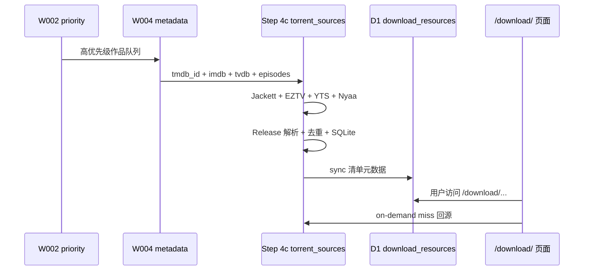

# 影视下载资源 — 工作流集成与模块规划

> **版本：** v1.2  
> **创建日期：** 2026-06-29  
> **前置阅读：** [02-数据源技术方案-详细展开.md](./02-数据源技术方案-详细展开.md)、[04-方案全景分析与优先级重评.md](./04-方案全景分析与优先级重评.md)  
> **代码位置：** [releasematch/workflow/](../releasematch/workflow/)（**已从字幕站解耦，下文历史路径仅供参考**）

---

## ⚠️ 隔离说明（v1.2 生效）

原规划将下载分支嵌入字幕工作流与 `subtitle-portal`。根据独立顶级域名策略，**以下路径已废弃**：

| 原路径 | 新路径 |
|--------|--------|
| `tmdbpy/workflow/torrent_sources/` | `releasematch/workflow/torrent_sources/` |
| `tmdbpy/workflow/run.py` Step 4c | `releasematch/workflow/run.py` |
| `subtitle-portal` `/download/*` 路由 | `releasematch/portal/` |
| D1 扩展 subtitle-portal | `releasematch/schema/d1_download_resources.sql` |
| `is_primary` 与字幕 Primary 对齐 | `is_recommended` + `recommended/scorer.py` |

开发优先级以 [04-方案全景分析与优先级重评.md](./04-方案全景分析与优先级重评.md) 的 **T0~T5（工具轨）+ C0~C4（内容轨）** 为准。

---
## 一、工作流中的位置

在现有 10 步工作流中插入 **Step 4c**（与 Step 4b opensubtitles 平行）：

```
Step 0  TMDB Export popularity          ✅ 复用
Step 1  字幕清单扫描                     ✅ 复用（Release 参考）
Step 2  优先级评分                       ✅ 复用
Step 3  名称匹配                         ✅ 复用
Step 4  元数据爬取                       ✅ 复用（需补 external_ids）
Step 4b 字幕增量（opensubtitles）        ✅ 已有
Step 4c 资源清单（torrent_sources）      🆕 本文档
Step 5  槽位匹配                         扩展 download_slots
Step 8  上线发布                         D1 download_resources
```



---

## 二、CLI 接入（对齐 run.py）

```bash
# 经 ReleaseMatch 总控（releasematch/workflow/run.py）
cd releasematch && python -m workflow.run run 4c --test --tmdb 1396 --season 4 --episode 6

# 模块独立 CLI
cd releasematch && python -m workflow.torrent_sources.run status
cd releasematch && python -m workflow.torrent_sources.run test --tmdb 1396 --season 4 --episode 6
# batch / on-demand — R0~R1 待实现
```

---

## 三、模块目录结构

```
releasematch/workflow/torrent_sources/
├── README.md                 # 模块使用文档
├── run.py                    # CLI：status / test / batch / on-demand
├── config.py                 # Jackett URL/Key、EZTV 域名、限速、环境变量
├── models.py                 # ResourceItem / FetchRequest / FetchResult
├── jackett_client.py         # Layer 1 Torznab 客户端
├── eztv_client.py            # Layer 2A 剧集 JSON
├── yts_client.py             # Layer 2B 电影 JSON + magnet 构造
├── nyaa_client.py            # Layer 2C RSS 解析（动漫 c=1_*）
├── nyaa_live_action_client.py # Layer 2D 日韩真人（c=4_*）
├── asia_fetch.py             # 日韩批补编排（多语言标题 + 路由）
├── release_parser.py         # PTN 封装 + 字幕 Primary 对齐
├── cache_index.py            # SQLite 缓存索引
├── fetch_service.py          # batch + on-demand 编排
├── batch_fetch.py            # 按 media_priority 批补
├── on_demand_fetch.py        # 用户访问 miss 回源
├── accounts.example.json     # Jackett/代理配置模板
├── .gitignore
└── data/
    ├── cache_index.sqlite3
    ├── batch_report.json
    ├── on_demand_log.jsonl
    └── raw/                  # 可选：原始 API 响应 debug
```

**设计对齐 `opensubtitles/`：**

| opensubtitles | torrent_sources |
|---------------|-----------------|
| `FetchRequest` (tmdb, lang, s, e) | `FetchRequest` (tmdb, media_type, s, e) |
| `OpenSubtitlesClient.search` | `JackettClient.search_tv/movie` |
| `cache_index.sqlite3` | 同结构 + seeders TTL |
| `batch_fetch.py` | 同模式，队列来自 `media_priority` |
| `on_demand_fetch.py` | Worker `/download/` miss 触发 |

---

## 四、数据模型

### 4.1 Python dataclass（models.py）

```python
@dataclass
class FetchRequest:
    """
    单次资源清单拉取请求。

    @var tmdb_id: TMDB 作品 ID
    @var media_type: movie 或 tv
    @var season: 季号（电影为 None）
    @var episode: 集号（电影为 None）
    @var imdb_id: IMDb ID（剧集/电影）
    @var tvdb_id: TVDB ID（剧集 Jackett 搜索）
    @var mode: batch 或 on_demand
    @var force: 忽略缓存强制重爬
    """
    tmdb_id: int
    media_type: str
    season: Optional[int] = None
    episode: Optional[int] = None
    imdb_id: Optional[str] = None
    tvdb_id: Optional[int] = None
    mode: str = "on_demand"
    force: bool = False

    def cache_key(self) -> str:
        """缓存键：movie:603 或 tv:1396:s04e06"""
        if self.media_type == "movie":
            return f"movie:{self.tmdb_id}"
        s = self.season or 0
        e = self.episode or 0
        return f"tv:{self.tmdb_id}:s{s:02d}e{e:02d}"
```

### 4.2 MySQL 批补清单表

```sql
CREATE TABLE IF NOT EXISTS download_inventory (
    id              BIGINT UNSIGNED AUTO_INCREMENT PRIMARY KEY,
    tmdb_id         INT UNSIGNED NOT NULL,
    media_type      ENUM('movie','tv_episode') NOT NULL,
    season_number   INT NOT NULL DEFAULT 0,
    episode_number  INT NOT NULL DEFAULT 0,
    infohash        CHAR(40) NOT NULL,
    title_raw       VARCHAR(1024) NOT NULL,
    release_group   VARCHAR(64) DEFAULT '',
    source          VARCHAR(32) DEFAULT '' COMMENT 'WEB-DL/BluRay/HDTV',
    resolution      VARCHAR(16) DEFAULT '',
    codec           VARCHAR(16) DEFAULT '',
    size_bytes      BIGINT UNSIGNED DEFAULT 0,
    seeders         INT DEFAULT 0,
    peers           INT DEFAULT 0,
    magnet_uri      TEXT,
    indexer         VARCHAR(32) NOT NULL COMMENT 'jackett/eztv/yts/nyaa',
    is_primary      TINYINT(1) DEFAULT 0 COMMENT '与字幕 Primary 对齐推荐',
    match_score     FLOAT DEFAULT 0,
    fetched_at      DATETIME NOT NULL,
    expires_at      DATETIME NOT NULL,
    UNIQUE KEY uk_hash_slot (tmdb_id, media_type, season_number, episode_number, infohash),
    INDEX idx_slot (tmdb_id, season_number, episode_number),
    INDEX idx_primary (tmdb_id, season_number, episode_number, is_primary)
) ENGINE=InnoDB DEFAULT CHARSET=utf8mb4;
```

### 4.3 D1 上线表（subtitle-portal 扩展）

```sql
CREATE TABLE IF NOT EXISTS download_resources (
    id            TEXT PRIMARY KEY,
    tmdb_id       INTEGER NOT NULL,
    media_type    TEXT NOT NULL,
    season        INTEGER,
    episode       INTEGER,
    title_raw     TEXT NOT NULL,
    release_group TEXT,
    source        TEXT,
    resolution    TEXT,
    codec         TEXT,
    size_bytes    INTEGER,
    seeders       INTEGER,
    magnet_uri    TEXT,
    is_primary    INTEGER DEFAULT 0,
    indexed_at    TEXT NOT NULL,
    expires_at    TEXT NOT NULL
);
CREATE INDEX idx_dl_tmdb_ep ON download_resources(tmdb_id, season, episode);
```

---

## 五、批补编排逻辑

```python
def batch_fetch_resources(priority_queue: list, registry: SourceRegistry) -> None:
    """
    按 media_priority 批量拉取资源清单。

    @param priority_queue: W002 输出 (tmdb_id, media_type, imdb_id, tvdb_id, episodes, region, search_titles)
    @param registry: Jackett/EZTV/YTS/Nyaa/NyaaLA 客户端集合
    """
    for work in priority_queue:
        items: list = []
        region = getattr(work, "region", None)  # jp / kr / None

        # 日韩影视 — 见 02-数据源技术方案 §九 batch_fetch_asia
        if region in ("jp", "kr"):
            items += batch_fetch_asia(work, registry)
            normalized = normalize_and_score(items, work.subtitle_primary_release)
            cache.upsert_batch(work.cache_key, normalized)
            mysql.upsert_download_inventory(normalized)
            continue

        if work.media_type == "movie":
            items += registry.yts.search_by_imdb(work.imdb_id)
            for idx in registry.jackett.routes["movie"]:
                items += registry.jackett.search_movie(idx, work.imdb_id, work.tmdb_id)
        else:
            for ep in work.episodes:
                items += registry.eztv.fetch_episode(work.imdb_id, ep.season, ep.episode)
                if work.tvdb_id:
                    for idx in registry.jackett.routes["tv"]:
                        items += registry.jackett.search_tv(
                            idx, work.tvdb_id, ep.season, ep.episode
                        )
            if work.is_anime:
                items += registry.nyaa.search(work.title)
        normalized = normalize_and_score(items, work.subtitle_primary_release)
        cache.upsert_batch(work.cache_key, normalized)
        mysql.upsert_download_inventory(normalized)
```

---

## 六、增量更新策略

| 类型 | 频率 | 方式 |
|------|------|------|
| 热门 Top 5000 | 每日 | batch 重爬 seeders |
| P0 新剧 | 每 6h | EZTV API + Nyaa RSS |
| **P0 日韩新剧** | 每 6h | Nyaa Live Action + 多语言标题搜索 |
| 长尾 | 每周 | 按 popularity 分批 |
| 失效清理 | 每日 | seeders=0 且 >7 天 → expired |

---

## 七、与 subtitle-portal 路由扩展

```typescript
// 规划路由（subtitle-portal/src/router/router.ts）
/download/{slug}/                    → handleDownloadShowIndex
/download/{slug}/s{season}e{episode}/ → handleDownloadEpisode
/api/v1/sources?tmdb=&s=&e=         → handleApiSources（Stremio）
```

页面展示 **不直接播放视频**，仅清单 + magnet 复制 + 与字幕页交叉链接。

---

## 八、环境变量

| 变量 | 说明 | 示例 |
|------|------|------|
| `JACKETT_BASE_URL` | Jackett 地址 | `http://127.0.0.1:9117` |
| `JACKETT_API_KEY` | API Key | — |
| `EZTV_BASE_URL` | EZTV 域名 | `https://eztvx.to` |
| `YTS_BASE_URL` | YTS 镜像 | `https://yts.mx` |
| `TORRENT_MIN_INTERVAL_SEC` | 全局限速 | `2.0` |
| `TORRENT_SEEDERS_TTL_HOURS` | seeders 缓存 TTL | `6` |

---

## 九、W004 补丁清单（阻塞 Step 4c）

| 任务 | 文件 | 说明 |
|------|------|------|
| tv_detail 增加 imdb_id/tvdb_id | `schemas/mysql.sql` | ALTER 或重建 |
| _save_tv_detail 写入 external_ids | `W004_metadata_crawler.py` | 从 append 响应提取 |
| 可选 media_external_ids 表 | `schemas/mysql.sql` | 统一外部 ID 桥接 |
| movie_detail 确认 imdb_id 完整 | 已有 | YTS 依赖 |

---

## 十、分阶段交付

| 阶段 | 交付物 | 估时 |
|------|--------|------|
| **Phase 0** | PoC 脚本 + 四源验证报告 | 1 天 |
| **Phase 1** | `torrent_sources/` 四 client + cache + **Nyaa LA / asia_fetch** | 4–5 天 |
| **Phase 2** | batch_fetch + MySQL download_inventory | 2 天 |
| **Phase 3** | on-demand + D1 sync + `/download/` 页 | 4–5 天 |
| **Phase 4** | run.py Step 4c + W004 补丁 | 1–2 天 |

---

## 十一、现有资产复用清单

| 现有资产 | 下载分支用法 |
|---------|-------------|
| `W000` TMDB popularity | 批补优先级队列 |
| `W002` priority_engine | 同上，可选加「下载缺口」因子 |
| `W003` title_matcher | indexer 标题 → tmdb_id 兜底 |
| `W004` metadata_crawler | 页面元数据 + **external_ids** |
| `opensubtitles/` 结构 | 模块模板 |
| `subtitle-portal` 路由/模板 | 平行 `/download/*` |
| Release 解析（W005/manifest） | Primary 对齐评分 |
| `proxy_pool.py` | EZTV/YTS 域名 fallback |

---

## 变更记录

| 版本 | 日期 | 说明 |
|------|------|------|
| v1.1 | 2026-06-29 | 日韩 asia_fetch、Nyaa LA 模块、批补路由 |
| v1.2 | 2026-06-29 | 代码迁移至 releasematch/；隔离说明；CLI 路径更新 |
| v1.3 | 2026-06-29 | 对齐 04 v1.1：T0~T5 + C0~C4 双轨优先级 |
