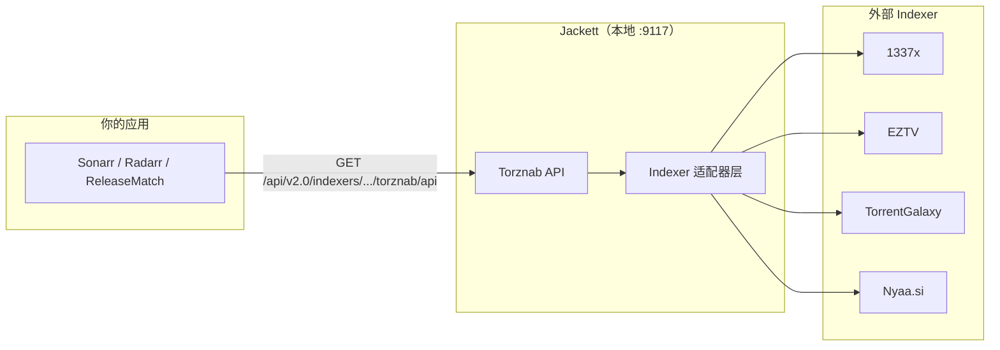

# Jackett 详解与安装使用教程

> **版本：** v1.0  
> **创建日期：** 2026-06-30  
> **定位：** Jackett 概念、架构、安装、配置、Torznab API 与 ReleaseMatch 集成的 **独立参考手册**  
> **相关文档：** [02-数据源技术方案-详细展开.md](./02-数据源技术方案-详细展开.md) §3 · [A4-Jackett安装引导.md](../worklogs/2026-06-30/A4-Jackett安装引导.md)

---

## 章节目录

| 节 | 主题 |
|----|------|
| 一 | Jackett 是什么 |
| 二 | 工作原理与生态位置 |
| 三 | Jackett vs Prowlarr |
| 四 | 安装（Windows / Docker / Linux） |
| 五 | 首次配置与 Dashboard 使用 |
| 六 | 添加 Indexer（索引源） |
| 七 | Torznab API 详解 |
| 八 | 与 Sonarr / Radarr / ReleaseMatch 集成 |
| 九 | FlareSolverr 与 Cloudflare 站点 |
| 十 | 常见问题与排错 |
| 十一 | 安全与合规提示 |

---

## 一、Jackett 是什么

**Jackett** 是一个开源的 **Indexer 代理 / 聚合网关**，由社区维护，托管于 GitHub：[Jackett/Jackett](https://github.com/Jackett/Jackett)。

### 1.1 它解决什么问题

互联网上存在大量 **BT 索引站（Indexer）**：1337x、EZTV、TorrentGalaxy、Nyaa 等。每个站的：

- 网页结构不同（HTML 抓取 vs 自带 API）
- 搜索参数不同（关键词、IMDb ID、TVDB ID）
- 反爬策略不同（Cloudflare、登录 Cookie、验证码）

若你的应用（如 Sonarr、Radarr、或 ReleaseMatch 的 `torrent_sources`）要对接多个源，就需要为 **每个站单独写爬虫**，维护成本极高。

**Jackett 的做法：** 在本地运行一个 HTTP 服务，内置 500+ 个 Indexer 适配器，对外统一暴露 **Torznab / Newznab 标准 API**。你的程序只需对接 Jackett 一家，即可间接搜索所有已配置的 Indexer。

### 1.2 核心特性

| 特性 | 说明 |
|------|------|
| 统一 API | Torznab XML RSS，与 Sonarr/Radarr 原生兼容 |
| ID 搜索 | 支持 `imdbid`、`tmdbid`、`tvdbid` + `season`/`ep` |
| 多 Indexer 聚合 | 可单源搜索，也可用 `all` 聚合（较慢） |
| 本地部署 | 默认监听 `9117` 端口，数据不出本机 |
| 跨平台 | Windows 服务、Docker、Linux systemd 均可 |
| 免费开源 | MIT 许可证，无 SaaS 订阅 |

### 1.3 它不做什么

- **不下载** torrent 文件或视频内容
- **不托管** 任何资源，只做搜索代理
- **不替代** 专用 API（如 EZTV JSON、YTS API）— 这些在 ReleaseMatch 中仍作为 Layer 2 直连补全

---

## 二、工作原理与生态位置

### 2.1 架构示意



**请求流程：**

1. 应用向 Jackett 发起 Torznab 搜索（带 API Key）
2. Jackett 根据 `{indexer}` 路由到对应适配器
3. 适配器访问外部 Indexer（HTTP 抓取或对方 API）
4. 结果归一化为 Torznab XML RSS 返回
5. 应用解析 XML，提取 `title`、`magnet`、`infohash`、`seeders` 等

### 2.2 与 Torznab / Newznab 的关系

- **Newznab**：Usenet 索引协议（Jackett 也支持部分 Usenet 源，但 BT 场景主要用 Torznab）
- **Torznab**：Newznab 的 BitTorrent 扩展，定义了 `t=movie`、`t=tvsearch`、`t=search` 等搜索模式及 `torznab:attr` 扩展字段（如 `seeders`、`infohash`）

Jackett 是 **Torznab 服务端**；Sonarr/Radarr/ReleaseMatch 是 **Torznab 客户端**。

### 2.3 在 ReleaseMatch 中的角色

ReleaseMatch 采用 **四层数据源** 架构，Jackett 位于 **Layer 1（聚合网关，主源 ~70%）**：

| Layer | 来源 | 说明 |
|-------|------|------|
| L1 | Jackett Torznab | 电影/剧集通用搜索，100+ indexer |
| L2 | EZTV / YTS / Nyaa | 品类专用 API，更快更稳 |
| L3 | TMDB external_ids 等 | 桥接与冷启动 |

详见 [02-数据源技术方案-详细展开.md](./02-数据源技术方案-详细展开.md) 第一节。

---

## 三、Jackett vs Prowlarr

| 维度 | Jackett | Prowlarr |
|------|---------|----------|
| 维护方 | 社区（Jackett 团队） | Servarr 官方（Sonarr 同组织） |
| API | Torznab | Torznab + 自有 REST API |
| Indexer 管理 | Web UI 手动添加 | 更现代的 UI，支持同步到 *arr 套件 |
| 与 Sonarr 集成 | 手动填 URL + Key | 一键推送到 Sonarr/Radarr |
| ReleaseMatch | **当前选用** | API 兼容，可替换 |

两者 Torznab 端点格式基本一致；ReleaseMatch 的 `jackett_client.py` 设计时以 Jackett 为准，迁移到 Prowlarr 通常只需改 `base_url`。

---

## 四、安装（Windows / Docker / Linux）

### 4.1 系统要求

| 项 | 建议 |
|----|------|
| 内存 | ≥ 512 MB（Indexer 多时可增至 1 GB） |
| 磁盘 | 配置目录约 50~200 MB |
| 网络 | 能访问所添加的 Indexer 域名 |
| 端口 | 默认 **9117**（可改） |

### 4.2 Windows 原生安装（推荐，无 Docker 时）

#### 方式 A — winget（最快）

```powershell
winget install --id Jackett.Jackett -e --accept-package-agreements --accept-source-agreements
net start Jackett
```

#### 方式 B — 官方安装包

1. 打开 [Jackett Releases](https://github.com/Jackett/Jackett/releases/latest)
2. 下载 `Jackett.Installer.Windows.exe` 并运行
3. 安装程序会注册 **Windows 服务** 并设置开机自启

#### 验证

```powershell
Test-NetConnection 127.0.0.1 -Port 9117
# 期望 TcpTestSucceeded : True
```

浏览器访问：**http://127.0.0.1:9117/UI/Dashboard**

#### ReleaseMatch 一键引导

```powershell
cd C:\Users\matth\Desktop\trafficforvideo\releasematch\releasematch
.\scripts\setup_jackett_a4.ps1
# 已有 API Key 时可：
.\scripts\setup_jackett_a4.ps1 -ApiKey "你的Key"
```

脚本会：检测端口 → 引导安装 → 打开 Dashboard → 写入 `accounts.local.json` → Torznab 冒烟测试。

---

### 4.3 Docker 安装

适用于已安装 Docker Desktop 的环境。

```powershell
docker run -d `
  --name jackett `
  --restart unless-stopped `
  -p 9117:9117 `
  -v C:\jackett\config:/config `
  linuxserver/jackett:latest
```

| 参数 | 含义 |
|------|------|
| `-p 9117:9117` | 映射 Web UI 与 API 端口 |
| `-v C:\jackett\config:/config` | 持久化配置、API Key、Indexer 列表 |

Linux / macOS 将卷路径改为本地目录，例如 `-v ~/jackett/config:/config`。

**验证：**

```powershell
curl http://127.0.0.1:9117/
docker logs jackett --tail 20
```

---

### 4.4 Linux（Debian/Ubuntu）systemd

```bash
# 参考官方文档或使用 Docker；也可下载 tar.gz 解压后：
sudo ./install_service_systemd.sh
sudo systemctl enable --now jackett
```

访问 `http://<服务器IP>:9117`。若远程访问，务必配置防火墙与 API Key 保护（见 §十一）。

---

### 4.5 安装方式选择建议

| 场景 | 推荐 |
|------|------|
| Windows 开发机、无 Docker | winget 或官方 exe |
| 已有 Docker、NAS/服务器 | linuxserver/jackett 镜像 |
| ReleaseMatch 块 A 验收 | Windows 用 `setup_jackett_a4.ps1` |

---

## 五、首次配置与 Dashboard 使用

### 5.1 打开 Dashboard

安装并启动后，浏览器访问：

```
http://127.0.0.1:9117/UI/Dashboard
```

首次进入可能提示设置 **管理员密码**（可选，建议局域网外暴露时启用）。

### 5.2 获取 API Key

API Key 是 Torznab 请求的必填凭证：

1. Dashboard **右上角** → **Copy API Key**
2. 或 **System** → **API Key** → 复制

> 请妥善保管 Key；任何持有 Key 的人都能通过你的 Jackett 实例搜索 Indexer。

### 5.3 常用 Dashboard 区域

| 区域 | 功能 |
|------|------|
| **Dashboard** | 已添加 Indexer 列表、测试、搜索 |
| **Add indexer** | 从目录中添加新 Indexer |
| **Manual search** | 在 UI 中手动试搜（调试 indexer 是否正常） |
| **System** | API Key、日志、更新、FlareSolverr URL |
| **Indexers** | 批量测试所有 Indexer 连通性 |

### 5.4 测试单个 Indexer

在 Dashboard 某 Indexer 行点击 **扳手/Test**，或使用 **Manual search** 输入关键词。若显示错误，常见原因见 §十。

---

## 六、添加 Indexer（索引源）

### 6.1 为什么必须添加 Indexer

Jackett **安装后默认没有任何 Indexer**。未添加时：

- Torznab 请求返回 **HTTP 200**
- 但 **结果为空**（0 条 `item`）

ReleaseMatch PoC 会出现「连通 OK 但无条目」— 这是配置问题，不是代码 bug。

### 6.2 添加步骤

1. Dashboard → **Add indexer**
2. 搜索并选择源，例如：
   - **1337x** — 综合、电影/剧集
   - **EZTV** — 欧美剧集（ReleaseMatch 也会直连 EZTV API）
   - **TorrentGalaxy** — 综合
   - **nyaasi** — 动漫（Nyaa）
3. 按向导填写（多数公开源无需账号）
4. 保存后在列表中 **Test** 确认绿色

### 6.3 ReleaseMatch 推荐 Indexer 组合

| 品类 | 优先 Indexer | 备注 |
|------|-------------|------|
| 电影 | yts, 1337x, torrentgalaxy | YTS 另有 Layer 2 直连 |
| 剧集 | eztv, 1337x, torrentgalaxy | EZTV 另有 Layer 2 直连 |
| 动漫 | nyaasi | Nyaa 另有 RSS 直连 |

批补时 **避免滥用 `all` 聚合**（慢、易超时）；在 `accounts.local.json` 中按品类指定 indexer 列表：

```json
"jackett": {
  "base_url": "http://127.0.0.1:9117",
  "api_key": "你的真实Key",
  "indexers": {
    "tv": ["eztv", "1337x", "torrentgalaxy"],
    "movie": ["yts", "1337x", "torrentgalaxy"]
  }
}
```

### 6.4 需要登录或 Cookie 的 Indexer

部分私有 Tracker 需：

- 在 Jackett 配置页粘贴 **Cookie**（从浏览器开发者工具复制）
- 或填写 **Username / Password**

公开 PoC 阶段可跳过，先用 1337x、EZTV 等公开源。

---

## 七、Torznab API 详解

### 7.1 基础 URL 格式

```
http://127.0.0.1:9117/api/v2.0/indexers/{indexer}/results/torznab/api
```

| 占位符 | 示例 | 说明 |
|--------|------|------|
| `{indexer}` | `1337x` | 单个 Indexer 的 ID（Dashboard 中可见） |
| `{indexer}` | `all` | 聚合所有已启用 Indexer（慢） |

### 7.2 通用查询参数

| 参数 | 必填 | 说明 |
|------|------|------|
| `apikey` | 是 | Dashboard 中的 API Key |
| `t` | 是 | 搜索类型：`movie` / `tvsearch` / `search` / `indexers` |
| `cache` | 否 | `false` 强制实时搜索（调试/PoC 建议 false） |
| `cat` | 否 | 分类 ID，逗号分隔 |

**常用 Category：**

| cat | 含义 |
|-----|------|
| `2000` | Movies（电影） |
| `5000` | TV（电视） |
| `5040` | TV HD |

### 7.3 搜索模式

#### 剧集单集 — `t=tvsearch`

```http
GET /api/v2.0/indexers/all/results/torznab/api
  ?apikey=YOUR_KEY
  &t=tvsearch
  &tvdbid=81189
  &season=4
  &ep=6
  &cat=5000,5040
  &cache=false
```

示例：**Breaking Bad S04E06**（TVDB ID `81189`）。

#### 电影 — `t=movie`

```http
GET /api/v2.0/indexers/1337x/results/torznab/api
  ?apikey=YOUR_KEY
  &t=movie
  &imdbid=0133093
  &cache=false
```

或使用 TMDB ID：`tmdbid=603`（The Matrix）。

#### 文本搜索 — `t=search`（兜底）

```http
GET /api/v2.0/indexers/all/results/torznab/api
  ?apikey=YOUR_KEY
  &t=search
  &q=Breaking+Bad+S04E06
  &cache=false
```

#### 列出 Indexer 能力 — `t=indexers`

用于探测某 Indexer 支持的搜索模式与 category。

### 7.4 响应格式（XML RSS）

生产环境使用 **XML**（`o=json` 为实验特性，勿依赖）。

```xml
<?xml version="1.0" encoding="UTF-8"?>
<rss version="2.0" xmlns:torznab="http://torznab.com/schemas/2015/feed">
  <channel>
    <item>
      <title>Breaking.Bad.S04E06.Cornered.1080p.WEB-DL.x264-GROUP</title>
      <link>magnet:?xt=urn:btih:ABCD...&amp;dn=...</link>
      <size>1234567890</size>
      <pubDate>Mon, 01 Jan 2024 12:00:00 +0000</pubDate>
      <torznab:attr name="seeders" value="42"/>
      <torznab:attr name="peers" value="10"/>
      <torznab:attr name="infohash" value="abcd1234..."/>
      <torznab:attr name="magneturl" value="magnet:?xt=..."/>
    </item>
  </channel>
</rss>
```

**ReleaseMatch 需提取的字段：**

| 字段 | 来源 | 用途 |
|------|------|------|
| `title` | `<title>` | Release 解析 |
| `infohash` | `torznab:attr name="infohash"` | 去重主键 |
| `magnet_uri` | `<link>` 或 `magneturl` attr | 用户下载 |
| `size_bytes` | `<size>` | 展示体积 |
| `seeders` | `torznab:attr name="seeders"` | 排序 |
| `indexer` | URL 中的 `{indexer}` 或 attr | 来源标记 |

### 7.5 PowerShell 快速测试

```powershell
$Key = "你的API_KEY"
$Url = "http://127.0.0.1:9117/api/v2.0/indexers/all/results/torznab/api?apikey=$Key&t=tvsearch&tvdbid=81189&season=4&ep=6&cache=false"
Invoke-WebRequest -Uri $Url -UseBasicParsing -TimeoutSec 45
```

或使用项目脚本：

```powershell
$env:JACKETT_API_KEY = "你的Key"
.\scripts\poc_phase0.ps1
# 期望 [1/4] OK status=200
```

### 7.6 限速建议

| 场景 | 建议 |
|------|------|
| 手动调试 | `cache=false`，间隔 ≥ 2 秒 |
| 批补爬取 | 按 Indexer 分流，勿频繁打 `all` |
| ReleaseMatch | `accounts.local.json` → `rate_limit.min_interval_sec: 2.0` |

---

## 八、与 Sonarr / Radarr / ReleaseMatch 集成

### 8.1 Sonarr / Radarr（通用 *arr 套件）

1. Sonarr → **Settings** → **Indexers** → **Add** → **Torznab**
2. 填写：
   - **URL：** `http://127.0.0.1:9117/api/v2.0/indexers/all/results/torznab/api`（或单 indexer URL）
   - **API Key：** Jackett Dashboard 中的 Key
3. **Test** → **Save**

Radarr 步骤相同，电影分类选 `2000` 等。

### 8.2 ReleaseMatch 集成

#### 配置文件

复制模板并填入 Key：

```powershell
copy workflow\torrent_sources\accounts.example.json workflow\torrent_sources\accounts.local.json
```

编辑 `workflow/torrent_sources/accounts.local.json`：

```json
{
  "jackett": {
    "base_url": "http://127.0.0.1:9117",
    "api_key": "粘贴真实Key",
    "indexers": {
      "tv": ["all"],
      "movie": ["all"]
    }
  }
}
```

#### 环境变量（优先级高于 JSON）

```powershell
$env:JACKETT_BASE_URL = "http://127.0.0.1:9117"
$env:JACKETT_API_KEY = "你的Key"
```

或在项目根 `.env` 中配置（参考 `.env.example`）。

#### 验收命令

```powershell
cd releasematch
.\.venv\Scripts\Activate.ps1

# 环境状态：has_valid_api_key、jackett_probe.reachable
python -m workflow.torrent_sources.run status

# 四源 PoC
.\scripts\poc_phase0.ps1

# 单集测试（jackett_client 实现后）
python -m workflow.torrent_sources.run test --tmdb 1396 --season 4 --episode 6
```

#### 验收标准（块 A4）

| ID | 项 | 通过条件 |
|----|-----|----------|
| A4-1 | 服务 | 9117 端口开放或 Dashboard 可访问 |
| A4-2 | API Key | `has_valid_api_key: true` |
| A4-3 | HTTP 探测 | `jackett_probe.reachable: true` |
| A4-4 | Torznab | PoC `[1/4]` 显示 `OK status=200` |

---

## 九、FlareSolverr 与 Cloudflare 站点

1337x、TorrentGalaxy 等站点使用 **Cloudflare 反爬**。Jackett 单独访问可能失败，需配合 **FlareSolverr**。

### 9.1 本机 / 单容器（开发机）

```powershell
docker run -d --name flaresolverr -p 8191:8191 ghcr.io/flaresolverr/flaresolverr:latest
```

Jackett → **System** → **FlareSolverr URL**：

```
http://127.0.0.1:8191
```

### 9.2 海外 VPS（Jackett + FlareSolverr 双 Docker）

Jackett 与 FlareSolverr 须在同一 Docker 网络（如 `jackett-net`），Jackett 内 URL **必须用容器名**：

```
http://flaresolverr:8191/
```

完整部署与日本测试机 `172.236.156.193` 运维说明见 [jackett-remote-linode.md](./jackett-remote-linode.md) §四。

保存后重新 **Test** 对应 Indexer（1337x 首次可能需 30~60 秒）。

| 现象 | 原因 |
|------|------|
| `Challenge detected but FlareSolverr is not configured` | 未填 URL，或 Docker 内误用 `127.0.0.1` 而非 `flaresolverr` |
| Indexer Test 失败 / 空结果 | FlareSolverr 未启动或未与 Jackett 同网 |
| FlareSolverr 日志报错 | Docker 内存不足或目标站变更 |

无 FlareSolverr 时，可暂时只用 **EZTV、YTS** 等 Layer 2 直连源完成 PoC。

---

## 十、常见问题与排错

| 现象 | 可能原因 | 处理 |
|------|----------|------|
| 9117 端口不通 | 服务未启动 | `net start Jackett` 或 Docker `docker start jackett` |
| `net start Jackett` 失败 | 服务名不同或未安装 | `services.msc` 手动启动；或开始菜单打开 Jackett |
| Dashboard 打不开 | 防火墙 / 端口被占 | 检查占用；Jackett Settings 改端口并同步 `base_url` |
| API 401 / Unauthorized | API Key 错误 | Dashboard 重新复制 Key |
| HTTP 200 但 0 结果 | 未添加 Indexer | Dashboard → Add indexer |
| 单 Indexer 失败 | Cloudflare | 配置 FlareSolverr（§九） |
| `all` 搜索超时 | 聚合太慢 | 改用单 Indexer URL，如 `indexers/1337x/...` |
| PoC SKIPPED | 未设置 Key | 编辑 `accounts.local.json` 或 `$env:JACKETT_API_KEY` |
| Key 已填但 `has_valid_api_key: false` | 仍为占位符 | 勿使用 `YOUR_JACKETT_API_KEY` |
| 远程机器访问失败 | 仅绑定 localhost | Jackett **Settings** → 允许外部访问（注意安全） |

### 10.1 日志位置

| 安装方式 | 日志 |
|----------|------|
| Windows 服务 | Dashboard → **System** → **View logs** |
| Docker | `docker logs jackett -f` |
| 配置文件 | `C:\ProgramData\Jackett\` 或 Docker 卷 `/config` |

### 10.2 更新 Jackett

- Windows：Dashboard → **System** → **Apply update**，或重新运行最新安装包
- Docker：`docker pull linuxserver/jackett:latest && docker restart jackett`

---

## 十一、安全与合规提示

### 11.1 网络安全

- Jackett 默认适合 **本机开发**（`127.0.0.1`）
- 若暴露到局域网或公网：
  - 设置 **管理员密码**
  - 使用反向代理 + HTTPS
  - 勿将 API Key 提交到 Git（`accounts.local.json` 已在 `.gitignore`）

### 11.2 法律与合规

- Jackett 是 **搜索代理工具**；ReleaseMatch 仅索引 **元数据**（magnet、infohash），不托管视频
- 各 Indexer 及 torrent 使用受当地法律约束；请确保你的使用场景合法合规
- 私有 Tracker 凭据（Cookie/密码）属于敏感信息，勿分享或入库

### 11.3 项目内敏感文件

| 文件 | 说明 |
|------|------|
| `workflow/torrent_sources/accounts.local.json` | Jackett URL + API Key，勿提交 |
| `workflow/torrent_sources/servers.local.json` | VPS SSH 密码、API Key、Docker 详情，勿提交 |
| `workflow/torrent_sources/servers.example.json` | 服务器配置模板，可提交 |
| `.env` | 环境变量，勿提交 |
| `accounts.example.json` | 仅模板，可提交 |

---

## 附录 A：ReleaseMatch 相关文件速查

| 路径 | 说明 |
|------|------|
| `scripts/setup_jackett_a4.ps1` | Windows 安装 + Key 写入 + 冒烟测试 |
| `scripts/poc_phase0.ps1` | 四源连通 PoC（含 Jackett `[1/4]`） |
| `workflow/torrent_sources/config.py` | Key 校验、`jackett_probe` |
| `workflow/torrent_sources/accounts.example.json` | 配置模板 |
| `workflow/torrent_sources/servers.example.json` | 海外 VPS 部署模板 |
| `docs/jackett-remote-linode.md` | 海外 VPS 部署（当前测试机 172.236.156.193） |
| `docs/jackett-stability.md` | 稳定性保障（配置规范、healthcheck、验收） |
| `worklogs/2026-06-30/A4-Jackett安装引导.md` | 块 A 验收精简版 |

---

## 附录 B：变更记录

| 版本 | 日期 | 说明 |
|------|------|------|
| v1.0 | 2026-06-30 | 初版：概念、安装、Dashboard、Torznab、ReleaseMatch 集成、排错 |
| v1.1 | 2026-06-30 | §九 补充 VPS 双 Docker FlareSolverr；敏感文件增加 servers.local.json |
| v1.2 | 2026-06-30 | 附录 A 增加 jackett-stability.md 链接 |
