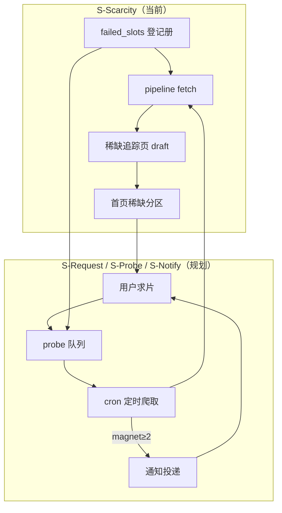
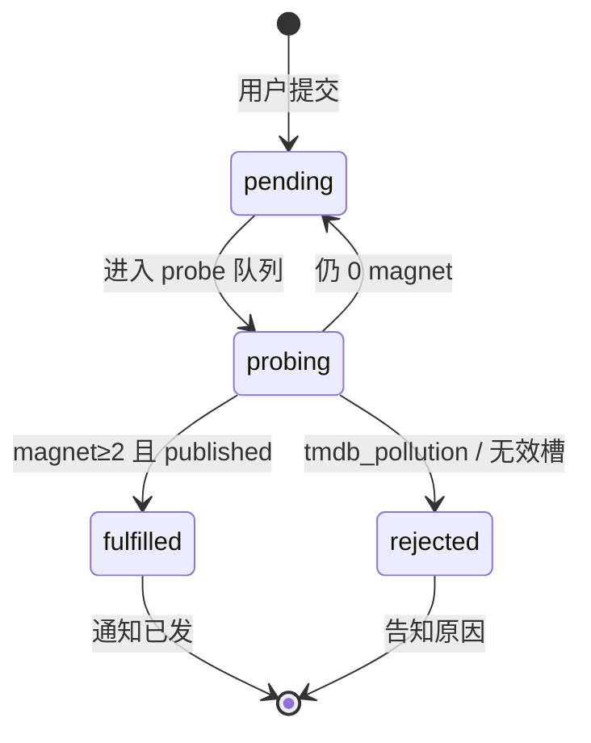

# 稀缺槽与用户求片 · 自动爬取 · 通知方案

> **版本：** v0.1（规划稿）  
> **创建日期：** 2026-07-03  
> **状态：** 📋 **仅文档，暂不开发** — 当前迭代聚焦稀缺槽工程化（P0）  
> **前置阅读：** [04-方案全景分析与优先级重评.md](./04-方案全景分析与优先级重评.md)、[05-存储与部署配置.md](./05-存储与部署配置.md)、[VPS迁移与部署.md](./VPS迁移与部署.md)  
> **关联代码（已存在）：** `workflow/storage/failed_slots_store.py`、`scripts/pipeline_batch_slots.py`、`workflow/torrent_sources/fetch_service.py`

---

## 〇、文档目的

ReleaseMatch 的 **缺失 slot（0 magnet / draft）** 不是失败产物，而是 **稀缺性信号** — 说明该资源在公开 indexer 上难以聚合，正是站点差异化所在。

本文档在 **不改动当前开发优先级** 的前提下，规划后续模块：

| 模块 | 代号 | 说明 |
|------|------|------|
| 稀缺槽产品化 | **S-Scarcity** | 当前 P0：可见页、分类、retry、首页分区 |
| 用户求片 | **S-Request** | 用户提交「想看但找不到」的槽位 |
| 定时爬取 | **S-Probe** | 对稀缺槽 / 求片队列自动重探 |
| 通知 | **S-Notify** | 命中 magnet 后推送用户与站内状态 |

**边界声明：** v0.1 只定义架构、数据流、验收口径；**不新增表、不写 Worker、不上线表单**，待 S-Scarcity 验收后再开 Sprint。

---

## 一、与当前方案的关系

### 1.1 当前基线（2026-07-03）

| 项 | 状态 | 路径 / 命令 |
|----|------|-------------|
| published 页 | 114 | `generate all` |
| active 失败槽 | 17 | `data/failed_slots/registry.json` |
| 登记册去重 | ✅ | `workflow/storage/failed_slots_store.py` |
| retry 清单 | ✅ | `data/failed_slots/failed-slots.json` |
| pipeline 拉取 | ✅ | `scripts/pipeline_batch_slots.py --fetch` |
| 全量测速 cron | ✅ 文档化 | `speedtest_batch_worker.py --all-published` |
| 首页 | 仅 published | `portal/generator/templates/home.html` |

### 1.2 当前 P0 聚焦（本文档 **不抢占**）

以下项属于 **S-Scarcity**，须先完成，求片模块才 meaningful：

1. **失败分类** `failure_class`：`fetch_gap` \| `region_gap` \| `tmdb_pollution` \| `genuine_scarcity`
2. **剧集拉取兜底**：TV 侧 `search_text`（对齐电影已有逻辑）
3. **稀缺静态页**：draft / 0 magnet 可生成 noindex 追踪页
4. **首页「稀缺追踪」分区**：与 published 卡片并列

求片模块 **依赖** 稀缺页存在：用户应在「追踪中」页点击「求片 / 订阅通知」，而非对空白 404 提交。

### 1.3 价值闭环



---

## 二、失败槽分类（S-Scarcity 前置，供求片复用）

求片与自动爬取共用同一 **slot_key**（`movie:{tmdb_id}` / `tv:{tmdb_id}:s{ss}e{ee}`）。登记册扩展字段（规划）：

| 字段 | 类型 | 说明 |
|------|------|------|
| `failure_class` | enum | 见下表 |
| `scarcity_score` | 0–100 | RM Scarcity Index（展示用） |
| `last_probed_at` | ISO8601 | 上次 pipeline 探测时间 |
| `next_probe_at` | ISO8601 | 下次 cron 计划时间 |
| `probe_interval_hours` | int | 动态间隔（真稀缺拉长，fetch_gap 缩短） |

| `failure_class` | 含义 | 求片优先级 | 默认探测间隔 |
|-----------------|------|------------|--------------|
| `fetch_gap` | 应有资源未抓到 | 低（先修工程） | 6h |
| `region_gap` | 区域源未覆盖 | 中 | 12h |
| `tmdb_pollution` | TMDB 污染，非目标内容 | **不开放求片** | 不探测 |
| `genuine_scarcity` | 真稀缺 | **高** | 24h~7d |

**用户求片** 仅对 `genuine_scarcity`、`region_gap` 开放；`fetch_gap` 由系统 retry 消化，避免用户订阅后很快自动命中造成噪音。

---

## 三、用户求片模块（S-Request）

### 3.1 产品定义

**求片** = 用户对某一 **slot_key** 表达「我需要这个资源的 Release 导航页 / magnet 聚合」，并在命中后接收通知。

与竞品差异：

- 不求托管视频，只求 **Verified Release 清单 + 测速证据**
- 与 **IG 登记册** 对齐：命中后页面自带 Recommended + group_tier

### 3.2 入口（规划 UI，暂不实现）

| 入口 | 场景 |
|------|------|
| 稀缺追踪页 CTA | 「订阅更新」primary button |
| 首页稀缺卡片 | 同上 |
| 搜索结果无页 | TMDB 联想 → 「创建追踪请求」（需 TMDB API） |
| 手动表单 | `/request/` 页：粘贴 IMDb / TMDB URL |

### 3.3 请求最小字段

```json
{
  "request_id": "uuid",
  "slot_key": "tv:136315:s01e01",
  "tmdb_id": 136315,
  "media_type": "tv",
  "season": 1,
  "episode": 1,
  "contact": {
    "channel": "email",
    "address": "user@example.com"
  },
  "locale": "zh-CN",
  "note": "可选：只要 1080p WEB-DL",
  "status": "pending",
  "created_at": "2026-07-03T12:00:00Z",
  "source": "scarcity_page"
}
```

### 3.4 状态机



| 状态 | 说明 |
|------|------|
| `pending` | 已登记，等待或正在排队探测 |
| `probing` | 本轮 cron 已触发 fetch |
| `fulfilled` | 槽位 published，通知已投递 |
| `rejected` | 无法追踪（无 TMDB、policy 拒绝） |
| `cancelled` | 用户取消 |

### 3.5 防滥用（规划）

- 单 contact 每日上限 N 条（默认 5）
- Turnstile / honeypot（CF Pages 上线后）
- 同一 `slot_key` 多用户合并为 **一个 probe 任务**，通知批量发送（降本）

---

## 四、定时爬取模块（S-Probe）

### 4.1 设计原则

1. **复用现有 pipeline**，不新写爬虫：`run_slot_pipeline(..., fetch=True)`
2. **与 speedtest cron 解耦**：fetch 探 magnet 存在性；speedtest 探下载速度
3. **队列合并**：`failed_slots.active` ∪ `user_requests WHERE status=pending`

### 4.2 调度策略

| 队列来源 | 优先级 | 间隔 |
|----------|--------|------|
| 用户求片且 `genuine_scarcity` | P0 | min(用户期望, 6h) |
| `failed_slots` active | P1 | 按 `failure_class` |
| 曾 published 后 magnet 跌破 2 | P2 | 24h（薄页恢复） |

**VPS crontab（规划示例，勿现在部署）：**

```bash
# 每 6 小时：稀缺槽 + 求片队列探测（与测速错开 30min）
30 */6 * * * cd /opt/releasematch/releasematch && \
  .venv/bin/python scripts/scarcity_probe_worker.py \
  --merge-failed-slots --merge-user-requests \
  --fetch --report /var/log/releasematch/scarcity-probe.json \
  >> /var/log/releasematch/scarcity-probe.log 2>&1
```

### 4.3 Worker 职责（规划脚本名）

`scripts/scarcity_probe_worker.py`（**未实现**）：

| 步骤 | 动作 |
|------|------|
| 1 | 加载 `registry.json` active + DB `user_requests` pending |
| 2 | 按优先级排序，respect `next_probe_at` |
| 3 | 调用 `pipeline_batch_slots` 或单槽 `run_slot_pipeline` |
| 4 | 更新 `last_probed_at` / `attempt_count` |
| 5 | `magnet_count >= 2` → 写 `resolved`、触发 S-Notify |
| 6 | 输出 JSON 报告至 `worklogs/` |

### 4.4 与现有命令对照

| 现状 | 规划演进 |
|------|----------|
| 手动 `pipeline_batch_slots.py --slots-json data/failed_slots/failed-slots.json` | probe worker 自动读同一 JSON + 求片表 |
| `failed_slots_merge_reports.py` | probe 结束后自动 merge |
| `speedtest_batch_worker.py --all-published` | **仅** published；稀缺命中转 published 后再进测速队列 |

---

## 五、通知模块（S-Notify）

### 5.1 触发条件

| 事件 | 条件 | 通知对象 |
|------|------|----------|
| **首次命中** | draft/scarcity → published，magnet≥2 | 该 slot 全部 pending 求片用户 |
| **推荐变更** | recommended release 更换且 IG 分提升 | 可选：已 fulfilled 用户 |
| **长期未命中** | probing ≥ 30 天 | 可选：「仍在追踪」安抚邮件 |

**v0.1 只做「首次命中」。**

### 5.2 通道（分期）

| 通道 | 阶段 | 说明 |
|------|------|------|
| Email | MVP | Cloudflare Email Workers / Resend；无登录体系友好 |
| Web Push | P2 | 需 Service Worker + 订阅 |
| RSS/Atom | P2 | 每用户 `feed/{token}.xml` 追踪列表 |
| Telegram Bot | P3 | 运维向；可选用户 bot |

### 5.3 通知 payload（规划）

```json
{
  "event": "slot_fulfilled",
  "slot_key": "tv:136315:s01e01",
  "title": "The Bear S01E01",
  "page_url": "https://releasematch.example/the-bear/s1e1/",
  "magnet_count": 6,
  "recommended": "The.Bear.S01E01.1080p.WEB-DL...",
  "scarcity_days": 14,
  "fulfilled_at": "2026-07-17T08:00:00Z"
}
```

### 5.4 邮件模板要点

- 主题：`[ReleaseMatch] 您求片的「The Bear S01E01」已有 Release 清单`
- 正文：Recommended 摘要、跨源 badge、链到 **静态页**（非 magnet 直链）
- 页脚：取消订阅链接（`unsubscribe_token`）

### 5.5 幂等与去重

- `notification_log` 表：`UNIQUE(request_id, event)` 防重复发
- cron 重跑安全：已 `fulfilled` 的请求 skip

---

## 六、数据模型扩展（规划，暂不 migration）

在 [05-存储与部署配置.md](./05-存储与部署配置.md) 现有表之外 **新增**：

### 6.1 `user_requests` — 求片主表

| 字段 | 类型 | 说明 |
|------|------|------|
| `request_id` | PK UUID | |
| `slot_key` | VARCHAR | 与登记册对齐 |
| `tmdb_id` | INT | |
| `media_type` | ENUM | movie \| tv |
| `season` / `episode` | INT | |
| `contact_channel` | ENUM | email \| web_push \| telegram |
| `contact_address` | VARCHAR | 邮箱 / push endpoint |
| `status` | ENUM | pending \| probing \| fulfilled \| rejected \| cancelled |
| `source` | VARCHAR | scarcity_page \| form \| api |
| `user_note` | TEXT | 可选偏好 |
| `created_at` / `updated_at` | DATETIME | |
| `fulfilled_at` | DATETIME | |
| `unsubscribe_token` | CHAR(32) | |

**索引：** `idx_requests_slot_status(slot_key, status)`、`idx_requests_contact(contact_address)`

### 6.2 `probe_schedule` — 探测调度（可与登记册 JSON 二选一）

| 字段 | 类型 | 说明 |
|------|------|------|
| `slot_key` | PK | |
| `priority` | INT | 越小越优先 |
| `next_probe_at` | DATETIME | |
| `last_probe_at` | DATETIME | |
| `probe_interval_hours` | INT | |
| `last_magnet_count` | INT | |
| `failure_class` | VARCHAR | |

**v0 可继续用 `registry.json` 存 probe 元数据，MySQL 表在求片上线前再迁。**

### 6.3 `notification_log` — 通知审计

| 字段 | 类型 | 说明 |
|------|------|------|
| `id` | PK | |
| `request_id` | FK | |
| `event` | VARCHAR | slot_fulfilled 等 |
| `channel` | VARCHAR | |
| `sent_at` | DATETIME | |
| `provider_id` | VARCHAR | 邮件服务商 message id |
| `error_message` | TEXT | 失败原因 |

### 6.4 `media_pages.page_status` 扩展（可选）

| 值 | 含义 |
|----|------|
| `draft` | 占位，0 magnet（现状） |
| `scarcity` | 显式稀缺追踪页（规划） |
| `thin` | 1 magnet |
| `published` | ≥2 magnet |

---

## 七、模块目录结构（规划）

```
releasematch/
├── workflow/
│   ├── scarcity/                    # 🆕 规划包（暂不创建）
│   │   ├── __init__.py
│   │   ├── probe_queue.py           # 合并 failed_slots + user_requests
│   │   ├── scarcity_score.py        # RM Scarcity Index
│   │   ├── request_store.py         # user_requests CRUD
│   │   └── notify_service.py        # 通知编排
│   └── storage/
│       └── failed_slots_store.py    # ✅ 已有；扩展 failure_class
├── scripts/
│   ├── scarcity_probe_worker.py     # 🆕 cron 入口
│   └── scarcity_request_api.py      # 🆕 本地/dev 表单 POST（可选）
├── portal/
│   └── generator/templates/
│       └── scarcity.html            # 🆕 稀缺追踪页模板
└── data/
    └── failed_slots/
        └── registry.json            # ✅ 已有
```

---

## 八、CLI 规划（接入 workflow.run）

```bash
# 规划命令 — 均未实现

# 单槽探测
python -m workflow.run scarcity probe --page-id tv:136315:s01e01 --fetch

# 合并队列批量探测
python -m workflow.run scarcity probe-batch --merge-requests

# 求片登记（CLI 调试）
python -m workflow.run scarcity request \
  --page-id tv:136315:s01e01 --email user@example.com

#  dry-run 通知
python -m workflow.run scarcity notify --request-id <uuid> --dry-run
```

---

## 九、优先级与排期

### 9.1 对齐双轨（04 文档）

| 轨道 | 编号 | 内容 | 排期 |
|------|------|------|------|
| 工具轨 | T3+ | fetch 兜底、稀缺页 generate | **当前 Sprint** |
| 内容轨 | C2 | 稀缺追踪首页、IG 稀缺叙事 | **当前 Sprint** |
| 工具轨 | T4 | S-Probe cron worker | 稀缺页上线后 |
| 内容轨 | C3 | S-Request 表单 + Email 通知 | T4 后 |
| 工具轨 | T4 | Web Push / RSS | 可选 |

### 9.2 分期验收

| 阶段 | 交付 | 验收 |
|------|------|------|
| **Phase A**（当前） | S-Scarcity：分类、TV 兜底、稀缺页、首页分区 | 17 active 可见；假稀缺 ≤4 转 published |
| **Phase B** | S-Probe：probe worker + VPS cron | 6h 自动 retry；report JSON |
| **Phase C** | S-Request：表单 + `user_requests` 表 | 提交后入队；合并探测 |
| **Phase D** | S-Notify：Email 首次命中 | 端到端：求片 → 命中 → 收信 |
| **Phase E** | RM Scarcity Index 对外展示 | 稀缺页展示分数 + IG 文案 |

**本文档覆盖 Phase B~E；实施从 Phase A 完成后启动。**

---

## 十、风险与约束

| 风险 | 缓解 |
|------|------|
| 用户求片 mainstream 内容（应已有 seed） | 开放前检查 `failure_class`；Bear/Grey 等先走 fetch_gap 修复 |
| cron 打满 Jackett / VPS | probe 与 speedtest 错峰；单轮 max_slots 上限 |
| 邮件进 spam | 独立发信域 + SPF/DKIM；见 Cloudflare Email 文档 |
| GDPR / 隐私 | 仅收 email；unsubscribe；不存 IP 长期 |
| CF Pages 未上线 | Phase C 前可用 dev_server + 本地 JSON 模拟请求 |

---

## 十一、关联文档与命令

| 资源 | 说明 |
|------|------|
| [failed_slots/registry.json](../data/failed_slots/registry.json) | 当前 17 active |
| [worklogs/2026-07-03/今日验收清单.md](../worklogs/2026-07-03/今日验收清单.md) | 100 页扩槽与 retry 记录 |
| [VPS迁移与部署.md](./VPS迁移与部署.md) | 现有 speedtest cron 模板 |
| [IG信息登记册.md](./IG信息登记册.md) | 命中后 Recommended 叙事 |

**当前可用命令（与规划无关，运维用）：**

```bash
# 合并失败报告 → 登记册
python scripts/failed_slots_merge_reports.py --worklog-dir worklogs/2026-07-03

# 查看 active
python scripts/failed_slots_merge_reports.py --list-active

# 手动 retry active 清单
python scripts/pipeline_batch_slots.py \
  --slots-json data/failed_slots/failed-slots.json --fetch --no-skip-existing
```

---

## 十二、总结

| 结论 | 说明 |
|------|------|
| **缺失 slot 是资产** | 登记册 + 稀缺页 + Scarcity Index 构成差异化 |
| **求片是稀缺页的自然延伸** | 用户表达需求 → 合并探测 → 命中通知 |
| **不重复造轮子** | probe 复用 pipeline；notify 仅多一层投递 |
| **当前不开发** | 先完成 S-Scarcity P0；本文档作为 Phase B~E 蓝图 |

---

*文档维护：稀缺槽状态变更时同步更新 §1.1 基线数字；Phase A 启动时再升 v0.2。*
