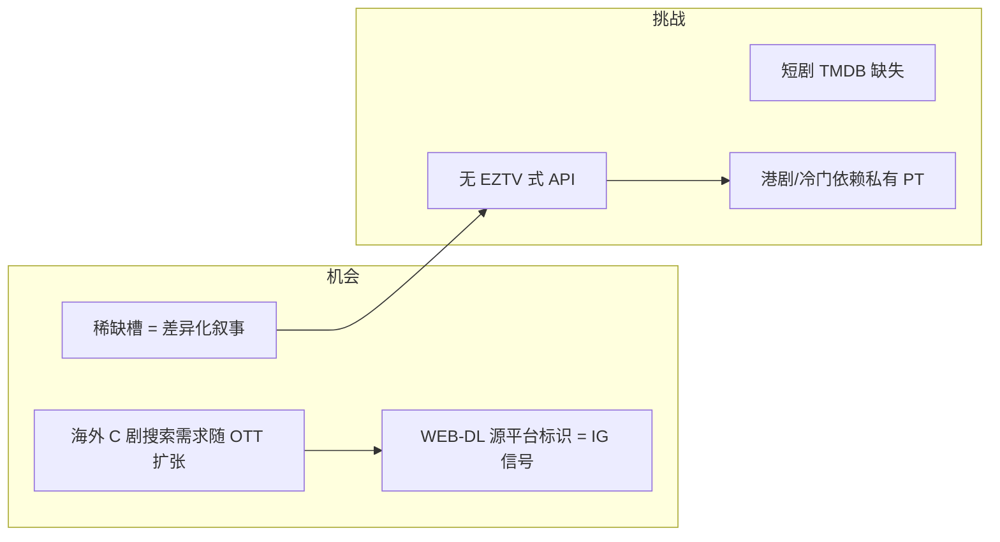
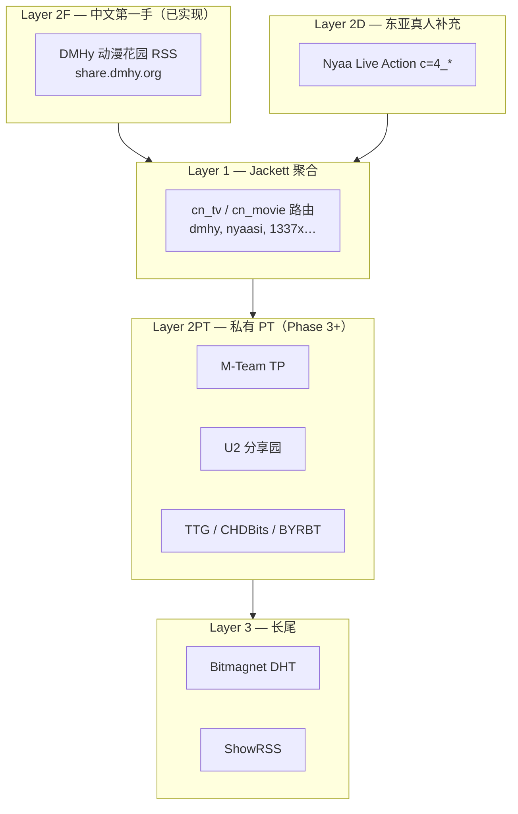
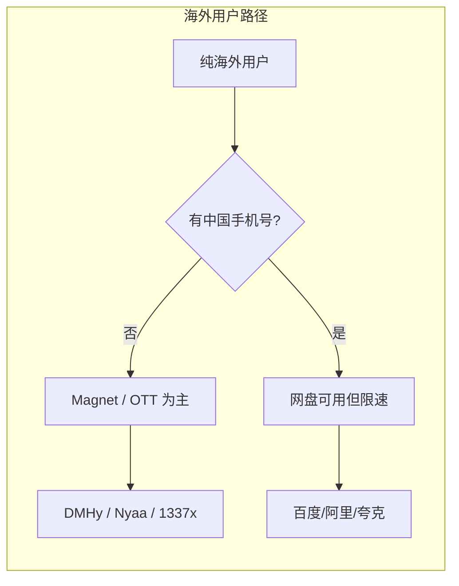
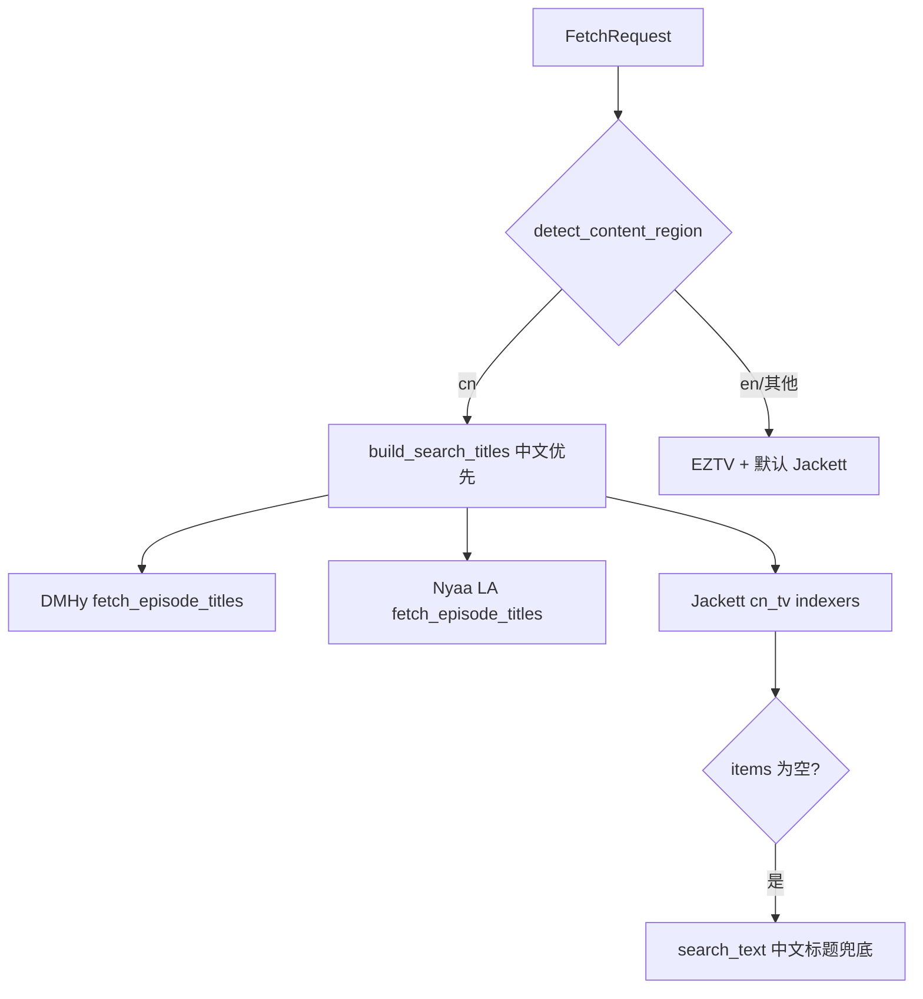

# CN 华语影视资源方案

> **版本：** v1.1  
> **创建日期：** 2026-07-03  
> **状态：** ✅ **工程已落地 Layer 2F（DMHy）+ `cn` 路由**；私有 PT / 短剧 taxonomy 为规划项；**网盘不纳入数据管道**  
> **前置阅读：** [02-数据源技术方案-详细展开.md](./02-数据源技术方案-详细展开.md)、[10-稀缺槽与用户求片通知方案.md](./10-稀缺槽与用户求片通知方案.md)、[nyaa-proxy-asia.md](./nyaa-proxy-asia.md)  
> **关联代码：** `workflow/torrent_sources/dmhy_client.py`、`asia_region.py`、`fetch_service.py`

---

## 〇、文档目的

华语（CN/HK/TW）影视在 **公开 indexer 上覆盖显著弱于欧美/日韩**，不存在类似 EZTV 的剧集专用 JSON API。ReleaseMatch 需单独定义：

| 维度 | 本文档覆盖 |
|------|------------|
| 全球华语 OTT 市场背景 | §一 |
| Magnet 渠道分层与覆盖预期 | §二 |
| **网盘共享与海外用户可操作性** | §2.6 |
| **`cn` 区域路由与 Layer 2F DMHy** | §三–§五 |
| TMDB 中文标题与搜索策略 | §六 |
| 稀缺槽分类（华语场景） | §七 |
| 配置、PoC、排期 | §八–§十 |

**边界：** 只存 **元数据**（infohash、magnet、seeders），不下载、不托管视频；与 [04-方案全景](./04-方案全景分析与优先级重评.md) Release 导航站定位一致。

---

## 一、全球华语影视网络市场（摘要）

### 1.1 三条并行赛道

| 赛道 | 2025–2026 量级 | 代表平台 | 与 magnet 生态关系 |
|------|----------------|----------|-------------------|
| **长剧/电影 OTT** | 东南亚流媒体 2030 约 **68 亿美元**；iQIYI 海外会员 Q1 2026 **+40% YoY** | iQIYI International、WeTV、Youku Intl、Netflix 采购 | Nyaa 字幕组常 rip **WETV/iQiyi/MGTV.WEB-DL** |
| **短剧/微短剧** | 海外 2025 **15–32 亿美元**；国内 2025 **~1000 亿人民币** | ReelShort、DramaBox、红果/抖音系 | **几乎无规范 torrent release**；TMDB 稀疏 |
| **国漫/动漫** | 随 iQIYI 国际动画榜增长 | B 站出海、爱奇艺动画 | **DMHy / U2** 第一手 |

### 1.2 区域热度（iQIYI 2025–2026 披露）

| 区域 | 趋势 |
|------|------|
| **东南亚** | 核心战场；泰/印尼/马来本地化合拍；华语平台份额在部分市场 **~40%** |
| **拉美** | 巴西、墨西哥会员 **+100% YoY** |
| **印尼** | 会员 **+80% YoY** |
| **北美/中东** | 热门 C 剧 Google Trends 多次登顶 |

### 1.3 对 ReleaseMatch 的产品含义



**结论：** 华语页的成功指标不是 magnet 条数，而是 **Recommended Release + 平台源（WETV.WEB-DL 等）+ 测速 + 稀缺追踪**。

---

## 二、Magnet 资源渠道全景

### 2.1 分层架构（华语专用）



### 2.2 渠道覆盖矩阵

| 渠道 | 类型 | 华语覆盖 | 接口 | 优先级 | 备注 |
|------|------|----------|------|--------|------|
| **DMHy 动漫花园** | 公开 RSS | ⭐⭐⭐⭐⭐ 国漫/日漫中字 | keyword RSS | **P0** | 中文动漫第一手；`dmhy_client.py` |
| **Nyaa Live Action** | 公开 RSS | ⭐⭐⭐ 热门 C 剧 | `c=4_*` | **P1** | 常见 WETV/iQiyi WEB-DL 命名 |
| **Nyaa Anime** | 公开 RSS | ⭐⭐⭐ 国漫 | `c=1_*` | P1 | 与 DMHy 大量重叠 |
| **1337x / TorrentGalaxy** | 公开 | ⭐⭐ 国际热门 C 剧 | Jackett | P1 | 英文标题为主；需 FlareSolverr |
| **Jackett `dmhy`** | 刮削 | 同 DMHy | Torznab | P0 | 与直连互补、跨源验证 |
| **M-Team (MTTP)** | 私有 PT | ⭐⭐⭐⭐⭐ 综合 | Cookie | **P3** | 华语最大综合库之一 |
| **U2 (u2.dmhy.org)** | 私有 PT | ⭐⭐⭐⭐⭐ 动漫 | 邀请 | P3 | ~57k torrents，动漫专精 |
| **Audiences / CHDBits / TTG / BYRBT** | 私有 PT | ⭐⭐⭐⭐ 影视 | 邀请 | P3 | 港剧/电影较多 |
| **Mikan** | 动漫聚合 | ⭐⭐⭐⭐ | RSS | P2 | 偏追番，非真人剧 |
| **Bitmagnet** | DHT 自托管 | ⭐⭐ 长尾 | GraphQL | P3 | 资源消耗大 |

### 2.3 按内容类型的 magnet 可得性

| 内容类型 | 公开源典型条数 | 主源 | 稀缺主因 |
|----------|----------------|------|----------|
| 热门国漫 | 5–30 | DMHy + U2 | 低 |
| Netflix/WeTV 国际版 C 剧 | 3–15 | Nyaa LA + 1337x | 需中英双标题 |
| 爱奇艺/优酷独播长剧 | 0–8 | Nyaa 字幕组 rip | 无 imdb 剧集 API |
| 港剧/台剧 | 0–5 | TTG/CHDBits（私有） | 公开源极弱 |
| 冷门国产老剧 | 0–2 | 私有 PT / 无 | `genuine_scarcity` |
| 短剧（微短剧） | ≈0 | — | TMDB 缺失 + 平台内分发 |
| 国产电影 | 2–12 | M-Team + 1337x | 国际片较好 |

### 2.4 与欧美/日韩的关键差异

| 维度 | 欧美 | 日韩 | **华语（cn）** |
|------|------|------|----------------|
| 第一手 API | EZTV / YTS | 无（Nyaa RSS） | **无**（仅 DMHy RSS） |
| ID 搜索 | imdb/tvdb 有效 | tvdb + 本地标题 | **tvdb 常无效**；靠中文原名 |
| 默认主源 | EZTV + Jackett | Nyaa LA | **DMHy + Nyaa LA** |
| 公开是否够用 | 是 | 热门够用 | **明显不够**（港剧/冷门） |

### 2.5 典型 Release 命名（Nyaa / DMHy）

```
[Gecko] 谷围南亭 S01 [WETV.WEB-DL 1080P AVC, AAC, M-SUB]
Hikaru no Go / 棋魂 (2020) [WEB 1080p] — ripped from iQiyi
ANi [ANi] 某国漫 - 12 [1080P][Baha][WEB-DL][CHT][MP4]
```

**IG 解析要点：** 提取 `source`（WETV/iQiyi/MGTV.WEB-DL）、`resolution`、`group`（Gecko/ANi/桜都）、字幕语言（CHT/CHS）。

### 2.6 网盘共享资源与海外可操作性

华语社区中，**网盘分享与 magnet 并行存在**，但面向的用户群、分发机制与 ReleaseMatch 可接入性截然不同。本节评估 **国外（含无中国手机号/支付手段的用户）获取网盘共享资源的可操作性**，并明确本站 **不索引网盘链** 的产品边界。

#### 2.6.1 网盘在华语资源生态中的位置

| 渠道 | 主要用户 | 典型场景 | 与 ReleaseMatch 关系 |
|------|----------|----------|----------------------|
| **Magnet / BT** | 全球用户、字幕组、Release 党 | WEB-DL、可测速、跨源验证 | ✅ **主数据管道**（§二–§五） |
| **网盘分享** | 大陆/华人社区、论坛、TG/QQ 群 | 整季打包、4K 原盘、免做种 | ❌ **不纳入** indexer |
| **流媒体 OTT** | 海外合法用户 | iQIYI International、WeTV | 出站推荐，非 magnet 源 |

网盘链接常见于：贴吧、NGA、各类论坛、Telegram 频道、字幕组公告——**几乎不进入 DMHy/Jackett 等可程序化源**，无法复用 `torrent_sources` 管道。



#### 2.6.2 主流网盘平台：海外可操作性矩阵

| 平台 | 注册门槛 | 海外访问 | 下载速度（海外） | 分享链稳定性 | 海外综合可操作性 |
|------|----------|----------|------------------|--------------|------------------|
| **百度网盘** | 国内手机号较易；海外号部分可用 | 可打开，常需登录 | 免费用户 **严重限速**（海外更慢） | 易过期；需提取码 | ⭐⭐ 能用但体验差 |
| **阿里云盘** | **国际手机号可注册** | 多数地区可用；偶发「区域不支持」 | 中等，优于百度 | 免费分享 **约 7 天过期** | ⭐⭐⭐ 相对最好 |
| **夸克网盘** | 阿里/手机号体系 | 海外一般 | 国内快；海外不稳定 | 论坛常见 | ⭐⭐ |
| **115 网盘** | 常需国内支付 | 路由差 | 免费 ~140KB/s（国内）；海外更差 | 老资源圈仍有 | ⭐⭐ |
| **123 云盘** | **需中国手机号 + 常需中国 IP** | 账号级限制 | — | — | ⭐ 海外几乎不可行 |
| **UC 网盘** | 国内导向 | GFW 路由不稳定 | 慢/断 | — | ⭐ |
| **腾讯微云** | 微信/QQ + 中国手机号 | 海外功能受限 | 差 | — | ⭐ |
| **Mega / Google Drive** | 全球 | 全球 | 正常 | 较稳定 | ⭐⭐⭐⭐（华语资源少） |

#### 2.6.3 海外用户典型痛点

| 痛点 | 说明 | 对「可操作性」的影响 |
|------|------|----------------------|
| **账号门槛** | 123、微云等强依赖中国手机号；阿里云盘相对友好，高阶功能或需中国实名 | 无华人身份用户 **难以持续使用** |
| **服务端限速** | 百度等对免费用户 deliberate throttle；VPN **不能解除** 服务端限速 | 大文件 practically 不可下 |
| **工具链 fragile** | 第三方解析、浏览器脚本、Fileball 等挂载——维护成本高、随时失效 | 不可作为产品依赖 |
| **分享时效** | 免费链常 **7–30 天过期**、和谐删除 | 不适合长期索引页 |
| **峰值拥堵** | 北京时间晚间为高峰，海外用户同时竞争已负载的基础设施 | 速度进一步恶化 |
| **无 infohash** | 无法跨源验证、无法 Phase 1/2 测速 | 与 ReleaseMatch IG 模型不兼容 |

#### 2.6.4 按用户画像的可操作建议

| 用户画像 | 推荐路径 | 网盘可操作性 |
|----------|----------|--------------|
| **东南亚华人** | iQIYI/WeTV 订阅 + 偶尔网盘 | 流媒体为主；网盘补充 |
| **欧美 C 剧爱好者** | Netflix 采购剧 + Nyaa magnet | 网盘门槛高，**magnet 更可操作** |
| **动漫受众** | DMHy magnet 第一手 | 网盘多为二次搬运 |
| **无中文手机号海外用户** | Magnet + 国际 OTT | **网盘 practically 不可持续** |
| **有 VPN + 国内亲友代下** | 百度/阿里代传 | 可行但 **不可规模化、不可自动化** |

#### 2.6.5 与 Magnet 的产品对比（ReleaseMatch 选型依据）

| 维度 | Magnet（本站主路径） | 网盘分享 |
|------|---------------------|----------|
| 程序化获取 | DMHy RSS、Jackett Torznab | **无稳定 API**；需爬论坛/TG |
| 跨源验证 | infohash 去重、`cross_source_count` | 链接唯一，无法交叉验证 |
| 测速 | `speedtest/` Phase 1/2 | **无法测速** |
| 链接寿命 | 做种在则长期有效 | 分享链 **易过期/和谐** |
| 海外用户 | 全球 BT 客户端即可 | 账号、限速、实名多重门槛 |
| 法律边界 | 元数据导航 | 直链更接近「提供下载」 |

**结论：** 对 **无中国身份与支付手段的纯海外用户**，网盘共享资源的可操作性 **显著低于 magnet**；对有华人社区渠道的用户，网盘是 **补充而非主路径**。

#### 2.6.6 ReleaseMatch 边界与后续策略

| 策略 | 状态 | 说明 |
|------|------|------|
| **主路径继续 magnet** | ✅ 当前 | 海外可操作性最高；与 Recommended + 测速 IG 一致 |
| **网盘不作为 P0~P2 数据源** | ✅ 当前 | 不可程序化、不可测速、维护成本极高 |
| **稀缺页生态说明（可选）** | 📋 C2+ | 文案注明「华语社区亦常见网盘分享，本站仅索引 BT release」——**不聚合网盘链** |
| **短剧/纯网盘内容** | 📋 T4 | 标记 `genuine_scarcity`；不强行补 magnet |
| **网盘 indexer 模块** | ❌ 不做 | 与 `torrent_sources` 管道分离；若未来评估需单独立项 |

**若未来仅服务华人 diaspora 且接受不可测速（Phase 3+ 参考，非当前排期）：**

1. 仅考虑 **阿里云盘**（国际注册成功率最高）
2. **人工/半自动** 从固定 TG/论坛录入，不做全站爬取
3. 页面标注 `source=cloud_drive`、`expires_at`；**无** Recommended 测速 badge
4. **不进入 GSC 批量 index**（薄页 + 死链风险）

> **一句话：** 海外用户获取华语网盘共享资源——技术上「偶尔可行」，产品上「不可规模化」，体验上「远差于 magnet + 国际 OTT」。ReleaseMatch 继续以 DMHy / Nyaa / Jackett 服务全球用户；网盘仅作生态背景说明，不作第一手数据管道。

---

## 三、`cn` 区域判定与路由

### 3.1 TMDB 判定规则

实现见 `workflow/torrent_sources/asia_region.py` → `detect_content_region()`：

| 条件 | 路由键 |
|------|--------|
| `original_language` ∈ `zh`, `cn` | **`cn`** |
| `origin_country` ∩ `{CN, HK, TW}` 且语言为 zh/en/空 | **`cn`** |
| 其他 | `None`（走欧美 `tv`/`movie` 默认路由） |

### 3.2 fetch 编排（`fetch_service.py`）

`original_language=zh` 时：

| 步骤 | 源 | 说明 |
|------|-----|------|
| 1 | **DMHy RSS** | Layer 2F 第一手 |
| 2 | **Nyaa Live Action** | 东亚真人区补充 |
| 3 | **Jackett `cn_tv` / `cn_movie`** | 多 indexer 交叉 |
| — | ~~EZTV / YTS~~ | **跳过**（对华语无效） |
| 兜底 | Jackett `search_text` | 中文标题文本搜索（TV 无结果时） |



### 3.3 Jackett 路由键

`accounts.local.json` → `jackett.indexers`：

| 键 | 默认 indexer | 用途 |
|----|--------------|------|
| `cn_tv` | `dmhy`, `nyaasi`, `1337x`, `torrentgalaxyclone` | 华语剧集 |
| `cn_movie` | `dmhy`, `nyaasi`, `1337x` | 华语电影 |

---

## 四、Layer 2F：DMHy（动漫花园）直连

### 4.1 为什么选 DMHy

| 能力 | 说明 |
|------|------|
| 中文第一手 | 国内字幕组/搬运组主发站点，国漫与日漫中字覆盖最全 |
| 稳定 RSS | keyword 搜索接口，可程序化 |
| 与 Jackett 互补 | Jackett 内置 `dmhy` indexer；直连 JSON 解析更可控 |
| 模式对齐 | 同 `nyaa_client.py`：HTTP + 限速 + 代理回退 |

**限制：** 偏 **动漫**；真人 C 剧/港剧覆盖有限，需 Nyaa LA + 私有 PT 补充。

### 4.2 RSS 接口规格

| 项 | 值 |
|----|-----|
| 端点 | `https://share.dmhy.org/topics/rss/rss.xml` |
| 认证 | **无需** API Key |
| 限速 | 建议 ≥3s/req |
| 关键词 | **必须 UTF-8 编码**（中文） |

**请求示例：**

```http
GET https://share.dmhy.org/topics/rss/rss.xml
  ?keyword=%E4%B8%89%E4%BD%93
  &sort_id=0
  &team_id=0
  &order=date-desc
```

| 参数 | 说明 |
|------|------|
| `keyword` | 搜索词（中文剧名/动漫名） |
| `sort_id` | `0` = 全部分类 |
| `team_id` | `0` = 全部字幕组；可指定组 ID |
| `order` | `date-desc` 按时间降序 |

**单条 RSS item 关键字段：**

```xml
<item>
  <title>ANi [ANi] 某作品 - 01 [1080P][WEB-DL][CHT][MP4]</title>
  <enclosure url="magnet:?xt=urn:btih:..." type="application/x-bittorrent"/>
</item>
```

> DMHy RSS **通常不含 seeders**；入库时 seeders=0，后续靠 Jackett 刷新或测速模块补充。

### 4.3 Python 客户端

| 文件 | 说明 |
|------|------|
| `workflow/torrent_sources/dmhy_client.py` | `DmhyClient`：RSS 搜索、季集过滤、多标题合并 |
| `INDEXER_LABEL` | 跨源统计键：`dmhy` |

**季集搜索词序列（`fetch_episode`）：**

1. `{title} S{ss}E{ee}`
2. `{title} {ss}x{ee}`
3. `{title} 第{ee}集`
4. `{title}`（宽松回退 + 本地 `matches_season_episode` 过滤）

### 4.4 网络与代理

| 场景 | 处理 |
|------|------|
| 国内直连 DMHy 超时 | `accounts.local.json` → `proxy`（SOCKS 隧道，见 [nyaa-proxy-asia.md](./nyaa-proxy-asia.md)） |
| VPS 可访问 DMHy | 在 VPS 跑 pipeline；或 Jackett 部署在 VPS 走 Torznab |
| 直连与 Jackett 均失败 | 登记 `fetch_gap`；排查网络后再 `retry` |

---

## 五、Layer 2D + Layer 1 华语补充

### 5.1 Nyaa Live Action（已有）

- 分类：`c=4_0`（Live Action - All）
- 华语热门剧常见 **WETV/iQiyi/MGTV.WEB-DL** release
- 与 DMHy 并行拉取，infohash 去重后累加 `cross_source_count`

### 5.2 Jackett 华语 Indexer 选型

| Indexer | Jackett ID | 华语 relevancy | 备注 |
|---------|-----------|----------------|------|
| **DMHy** | `dmhy` | ⭐⭐⭐⭐⭐ | 与 Layer 2F 直连互补 |
| **Nyaa.si** | `nyaasi` | ⭐⭐⭐⭐ | Live Action + Anime |
| **1337x** | `1337x` | ⭐⭐⭐ | 国际版 C 剧 WEB-DL |
| **TorrentGalaxy** | `torrentgalaxy` | ⭐⭐⭐ | 同上 |
| **M-Team** | `mteamtp` | ⭐⭐⭐⭐⭐ | 私有，需 Cookie |
| **U2** | `u2` | ⭐⭐⭐⭐⭐ | 私有，动漫 |

Jackett Dashboard → Add indexer → 搜索 `dmhy` / `nyaasi`；1337x 需 **FlareSolverr**（见 [05-Jackett详解](./05-Jackett详解与安装使用教程.md) §3.7）。

### 5.3 私有 PT（Phase 3+ 规划）

| Tracker | 华语强项 | 接入方式 |
|---------|----------|----------|
| M-Team TP | 国剧/电影/综合 | Jackett Cookie |
| U2 | 动漫 | Jackett 邀请 + Cookie |
| CHDBits / TTG / BYRBT | 港剧/高清电影 | Jackett Cookie |
| Audiences | 影视综合 | Jackett Cookie |

**不纳入 Phase 0 PoC** — 凭据敏感、维护成本高；待公开源 `fetch_gap` 消化后再评估。

---

## 六、TMDB 元数据与中文搜索标题

### 6.1 字段依赖

| 字段 | 来源 | 用途 |
|------|------|------|
| `title_zh` | TMDB `original_name` / `original_title`（`original_language=zh`） | DMHy 主搜索词 |
| `original_title` | 同上 | 与 TMDB 英文名区分 |
| `title` | TMDB 英文/国际名 | 第二搜索词 |
| `origin_country` | TMDB API | `cn` 区域兜底判定 |

实现：`workflow/metadata/tmdb_api.py` → `fetch_metadata()` 写入 `title_zh`；`enrich_external_ids()` 合并至 fetch 管道。

### 6.2 搜索词生成

`asia_region.build_search_titles()` — **`cn` 区域中文优先：**

```python
# 伪代码 — 实际见 asia_region.py
if region == "cn":
    titles = [title_zh, original_title, title_en]  # 去重保序
```

| 作品 | 搜索词序列示例 |
|------|----------------|
| 《三体》 | `三体` → `The Three-Body Problem` |
| 《庆余年》 | `庆余年` → `Joy of Life` |
| 《谷围南亭》 | `谷围南亭` → `The Chosen One` |

### 6.3 Release 标题匹配

CJK 子串匹配见 `asia_region.title_matches_release()` — 中文 query 用 **子串包含**，英文 query 走 `slot_filter.matches_show_title`。

### 6.4 待增强（规划）

| 项 | 说明 |
|----|------|
| TMDB `translations` 拉取 `zh-CN` / `zh-TW` | 港剧/台剧别名 |
| `title_zh_tw` / `title_yue` 落库 | 粤语剧搜索 |
| 短剧外键（非 TMDB slot） | 微短剧 taxonomy |

---

## 七、稀缺槽分类（华语场景）

与 [10-稀缺槽与用户求片通知方案.md](./10-稀缺槽与用户求片通知方案.md) 共用 `failure_class`：

| `failure_class` | 华语典型场景 | 探测策略 |
|-----------------|--------------|----------|
| `fetch_gap` | 有中文标题但未搜 DMHy/Nyaa；网络超时 | 修 proxy / 中文标题；间隔 **6h** |
| `region_gap` | 仅 M-Team/TTG 有；公开源未覆盖 | 扩展 Jackett 私有 indexer；间隔 **12h** |
| `genuine_scarcity` | 短剧、下架内容、极冷门老剧；**纯网盘分发无 BT** | 用户求片；间隔 **24h~7d** |
| `tmdb_pollution` | 短剧/同名片 TMDB 错配 | **不探测、不开放求片** |

**用户求片：** 仅对 `genuine_scarcity`、`region_gap` 开放；`fetch_gap` 由系统 retry 消化。

---

## 八、配置参考

### 8.1 `accounts.local.json` 片段

```json
{
  "proxy": {
    "enabled": true,
    "url": "socks5h://127.0.0.1:1080",
    "use_when_direct_fails": true
  },
  "jackett": {
    "base_url": "http://127.0.0.1:9117",
    "api_key": "YOUR_JACKETT_API_KEY",
    "indexers": {
      "cn_tv": ["dmhy", "nyaasi", "1337x", "torrentgalaxyclone"],
      "cn_movie": ["dmhy", "nyaasi", "1337x"]
    }
  },
  "dmhy": {
    "enabled": true,
    "base_url": "https://share.dmhy.org",
    "mirrors": [],
    "sort_id": 0,
    "team_id": 0,
    "order": "date-desc"
  },
  "nyaa_live_action": {
    "enabled": true,
    "category": "4_0"
  }
}
```

### 8.2 环境变量

| 变量 | 默认 | 说明 |
|------|------|------|
| `DMHY_BASE_URL` | `https://share.dmhy.org` | DMHy 根 URL |
| `TORRENT_PROXY` | — | 直连失败时 SOCKS/HTTP 代理 |

---

## 九、PoC 验证清单

```powershell
# 1. DMHy RSS（中文关键词 UTF-8）
curl -G "https://share.dmhy.org/topics/rss/rss.xml" `
  --data-urlencode "keyword=三体" `
  --data-urlencode "sort_id=0" `
  --data-urlencode "team_id=0" `
  --data-urlencode "order=date-desc"

# 2. Nyaa Live Action — 华语剧
curl "https://nyaa.si/?page=rss&q=庆余年&c=4_0&s=seeders&o=desc"

# 3. Jackett 中文文本搜索
curl "http://127.0.0.1:9117/api/v2.0/indexers/dmhy/results/torznab/api?apikey=KEY&t=search&q=三体&cache=false"

# 4. 模块单槽测试（替换 tmdb_id 为华语作品）
python -m workflow.torrent_sources.run test --tmdb <CN_TV_TMDB_ID> --season 1 --episode 1
```

**通过标准（华语）：**

| 类别 | 条件 |
|------|------|
| DMHy | RSS 返回 ≥1 条有效 infohash/magnet |
| 路由 | `detect_content_region` → `cn`；`source_enabled.dmhy=true` |
| 合并 | SQLite 写入；`cross_source_count` 含 `dmhy` 源族 |
| 标题 | 中文搜索词优先于英文 |

---

## 十、排期与双轨对齐

| 轨道 | 编号 | 内容 | 状态 |
|------|------|------|------|
| 工具轨 | T0+ | `dmhy_client.py` + `cn` 路由 + `accounts.example.json` | ✅ 已落地 |
| 工具轨 | T1 | 跨源验证含 `dmhy`；华语 demo 槽位 batch | 🔧 进行中 |
| 工具轨 | T3+ | Jackett M-Team/U2 Cookie 接入 | 📋 Phase 3+ |
| 工具轨 | T4 | 短剧 taxonomy（TMDB 外） | 📋 规划 |
| 内容轨 | C2 | 华语页 hreflang / `{作品名} download` 长尾 | 📋 随 C2 GSC |
| 稀缺 | S-Scarcity | 华语 `failure_class` 标注 + retry | 见 [10](./10-稀缺槽与用户求片通知方案.md) |

---

## 十一、风险与约束

| 风险 | 缓解 |
|------|------|
| DMHy 国内/海外网络不稳定 | proxy 回退 + VPS Jackett |
| RSS 无 seeders | 测速 cron / Jackett 刷新 |
| 短剧无 TMDB 槽位 | 单独 taxonomy，不强行 generate |
| 私有 PT 凭据泄露 | 不入库 Git；仅 `accounts.local.json` |
| 假稀缺（未搜中文标题） | `fetch_gap` 分类 + TV 文本兜底 |
| SEO 薄页 | magnet < 2 不 index（T3 门禁） |
| 用户误以为本站提供网盘 | §2.6 边界说明；不索引网盘链；稀缺页可选生态文案 |
| 网盘链死链/过期 | 不纳入 pipeline；避免与 magnet 页混排 |

---

## 十二、关联文档与命令

| 资源 | 说明 |
|------|------|
| [02-数据源技术方案](./02-数据源技术方案-详细展开.md) | 总架构 §一；日韩 §七–§九 |
| [nyaa-proxy-asia.md](./nyaa-proxy-asia.md) | Nyaa/DMHy 代理隧道 |
| [05-Jackett详解](./05-Jackett详解与安装使用教程.md) | FlareSolverr、indexer 添加 |
| [IG信息登记册.md](./IG信息登记册.md) | WEB-DL 源平台 IG 叙事 |

**运维命令：**

```bash
# 单槽拉取（华语 TV）
python -m workflow.torrent_sources.run test --tmdb <ID> --season 1 --episode 1

# 失败槽 retry
python scripts/pipeline_batch_slots.py \
  --slots-json data/failed_slots/failed-slots.json --fetch --no-skip-existing
```

---

## 变更记录

| 版本 | 日期 | 说明 |
|------|------|------|
| v1.1 | 2026-07-03 | 新增 §2.6 网盘共享与海外用户可操作性；明确不纳入数据管道 |
| v1.0 | 2026-07-03 | 初版：市场摘要、渠道矩阵、Layer 2F DMHy、`cn` 路由、配置与 PoC |

---

*文档维护：DMHy/Jackett 索引变更、Phase 3 私有 PT 或网盘策略评估时升版本。*
