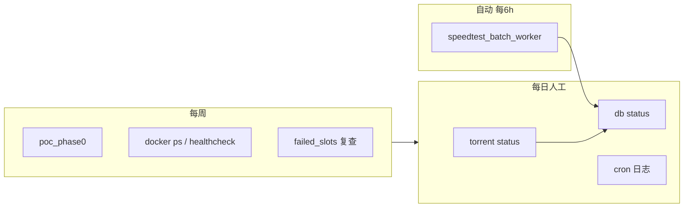

# 12 — 日常运营执行手册

> **版本：** v1.0（2026-07-04）  
> **适用阶段：** C2 SEO 冷启动（GSC 提交前）· T3 生成器已闭环 · VPS 测速 cron 已上线  
> **读者：** 日常运维 / 单人全栈  
> **命令细节：** 见 [06-run-cli使用说明.md](./06-run-cli使用说明.md)  
> **开发冲刺记录：** 见 [worklogs/](../worklogs/)（与本手册分离）

---

## 零、文档定位

| 文档 | 用途 | 更新频率 |
|------|------|----------|
| **本手册** | 重复性运营动作：巡检、cron、扩槽、生成、SEO 门禁 | 阶段切换或基线变更时 |
| [06-run-cli使用说明.md](./06-run-cli使用说明.md) | CLI 参数、退出码、故障排查 | 功能变更时 |
| [worklogs/YYYY-MM-DD/今日验收清单.md](../worklogs/) | 当日开发任务、验收、Git 快照 | 每日 |
| [jackett-stability.md](./jackett-stability.md) | Jackett / 多源 / 缓存策略 | 配置变更时 |
| [VPS迁移与部署.md](./VPS迁移与部署.md) | VPS IP、cron 安装、systemd | 迁移时 |
| [seo/TRACKER-E-E-A-T-InfoGain.md](./seo/TRACKER-E-E-A-T-InfoGain.md) | E-E-A-T / Info Gain 跟进看板、SEO 迭代日志 | SEO 变更或阶段切换时 |

**原则：** 本手册只写「做什么、多久做一次、通过标准」；具体命令复制块指向 §六 与 CLI 文档，避免两处维护同一长命令。

---

## 一、当前基线（2026-07-04）

> 阶段切换或大规模扩槽后，更新下表并改 `meta.updated_at`。

| 项 | 当前值 | 说明 |
|----|--------|------|
| **内容轨** | C2 SEO 冷启动 | G1–G3 已拍板；**GSC 提交仍暂缓** |
| **published 页** | **118**（`magnet_count ≥ 2`） | `python -m workflow.run db status` + `list_published_page_ids` |
| **sitemap** | ≤35 URL（首页 + Trust 4 + ≤30 indexable） | D3 决策；Hub **noindex,follow** |
| **测速 cron** | 每 6h · `--all-published --write --workers 5` | 见 [VPS迁移与部署.md](./VPS迁移与部署.md) |
| **VPS** | `172.237.11.232` | Jackett + FlareSolverr + SSH SOCKS |
| **失败槽登记册** | active **18** | [failed-slots-registry.json](../worklogs/failed-slots-registry.json) |
| **仍暂缓** | CF Pages 正式上线 · GSC · C4 批量扩页 | 勿在未过 C2 门禁前全量提交 sitemap |

---

## 二、运营节奏总览

| 频率 | 动作 | § | 耗时 |
|------|------|---|------|
| **每 6h（自动）** | 全 published 测速 cron | §四 | 0（cron） |
| **每日** | 数据源 status · DB 行数 · cron 日志 | §三 | ~10 min |
| **每周** | 四源 PoC · VPS 容器健康 · 失败槽复查 | §三 · §八 | ~30 min |
| **扩槽后** | pipeline batch → generate all → SEO 检查 | §五 · §七 | 视槽位数 |
| **发版前** | BB S04E06 回归槽 · seo_c2_checklist | §七 · §九 | ~20 min |
| **C2 门禁通过后** | CF Pages 部署 → GSC 属性 + sitemap | §七 | 一次性 |



---

## 三、每日例行（必做）

### 3.1 数据源连通

```bash
cd releasematch
python -m workflow.torrent_sources.run status
```

| 字段 | 通过标准 |
|------|----------|
| `jackett_probe.reachable` | `true` |
| `has_valid_api_key` | `true` |
| `jackett_base_url` | `http://172.237.11.232:9117` |

**失败时：** 见 [jackett-stability.md](./jackett-stability.md) §四 VPS healthcheck；必要时 `bash scripts/start_ssh_socks_tunnel.sh` 后重测 Nyaa/DMHy（[nyaa-proxy-asia.md](./nyaa-proxy-asia.md)）。

### 3.2 数据库快照

```bash
python -m workflow.run db status
```

| 指标 | 参考基线 | 异常信号 |
|------|----------|----------|
| `ping.ok` | `true` | 库不可达 → `db init` 或 MySQL 服务 |
| `media_pages` | ~139 | 突降 → 误删或 seed 覆盖 |
| `download_resources` | ~3600+ | 长期不涨 → pipeline/cron 停跑 |
| `slot_speed_summary` | **96/96 有 Rec** · 97/118 全 published | 有 Rec 页缺 summary → 手动 gap-fill 或查 cron |

### 3.3 测速 cron 日志（VPS 或本机 cron 环境）

```bash
# VPS 上
tail -50 /var/log/releasematch/speedtest-cron.log
# 最近一次 JSON 报告（路径以 crontab 为准）
ls -lt /var/log/releasematch/speedtest-batch.json
```

| 通过标准 | 说明 |
|----------|------|
| 无连续 Python traceback | 单槽 skip（TTL / no_recommended）可接受 |
| 最近一次 `ok/total` ≥ **80%** | 2026-07-04 基线：114 槽 92 ok（~81%） |
| 单次耗时 | 100+ 槽约 7–10 min（5 workers） |

### 3.4 每日勾选（复制到 worklog 或日历）

```
[ ] torrent_sources.run status 通过
[ ] db status ping.ok
[ ] 测速 cron 24h 内至少 1 次成功
[ ] 无 Jackett / MySQL 持续告警
```

---

## 四、测速 cron（每 6 小时 · 自动）

**推荐命令（生产）：**

```bash
cd /opt/releasematch/releasematch
.venv/bin/python scripts/speedtest_batch_worker.py \
  --all-published --write --workers 5 --target-bytes 262144 \
  --report /var/log/releasematch/speedtest-batch.json \
  >> /var/log/releasematch/speedtest-cron.log 2>&1
```

**crontab：**

```cron
0 */6 * * * cd /opt/releasematch/releasematch && .venv/bin/python scripts/speedtest_batch_worker.py --all-published --write --workers 5 --target-bytes 262144 --report /var/log/releasematch/speedtest-batch.json >> /var/log/releasematch/speedtest-cron.log 2>&1
```

| 参数 | 值 | 说明 |
|------|-----|------|
| `--all-published` | 必选 | 随 MySQL published 自动扩覆盖 |
| `--workers` | `5` | 与 2026-07-03 benchmark 一致 |
| `--target-bytes` | `262144`（256KB） | 日常默认；重点页可 1MB |
| TTL | 默认 6h | TTL 内 skip，配合 cron 不重复 Phase1 |

**Phase2-only 增量（可选）：** TTL 内仅补 Phase2 时加 `--phase2-only`（见 worklogs 2026-07-04 Phase2 benchmark）。日常 cron **不必** 默认开启。

完整 systemd / 安装说明：[VPS迁移与部署.md](./VPS迁移与部署.md) §测速 cron Worker。

---

## 五、内容刷新标准路径

扩槽、重拉、改模板后，按顺序执行（勿跳步）：

```bash
cd releasematch

# 1. 批量 pipeline（新槽位 JSON）
python -m workflow.run pipeline batch \
  --slots-json worklogs/YYYY-MM-DD/your-slots.json --fetch

# 2. 静态站 + sitemap
python -m workflow.run generate all

# 3. C2 SEO 本地门禁
bash scripts/seo_c2_checklist.sh

# 4. 测速（若 cron 未覆盖或刚扩槽）
python scripts/speedtest_batch_worker.py \
  --all-published --write --workers 5 \
  --report worklogs/$(date +%Y-%m-%d)/speedtest-all-published-benchmark.json
```

| 步骤 | 通过标准 |
|------|----------|
| pipeline batch | 报告 0 fail；单槽 ≥2 magnet → `published` |
| generate all | 退出码 0；`portal/dist/sitemap.xml` 存在 |
| seo_c2_checklist | 退出码 0（无 FAIL） |
| 测速 | 报告 JSON 中 ok 比例 ≥80% |

**缓存策略：** 日常 pipeline **不加** `--force`，优先 6h 缓存（[jackett-stability.md](./jackett-stability.md) §3.2）。仅调试或验收单槽时使用 `--force`。

---

## 六、命令速查

| 场景 | 命令 |
|------|------|
| 全局状态 | `python -m workflow.run status` |
| 单页上下文 | `python -m workflow.run query page --page-id tv:1396:s04e06` |
| 单槽拉取+入库 | `python -m workflow.run pipeline slot --tmdb 1396 --season 4 --episode 6 --mode live --fetch` |
| 本地预览 | `python -m workflow.run serve` |
| 失败槽列表 | `python scripts/failed_slots_merge_reports.py --list-active` |
| 失败槽重试 | `python -m workflow.run pipeline batch --slots-json data/failed_slots/failed-slots.json --fetch --no-skip-existing` |
| SSH SOCKS（Nyaa/DMHy） | `bash scripts/start_ssh_socks_tunnel.sh` |
| 华语源探测 | `python scripts/cn_probe_sources.py --slots-json ... --report ...` |
| SEO JSON 报告 | `bash scripts/seo_c2_checklist.sh --json` |

---

## 七、SEO 运营（C2 阶段）

### 7.1 已落地决策（勿回退）

| ID | 决策 | 落地 |
|----|------|------|
| D1 | 全站 `lang="en"` | `base.html` |
| D2 | Hub `noindex,follow` | `show_hub.html` |
| D3 | sitemap ≤30 indexable 内容页 | `portal/generator/sitemap.py` |
| D4 | subtitle 出站 `nofollow ugc` | `episode.html` |

### 7.2 本地验收（每次 `generate all` 后）

```bash
python -m workflow.run generate all
bash scripts/seo_c2_checklist.sh
# 或一键：bash scripts/seo_c2_checklist.sh --prepare
```

**通过标准：** 退出码 `0`。§6.4 GSC、HTTPS/HSTS **须上线后**在 Search Console 验收（脚本标记 SKIP）。

### 7.3 上线与 GSC（暂缓清单）

| 步骤 | 状态 | 说明 |
|------|------|------|
| `generate all` + seo_c2 全绿 | ✅ 可重复跑 | 本地门禁 |
| `bash scripts/deploy_cf_pages.sh` | ⏸ | CF Pages 正式上线仍暂缓 |
| GSC 属性验证 + sitemap 提交 | ⏸ | **C2 全部门禁通过后再做** |
| C4 每周 +50 页 | ⏸ | 收录率 &lt;25% 时不启动 |

任务明细：[worklogs/2026-07-03/页面SEO分析与优化方向.md](../worklogs/2026-07-03/页面SEO分析与优化方向.md) · 战略：[全球SEO流量定位.md](./全球SEO流量定位.md) §十五。

---

## 八、失败槽与稀缺页

| 动作 | 命令 / 文件 |
|------|-------------|
| 查看 active 失败槽 | `python scripts/failed_slots_merge_reports.py --list-active` |
| 登记册 | [worklogs/failed-slots-registry.json](../worklogs/failed-slots-registry.json) |
| 合并 pipeline 报告 | `python scripts/failed_slots_merge_reports.py --merge ...` |
| 首页稀缺追踪 | `generate all` 自动读 `failed_slots_store`（UX-06） |

**运营规则：**

- `genuine_scarcity`：真稀缺，保留叙事，勿无限 `--force` 重拉
- `fetch_error` / 配置类：修源后 batch 重试
- active 数突增 → 查 Jackett / 代理 / indexer 是否集体失败

---

## 九、华语源（CN 路由）

日常以 **国际源 + cn 路由** 为主；DMHy/Mikan 经 VPS SOCKS。

| 场景 | 动作 |
|------|------|
| DMHy 超时 | `bash scripts/start_ssh_socks_tunnel.sh` → `bash scripts/test_dmhy_via_socks.sh` |
| 华语 PoC / 探测 | 见 [11-CN华语影视资源方案.md](./11-CN华语影视资源方案.md) · [worklogs/2026-07-04/华语todo.md](../worklogs/2026-07-04/华语todo.md) |
| 国漫 vs 真人剧 | 国漫走 dmhy/mikan；真人剧 S01E01 常靠国际 Complete 包 |

**产品口径：** 华语页 metric = Recommended + 平台源标识 + 稀缺叙事，**非** magnet 条数。

---

## 十、每周例行

```bash
cd releasematch

# 四源通道 PoC
python scripts/poc_phase0.py

# VPS 容器（SSH 到 172.237.11.232）
docker ps --filter name=jackett --filter name=flaresolverr
# 可选：查看 /opt/healthcheck.sh 日志

# 失败槽：是否有可关闭项
python scripts/failed_slots_merge_reports.py --list-active
```

| 动作 | 通过标准 |
|------|----------|
| poc_phase0 | 四源至少各 1 条有效结果 |
| docker ps | jackett + flaresolverr Up |
| 失败槽 | active 无异常批量新增 |

---

## 十一、发版前回归

固定基准槽 **Breaking Bad S04E06**（tmdb 1396）：

```bash
python -m workflow.torrent_sources.run test --tmdb 1396 --season 4 --episode 6 --force
python -m workflow.run pipeline slot --tmdb 1396 --season 4 --episode 6 --mode live --fetch
python -m workflow.run generate page --page-id tv:1396:s04e06
bash scripts/seo_c2_checklist.sh
```

| 指标 | 期望 |
|------|------|
| slot_filter 后条数 | 与 S04E06 一致，无百条误匹配 |
| 页面 All Sources | ~10+ 条 |
| seo_c2_checklist | 退出码 0 |

---

## 十二、故障速查

| 现象 | 第一步 | 详情 |
|------|--------|------|
| Jackett unreachable | VPS `docker ps` · 重启容器 | [jackett-stability.md](./jackett-stability.md) |
| Nyaa/DMHy 超时 | SSH SOCKS 隧道 | [nyaa-proxy-asia.md](./nyaa-proxy-asia.md) |
| pipeline items &lt; 2 | `run status` · 单 indexer 诊断 | [06-run-cli §八](./06-run-cli使用说明.md) |
| 测速全 dry_run | 安装 libtorrent | worklogs speedtest 文档 |
| seo_c2 FAIL | 看 FAIL 项（OG/favicon/privacy） | worklogs SEO §六 |
| cron 无新 summary | 查 log · 手动跑 worker | §四 |
| MySQL 1049 | `python -m workflow.run db init` | [05-存储与部署配置.md](./05-存储与部署配置.md) |

---

## 十三、指标看板（建议记录）

每周在 worklog 或表格中记录：

| 指标 | 来源 |
|------|------|
| published 页数 | `list_published_page_ids()` 长度 |
| 测速覆盖率 | `slot_speed_summary` / published |
| cron ok 率 | speedtest JSON 报告 |
| failed_slots active | registry `meta.active_count` |
| sitemap URL 数 | `portal/dist/sitemap.xml` |
| seo_c2 最近结果 | checklist 退出码 + FAIL 数 |

---

## 十四、与 worklog 的分工

| 类型 | 写哪里 |
|------|--------|
| **重复性运维**（本节各 §） | 本手册；仅基线变更时改 §一 |
| **当日开发 / 验收 / Git** | `worklogs/YYYY-MM-DD/今日验收清单.md` |
| **专题待办**（如华语 H14–H18） | `worklogs/YYYY-MM-DD/华语todo.md` 等 |
| **一次性决策** | 方案文档或 worklog，本手册只引用 |

**建议：** 每日开工复制 [worklogs 模板](../worklogs/README.md#日志模板建议) 写验收清单；巡检项从本手册 §三 勾选。

---

## 十五、关联文档

| 文档 | 说明 |
|------|------|
| [06-run-cli使用说明.md](./06-run-cli使用说明.md) | CLI 完整参考 |
| [VPS迁移与部署.md](./VPS迁移与部署.md) | VPS · cron · systemd |
| [jackett-stability.md](./jackett-stability.md) | 多源 · 缓存 · healthcheck |
| [05-存储与部署配置.md](./05-存储与部署配置.md) | MySQL · 环境变量 |
| [全球SEO流量定位.md](./全球SEO流量定位.md) | C2/C3/C4 节奏 |
| [11-CN华语影视资源方案.md](./11-CN华语影视资源方案.md) | 华语路由与 PoC |
| [worklogs/2026-07-03/页面SEO分析与优化方向.md](../worklogs/2026-07-03/页面SEO分析与优化方向.md) | T-SEO 任务清单 |
| [worklogs/2026-07-03/页面UX分析与优化方向.md](../worklogs/2026-07-03/页面UX分析与优化方向.md) | UX 验收项 |

---

## 变更记录

| 版本 | 日期 | 说明 |
|------|------|------|
| v1.0 | 2026-07-04 | 初版：从 VPS/cron/jackett-stability/今日验收清单  Consolidate；区分 worklog 与重复运维 |
