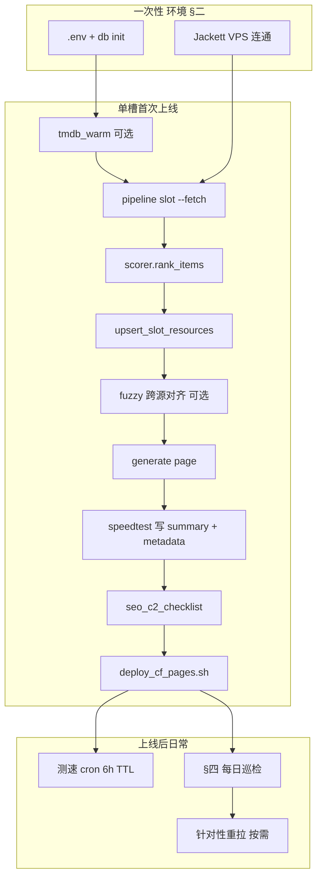
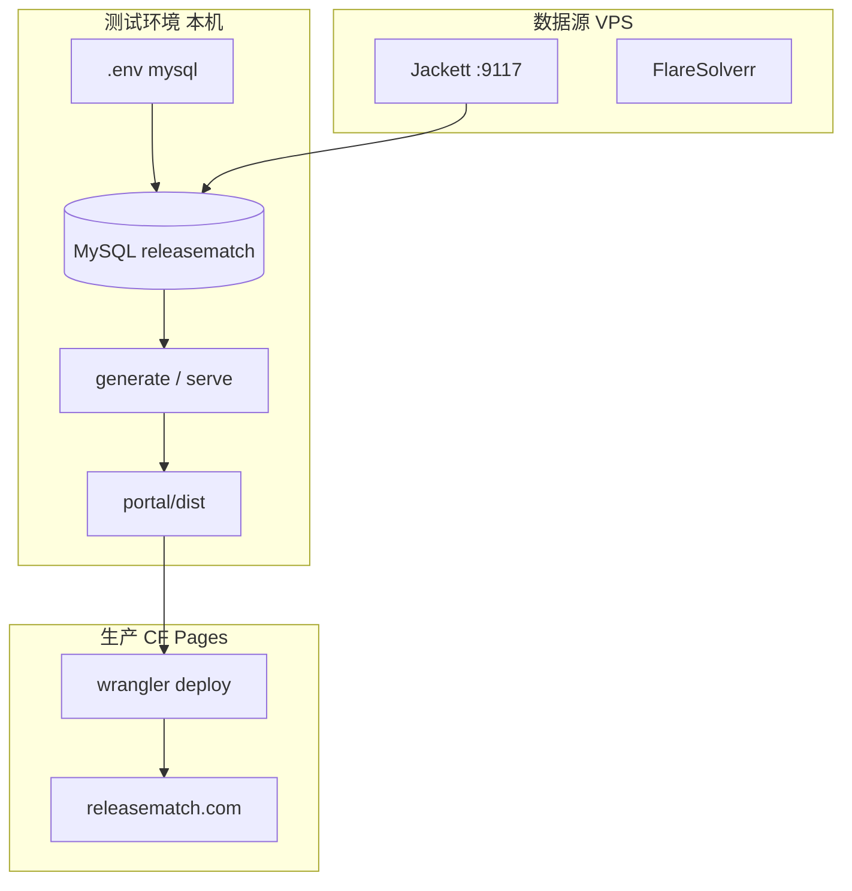
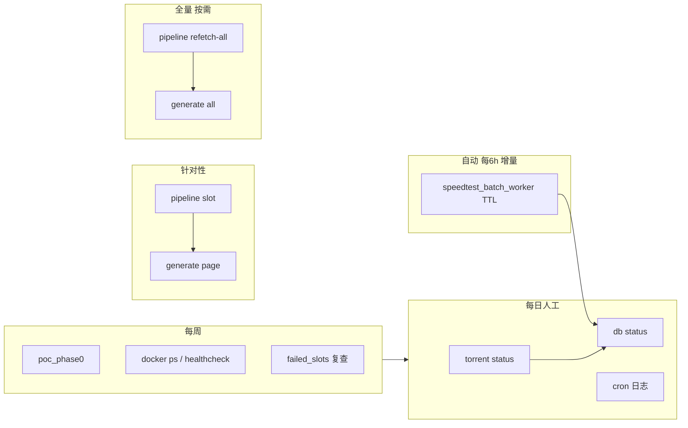

# 12 — 日常运营执行手册

> **版本：** v1.5（2026-07-06）  
> **适用阶段：** C2 SEO 冷启动 — **本地 §6.1～6.3 已通过** · GSC/CF 仍暂缓  
> **读者：** 日常运维 / 单人全栈  
> **命令细节：** 见 [06-run-cli使用说明.md](./06-run-cli使用说明.md)  
> **环境配置：** 见 [05-存储与部署配置.md](./05-存储与部署配置.md) · [07-部署架构解疑.md](./07-部署架构解疑.md)  
> **开发冲刺记录：** 见 [worklogs/](../worklogs/)（与本手册分离）

---

## 零、文档定位

| 文档 | 用途 | 更新频率 |
|------|------|----------|
| **本手册** | 重复性运营动作：环境部署、巡检、cron、增量/全量/针对性更新、SEO 门禁；**§一附 单槽端到端叙事** | 阶段切换或基线变更时 |
| [06-run-cli使用说明.md](./06-run-cli使用说明.md) | CLI 参数、退出码、故障排查 | 功能变更时 |
| [05-存储与部署配置.md](./05-存储与部署配置.md) | MySQL / D1 环境变量、db init | 存储变更时 |
| [07-部署架构解疑.md](./07-部署架构解疑.md) | CF Pages、generate、D1 是否必需 | 部署决策变更时 |
| [worklogs/YYYY-MM-DD/今日验收清单.md](../worklogs/) | 当日开发任务、验收、Git 快照 | 每日 |
| [jackett-stability.md](./jackett-stability.md) | Jackett / 多源 / 缓存策略 | 配置变更时 |
| [VPS迁移与部署.md](./VPS迁移与部署.md) | VPS IP、cron 安装、systemd | 迁移时 |
| [seo/TRACKER-E-E-A-T-InfoGain.md](./seo/TRACKER-E-E-A-T-InfoGain.md) | E-E-A-T / Info Gain 跟进看板、SEO 迭代日志 | SEO 变更或阶段切换时 |
| [15-多地多环境开发切换.md](./15-多地多环境开发切换.md) | 两地 Mac/Windows：私有仓同步代码+密钥、收工/开工 | 切换流程变更时 |

**原则：** 本手册只写「做什么、多久做一次、通过标准」；具体命令复制块指向 §七 与 CLI 文档，避免两处维护同一长命令。

---

## 一、当前基线（2026-07-05）

> 阶段切换或大规模扩槽后，更新下表并改 `meta.updated_at`。

| 项 | 当前值 | 说明 |
|----|--------|------|
| **内容轨** | C2 SEO 冷启动 | **本地 C2 checklist 13 pass**；GSC/CF 仍暂缓 |
| **published 页** | **117**（indexable · `magnet_count ≥ 2` + 有 Rec） | renderable **120**（含 thin / 无 Rec noindex） |
| **sitemap** | **36 URL**（首页 + Trust **5** + ≤30 indexable） | D3 决策；Hub **noindex,follow** |
| **C2 本地门禁** | **`seo_c2_checklist` 13 pass / 0 fail** | OG + favicon + Schema 已落地（2026-07-05） |
| **测速 cron** | 每 6h · `--all-published --write --workers 5` | Rec+summary **107/107** |
| **VPS** | `172.236.156.193` | Jackett + FlareSolverr + SSH SOCKS |
| **跨源分母** | `cross_source_total` 均值 **3.58**（max **6**） | 分子 cross≥2 **8/110** · 7+ 代理 **7** |
| **失败槽登记册** | active **18** | [failed-slots-registry.json](../worklogs/failed-slots-registry.json) |
| **仍暂缓** | CF Pages 正式上线 · GSC · C4 批量扩页 | dist 须 sync Trust/static 后再跑 checklist |

---

## 一附、单槽端到端示例（Breaking Bad S04E06）

> **目的：** 用一个真实槽位串起「首次上线」与「上线后日常」；其余 § 为矩阵与速查，本节为**叙事主线**。  
> **示例槽：** 回归基准 **Breaking Bad S04E06** — 数据成熟、源稳定，与 §十三发版回归一致。

### 附.1 槽位身份

| 字段 | 值 |
|------|-----|
| **page_id** | `tv:1396:s04e06` |
| **TMDB** | `1396` · S04E06 |
| **canonical** | `/breaking-bad/s4e6/` |
| **dist 路径** | `portal/dist/breaking-bad/s4e6/index.html` |

### 附.2 全流程总览



**数据流口诀：** Jackett 拉 magnet → scorer 选 Recommended → MySQL 定 `page_status` → Jinja bake 进 dist → 测速写 `slot_speed_summary` / `torrent_metadata` → SEO 门禁 → wrangler 上线。

### 附.3 阶段 0 — 环境就绪（一次性）

首次在本机跑任意槽前完成（细节见 §二）：

```bash
cd releasematch
cp config.env.example .env          # RM_STORAGE_BACKEND=mysql
python -m workflow.run db init --seed
bash scripts/sync_jackett_vps_key.sh --host 172.236.156.193
python -m workflow.torrent_sources.run status   # jackett_probe.reachable=true
```

**逻辑：** `db init --seed` 已写入 S04E06 的 demo 资源；生产扩槽走 `--fetch`，不依赖 seed。

### 附.4 阶段 1 — 定义槽位（MySQL 骨架）

```bash
# 可选：预热 TMDB external_ids（imdb/tvdb），减少首次拉取失败
python scripts/tmdb_warm_external_ids.py \
  --slots-json worklogs/YYYY-MM-DD/bb-s04e06.json

# 单槽拉取 + 全流程 pipeline（live 必须 --fetch）
python -m workflow.run pipeline slot \
  --tmdb 1396 --season 4 --episode 6 \
  --mode live --fetch

# 验收：看 Jinja 上下文与 Recommended
python -m workflow.run query page --page-id tv:1396:s04e06
```

**内部逻辑（`run_slot_pipeline`）：**

1. `resolve_page_id` → `tv:1396:s04e06`
2. `ensure_slot_page` → 写入/更新 `media_pages` + `catalog` 行（`canonical_path` 等）
3. 若 `--fetch`：`enrich_external_ids` → `FetchService.fetch_slot` → 多 indexer（Jackett）拉 magnet
4. 每条 item `enrich_item_dict`（release 解析、体积、编码等）
5. `rank_items` → scorer 排序，首位为 **Recommended**
6. `upsert_slot_resources` → `download_resources` 全量替换 + 更新页级字段

**拉取缓存：** 不加 `--force` 时命中 **6h TTL**（[jackett-stability.md](./jackett-stability.md)）；调试或源恢复后：

```bash
python -m workflow.torrent_sources.run test --tmdb 1396 --season 4 --episode 6 --force
python -m workflow.run pipeline slot --tmdb 1396 --season 4 --episode 6 --mode live --fetch --force
```

### 附.5 阶段 2 — 发布门禁（写库结果判定）

pipeline 返回的 `write` 块与 `query page` 应对齐：

| 条件 | `page_status` | `robots_noindex` | 是否 indexable | 是否进 sitemap |
|------|---------------|------------------|----------------|----------------|
| `magnet_count < 2` | `thin` | `1` | 否 | 否 |
| `magnet_count ≥ 2` 但无 Recommended | `published` | `1` | 否 | 否 |
| `magnet_count ≥ 2` 且有 Recommended | `published` | `0` | **是** | 可能（D3 ≤30 内容页） |

**逻辑出处：** `mysql_store.upsert_slot_resources` 写 `magnet_count` / `page_status` / `robots_noindex`；`MediaPage.is_indexable()` 要求三者同时满足。

```bash
python -m workflow.run query page --page-id tv:1396:s04e06
# 关注：magnet_count、page_status、recommended、cross_source_count/total
```

S04E06 典型：`magnet_count` 10+ · `page_status=published` · 有 NTb 等 Recommended · `robots_noindex=false`。

**未达标：** 记入 [failed-slots-registry.json](../worklogs/failed-slots-registry.json)（§十）；`genuine_scarcity` 勿无限 `--force`。

### 附.6 阶段 3 — 跨源 fuzzy 对齐（按需）

Indexer 变更或 S-04 规则调整后：

```bash
python scripts/recompute_cross_source_fuzzy.py --page-id tv:1396:s04e06
python -m workflow.run generate page --page-id tv:1396:s04e06
```

**逻辑：** 不重拉 Jackett；读已有 `download_resources`，按标题 fuzzy 对齐跨源计数，更新 `cross_source_count` / `cross_source_total`，再 bake 进 HTML。

全站变更走 `recompute_cross_source_fuzzy.py --all-published --rescore-after`（§7.5）。

### 附.7 阶段 4 — 生成静态 HTML

```bash
# 单页验证（扩 1 槽时推荐）
python -m workflow.run generate page --page-id tv:1396:s04e06

# 发版前全站（首页聚合 + sitemap 重算 + Trust + static 壳）
python -m workflow.run generate all

# 可选：部署脚本仅做 dist 校验与 wrangler 准备（generate all 已含 Trust/static）
bash scripts/deploy_cf_pages.sh --prepare-only
```

**逻辑：**

- `generate page` 只处理 `list_published_page_ids()` 中的槽（`published` 且 `magnet_count ≥ 2`）
- 输出 `portal/dist/breaking-bad/s4e6/index.html`；bake Recommended 理由、All Sources、测速折叠块、torrent metadata 面板（A-11）
- `generate all` 额外写首页、`sitemap.xml`（D3：≤30 indexable 内容页 + Trust 6 + 首页）、`static_shell`（`dist/static/`、404/410）
- Hub 页（`/breaking-bad/`）**noindex,follow**（D2），不进 sitemap

**本地预览：**

```bash
# 动态（读 MySQL）
python -m workflow.run serve
# http://127.0.0.1:8080/breaking-bad/s4e6/

# 静态 dist（部署同源，推荐验收双语）
python -m workflow.run serve-static --port 8080
```

### 附.8 阶段 5 — 测速与 torrent metadata

```bash
# 单槽测速（写 slot_speed_summary + torrent_metadata）
python scripts/speedtest_batch_worker.py \
  --page-ids tv:1396:s04e06 --write --workers 1 \
  --report worklogs/$(date +%Y-%m-%d)/speedtest-s04e06.json

# metadata 已入库但 dist 无面板时 — 必须 regenerate
python -m workflow.run generate page --page-id tv:1396:s04e06
```

**逻辑（两阶段）：**

| 阶段 | 写入 | 页面体现 |
|------|------|----------|
| **Phase 1** | peers、下载字节、速度 | Recommended 折叠「Speed test」 |
| **Phase 2** | `torrent_metadata`（体积、文件列表、size_match） | 折叠「Torrent structure」+ reason 中 swarm 验证句（A-11） |

**TTL：** cron 默认 **6h** 内跳过已测槽；加 `--force` 强制重测。dead swarm 槽可能无 metadata（2026-07-06 基线约 40/115）。

**不重拉 indexer 的全量 metadata 回填：**

```bash
python scripts/speedtest_retest_no_refetch.py --write --workers 5
python -m workflow.run generate all
```

### 附.9 阶段 6 — SEO 门禁

```bash
bash scripts/seo_c2_checklist.sh
# 或 JSON：bash scripts/seo_c2_checklist.sh --json
```

**通过标准：** 退出码 `0`（13 pass / 0 fail）。检查 dist 中 S04E06：canonical、OG、Schema、Hero 表格含 Magnet、无 duplicate REC 行。

### 附.10 阶段 7 — 生产上线

```bash
# 当前阶段：仅构建 dist + 本地门禁（CF 正式上线仍暂缓 §9.3）
bash scripts/deploy_cf_pages.sh --prepare-only
bash scripts/seo_c2_checklist.sh

# 正式上线时（GSC 前置）
CF_PROJECT=releasematch bash scripts/deploy_cf_pages.sh
```

**逻辑：** `deploy_cf_pages.sh` = `generate all` → rsync Trust/static/404 → `wrangler deploy` 上传 `portal/dist`。

### 附.11 上线后 — 该槽的日常运营

| 频率 | 动作 | 命令 / 机制 | S04E06 说明 |
|------|------|-------------|-------------|
| **每 6h 自动** | 测速增量 | cron `speedtest_batch_worker --all-published` | TTL 内 skip；到期重测 Phase1/2，刷新 summary/metadata |
| **每日** | 数据源 + DB | §4.1–4.2 `torrent_sources.run status` · `db status` | 确认 `slot_speed_summary` 覆盖率；S04E06 应有 Rec+summary |
| **每日** | TMDB 标题库 | `ops tmdb-sync`（全量下载 → MySQL 增量） | Ops UI 搜索选槽依赖 `tmdb_export_titles`；同日幂等可跳过 |
| **每日** | cron 日志 | `tail speedtest-cron.log` | 单槽 skip 正常；连续 traceback 需人工介入 |
| **每周** | 回归 + PoC | §十二 `poc_phase0` · 可选 S04E06 force 重拉 | 发版前必跑 §十三 全套 |
| **按需** | 修数据 | §7.3 单槽 `pipeline slot --fetch` → `generate page` | Jackett/indexer 恢复后 |
| **按需** | 仅改模板 | `generate page`（不必 refetch） | Jinja/CSS 变更 |
| **Indexer 大变更** | 全量 | `refetch-all` → fuzzy → `generate all` | 约 1.5–3h，117 槽 |

**该槽日常无需人工命令** — 只要 cron 与 Jackett 健康，测速与 TTL 自动维护；人工只在巡检异常、模板/规则变更、或发版前回归时介入。

### 附.12 单槽命令清单（复制块）

```bash
cd releasematch

# —— 首次上线（按序，勿跳步）——
python -m workflow.run pipeline slot --tmdb 1396 --season 4 --episode 6 --mode live --fetch
python -m workflow.run query page --page-id tv:1396:s04e06
python scripts/recompute_cross_source_fuzzy.py --page-id tv:1396:s04e06   # 可选
python -m workflow.run generate page --page-id tv:1396:s04e06
python scripts/speedtest_batch_worker.py --page-ids tv:1396:s04e06 --write --workers 1
python -m workflow.run generate page --page-id tv:1396:s04e06   # 测速后须再 generate
bash scripts/deploy_cf_pages.sh --prepare-only
bash scripts/seo_c2_checklist.sh
# CF_PROJECT=releasematch bash scripts/deploy_cf_pages.sh   # 正式上线时取消注释

# —— 日常巡检（全站，含本槽）——
python -m workflow.torrent_sources.run status
python -m workflow.run db status

# —— 发版前回归（固定本槽）——
python -m workflow.torrent_sources.run test --tmdb 1396 --season 4 --episode 6 --force
python -m workflow.run pipeline slot --tmdb 1396 --season 4 --episode 6 --mode live --fetch
python -m workflow.run generate page --page-id tv:1396:s04e06
bash scripts/seo_c2_checklist.sh
```

### 附.13 失败分支速查

| 现象 | 可能原因 | 第一步 |
|------|----------|--------|
| pipeline `magnet_count < 2` | 源稀缺 / Jackett 挂 / 代理未开 | `torrent_sources.run test --force` · SOCKS（§十一） |
| 有 magnet 无 Recommended | scorer 过滤过严 / 条目质量差 | `query page` 看 sources；调 scorer 后 `rescore` + `generate` |
| 测速 skip `no_recommended` | 上栏 | 先修 pipeline |
| dist 无 metadata 面板 | 测速后未 `generate` | `generate page` 或 `generate all` |
| seo_c2 FAIL | Trust 缺页 / dist 过期 | `deploy_cf_pages.sh --prepare-only` 后重跑 |
| cron 长期不更新本槽 | TTL 内 / worker 崩溃 | 手动 `--page-ids` 单槽测速；查 cron log |

---

## 二、测试 / 生产环境配置与部署

### 2.1 三层环境划分

| 环境 | 职责 | 数据存储 | 静态产出 | 典型路径 |
|------|------|----------|----------|----------|
| **测试（本机）** | 开发、验收、SEO 本地门禁 | MySQL `RM_STORAGE_BACKEND=mysql` | `portal/dist/`（不上传） | `python -m workflow.run serve` |
| **数据源（VPS）** | Jackett / FlareSolverr / SOCKS | 无业务库 | — | `172.236.156.193:9117` |
| **生产（CF Pages）** | 公网静态站托管 | 仍由本机 MySQL 生成后上传（路线 A） | `portal/dist/` → wrangler | `bash scripts/deploy_cf_pages.sh` |

> **路线 A（当前）：** 本机 MySQL → pipeline → `generate all` → `deploy_cf_pages.sh` → Cloudflare。D1 sync Worker 属 T3 计划，见 [05-存储与部署配置.md](./05-存储与部署配置.md) §六。



### 2.2 测试环境 — 首次配置

```bash
cd releasematch

# 1. 环境变量（测试固定 mysql）
cp config.env.example .env
# 编辑 RM_RELEASE_MYSQL_USER / RM_RELEASE_MYSQL_PASSWORD
# 确认 RM_STORAGE_BACKEND=mysql · RM_SHOW_IG_DEBUG=0

# 2. Python 依赖
python3 -m venv .venv && source .venv/bin/activate
pip install -r requirements.txt

# 3. 建库 + 演示种子
python -m workflow.run db init --seed

# 4. Jackett 凭证（VPS）
cp workflow/torrent_sources/accounts.example.json \
   workflow/torrent_sources/accounts.local.json
bash scripts/sync_jackett_vps_key.sh --host 172.236.156.193

# 5. 连通验收
python -m workflow.run status
python -m workflow.torrent_sources.run status
python -m workflow.run db status
```

| 检查项 | 通过标准 |
|--------|----------|
| `workflow.run status` | MySQL ping.ok |
| `torrent_sources.run status` | `jackett_probe.reachable=true` |
| `db status` | 表齐全 · S04E06 有 4 条 resource |

### 2.3 测试环境 — 本地预览与 dist 构建

```bash
cd releasematch

# 动态预览（读 MySQL 实时渲染，非生产方案）
python -m workflow.run serve
# 浏览器 http://127.0.0.1:8080/

# 构建 dist（generate all 已含 Trust/static；不上传 CF）
bash scripts/deploy_cf_pages.sh --prepare-only
# 等价：bash scripts/seo_c2_checklist.sh --prepare

# C2 SEO 本地门禁
bash scripts/seo_c2_checklist.sh
```

### 2.4 数据源 VPS — 部署与同步

```bash
cd releasematch

# 一键安装 / 重建 Jackett + FlareSolverr
export SSHPASS=$(python3 -c "import json; print(json.load(open('workflow/torrent_sources/servers.local.json'))['jackett_vps_japan']['ssh']['password'])")
FORCE_RECREATE=1 bash scripts/deploy_jackett_vps.sh --host 172.236.156.193

# API Key → accounts.local.json
bash scripts/sync_jackett_vps_key.sh --host 172.236.156.193

# Nyaa/DMHy 代理隧道（本机）
bash scripts/start_ssh_socks_tunnel.sh
bash scripts/test_dmhy_via_socks.sh
```

详见 [VPS迁移与部署.md](./VPS迁移与部署.md)。

### 2.5 生产环境 — CF Pages 部署

**前置：** 本机 `seo_c2_checklist` 13 pass；`RM_SITE_ORIGIN` 与线上域名一致。

```bash
cd releasematch

# 仅构建 dist（发版前本地验收）
bash scripts/deploy_cf_pages.sh --prepare-only
bash scripts/seo_c2_checklist.sh

# 正式上线（generate + sync 壳 + wrangler deploy）
# 需 wrangler login 或 CLOUDFLARE_API_TOKEN
CF_PROJECT=releasematch bash scripts/deploy_cf_pages.sh
```

| 变量 / 文件 | 说明 |
|-------------|------|
| `CF_PROJECT` | Cloudflare 项目名，默认 `releasematch` |
| `CLOUDFLARE_API_TOKEN` | CI / 无头部署用 |
| `wrangler.toml` | `[assets] directory = ./portal/dist` |
| `RM_SITE_ORIGIN` | `.env` 中 canonical / OG 域名 |

**生产部署检查清单：**

```
[ ] deploy_cf_pages.sh --prepare-only 退出码 0
[ ] seo_c2_checklist 13 pass / 0 fail
[ ] portal/dist/sitemap.xml 存在且 URL 数符合 D3
[ ] Trust 五页 + static 已 rsync 进 dist
[ ] wrangler deploy 成功（正式上线时）
```

> **当前状态：** CF Pages 正式上线仍暂缓（§8.3）；日常以 `--prepare-only` + 本地门禁为主。

### 2.6 生产测速 cron（VPS 或本机）

与测试共用同一 MySQL；cron 跑在能连库且有 `libtorrent` 的机器上：

```bash
# 安装示例见 VPS迁移与部署.md
0 */6 * * * cd /opt/releasematch/releasematch && .venv/bin/python scripts/speedtest_batch_worker.py --all-published --write --workers 5 --target-bytes 262144 --report /var/log/releasematch/speedtest-batch.json >> /var/log/releasematch/speedtest-cron.log 2>&1

# 每天 06:30 — TMDB Daily Export 全量下载 → MySQL 增量入库（Ops 搜索选槽）
30 6 * * * cd /opt/releasematch/releasematch && .venv/bin/python -m workflow.run ops tmdb-sync >> /var/log/releasematch/tmdb-sync-cron.log 2>&1
```

---

## 三、运营节奏总览

| 频率 | 动作 | § | 耗时 |
|------|------|---|------|
| **每 6h（自动）** | 全 published 测速 cron（**增量 TTL**） | §五 | 0（cron） |
| **每日** | 数据源 status · DB 行数 · cron 日志 | §四 | ~10 min |
| **每周** | 四源 PoC · VPS 容器健康 · 失败槽复查 | §四 · §十 | ~30 min |
| **扩槽后** | pipeline batch → generate all → SEO 检查 | §一附 · §六 · §七 · §八 | 视槽位数 |
| **针对性更新** | 单槽 pipeline → generate page → 可选测速 | §一附 · §七 | ~5 min/槽 |
| **Indexer/跨源变更** | refetch-all → fuzzy 重算 → generate all | §七 | 1.5–3h |
| **发版前** | BB S04E06 回归槽 · seo_c2_checklist | §十二 · §八 | ~20 min |
| **C2 门禁通过后** | CF Pages 部署 → GSC 属性 + sitemap | §八 | 一次性 |



---

## 四、每日例行（必做）

### 4.1 数据源连通

```bash
cd releasematch
python -m workflow.torrent_sources.run status
```

| 字段 | 通过标准 |
|------|----------|
| `jackett_probe.reachable` | `true` |
| `has_valid_api_key` | `true` |
| `jackett_base_url` | `http://172.236.156.193:9117` |

**失败时：** 见 [jackett-stability.md](./jackett-stability.md) §四 VPS healthcheck；必要时 `bash scripts/start_ssh_socks_tunnel.sh` 后重测 Nyaa/DMHy（[nyaa-proxy-asia.md](./nyaa-proxy-asia.md)）。

### 4.2 数据库快照

```bash
python -m workflow.run db status
```

| 指标 | 参考基线 | 异常信号 |
|------|----------|----------|
| `ping.ok` | `true` | 库不可达 → `db init` 或 MySQL 服务 |
| `media_pages` | ~139 | 突降 → 误删或 seed 覆盖 |
| `download_resources` | ~3600+ | 长期不涨 → pipeline/cron 停跑 |
| `slot_speed_summary` | **107/107 有 Rec** · 117 indexable published | 有 Rec 页缺 summary → gap-fill 或查 cron |

### 4.3 测速 cron 日志（VPS 或本机 cron 环境）

```bash
# VPS 上
tail -50 /var/log/releasematch/speedtest-cron.log
# 最近一次 JSON 报告（路径以 crontab 为准）
ls -lt /var/log/releasematch/speedtest-batch.json
```

| 通过标准 | 说明 |
|----------|------|
| 无连续 Python traceback | 单槽 skip（TTL / no_recommended）可接受 |
| 最近一次 `ok/total` ≥ **80%** | 2026-07-04 基线：114 槽 92 ok（~81%） |
| 单次耗时 | 100+ 槽约 7–10 min（5 workers） |

### 4.4 每日勾选（复制到 worklog 或日历）

```
[ ] torrent_sources.run status 通过
[ ] db status ping.ok
[ ] 测速 cron 24h 内至少 1 次成功
[ ] 无 Jackett / MySQL 持续告警
[ ] 若有昨日扩槽/改模板：已跑针对性或全量 generate（见 §七）
```

---

## 五、测速 cron（每 6 小时 · 自动 · 增量）

**推荐命令（生产）：**

```bash
cd /opt/releasematch/releasematch
.venv/bin/python scripts/speedtest_batch_worker.py \
  --all-published --write --workers 5 --target-bytes 262144 \
  --report /var/log/releasematch/speedtest-batch.json \
  >> /var/log/releasematch/speedtest-cron.log 2>&1
```

**crontab：**

```cron
0 */6 * * * cd /opt/releasematch/releasematch && .venv/bin/python scripts/speedtest_batch_worker.py --all-published --write --workers 5 --target-bytes 262144 --report /var/log/releasematch/speedtest-batch.json >> /var/log/releasematch/speedtest-cron.log 2>&1
30 6 * * * cd /opt/releasematch/releasematch && .venv/bin/python -m workflow.run ops tmdb-sync >> /var/log/releasematch/tmdb-sync-cron.log 2>&1
```

| 参数 | 值 | 说明 |
|------|-----|------|
| `--all-published` | 必选 | 随 MySQL published 自动扩覆盖 |
| `--workers` | `5` | 与 2026-07-03 benchmark 一致 |
| `--target-bytes` | `262144`（256KB） | 日常默认；重点页可 1MB |
| torrent metadata | Phase 2 自动写入 `torrent_metadata` | 新库已含表；旧库跑 `schema/mysql_migrate_torrent_metadata.sql` |
| TTL | 默认 6h | TTL 内 skip，配合 cron 不重复 Phase1 |

**测速模式对照：**

| 模式 | 命令要点 | 何时用 |
|------|----------|--------|
| **增量（cron 默认）** | 不加 `--force` | 每 6h 自动；TTL 内跳过已测槽 |
| **Phase2 增量** | 加 `--phase2-only` | TTL 内仅补 Phase2 测速 |
| **全量强制** | 加 `--force` | 扩槽后 / libtorrent 升级 / 验收 benchmark |
| **针对性** | `--page-ids tv:1396:s04e06` 或 `--slots-json` | 单页或少量槽补测 |
| **不重拉重测** | `speedtest_retest_no_refetch.py` | 仅回填 metadata / 强制重测，不走 pipeline |

```bash
# 针对性：单页测速
python scripts/speedtest_batch_worker.py \
  --page-ids tv:1396:s04e06 --write --workers 1 \
  --report worklogs/$(date +%Y-%m-%d)/speedtest-single.json

# 全量强制重测
python scripts/speedtest_batch_worker.py \
  --all-published --write --workers 5 --force \
  --report worklogs/$(date +%Y-%m-%d)/speedtest-all-force.json
```

**不重拉、仅重测（回填 torrent_metadata / 强制全量）：**

```bash
cd releasematch
python scripts/speedtest_retest_no_refetch.py --write --workers 5 \
  --report worklogs/$(date +%Y-%m-%d)/speedtest-retest-no-refetch.json

# 测速 + 全站 regenerate
python scripts/speedtest_retest_no_refetch.py --write --generate-all
```

不调用 `pipeline refetch-all` / `pipeline fetch`；默认 `--force` 忽略 TTL。旧库先自动尝试 `schema/mysql_migrate_torrent_metadata.sql`。

**回填后必做（2026-07-06 基线）：**

```bash
# metadata 写入 MySQL 后必须 generate，否则 dist 无面板
python -m workflow.run generate all
bash scripts/seo_c2_checklist.sh

# 验收：面板数 ≈ torrent_metadata 行数
rg -l "rm-torrent-meta" portal/dist | wc -l
python -m workflow.run db status   # torrent_metadata 在 tables_found 中
```

| 指标 | 2026-07-06 基线 |
|------|----------------|
| metadata 写入 | **75 / 115** 槽 |
| size_match | **75/75 ok** |
| dist 面板 | **75** 页（generate 后） |
| 无 metadata | **40** 槽（dead swarm，可 `--timeout 180` 重试） |

**页面展示（A-11）：** Recommended 理由下方折叠「Torrent structure」；summary 含体积/文件数/验证结论；`recommend_reason` 首屏含 swarm 体积验证句。详见 [SEO 迭代](../seo/iterations/2026-07-06-torrent-metadata回填与页面优化.md)。

**Phase2-only 增量（可选）：** TTL 内仅补 Phase2 时加 `--phase2-only`（见 worklogs 2026-07-04 Phase2 benchmark）。日常 cron **不必** 默认开启。

完整 systemd / 安装说明：[VPS迁移与部署.md](./VPS迁移与部署.md) §测速 cron Worker。

---

## 六、内容刷新标准路径（全量）

扩槽、重拉、改模板后，按顺序执行（勿跳步）。

**UI 替代路径：** 本地 Ops 控制台可将同一流程拆为「清单从哪来 → 筛选 → 跑生成 → 上线」，筛选后用 MySQL 跟踪表（`ops_track_batches` / `ops_track_slots`）贯通后两步：

```bash
python -m workflow.run ops serve   # http://127.0.0.1:8090/ · 仅本机 · 见 06 §5.4b

# TMDB 标题库日同步（全量下载文件 → MySQL 增量 UPSERT；建议每日 cron）
python -m workflow.run ops tmdb-sync
```

CLI 标准路径：

```bash
cd releasematch

# 0.（可选）Jackett/indexer 变更后 — 全站 force 重拉
python -m workflow.run pipeline refetch-all
python scripts/recompute_cross_source_fuzzy.py --all-published --rescore-after

# 1. 批量 pipeline（新槽位 JSON）
python -m workflow.run pipeline batch \
  --slots-json worklogs/YYYY-MM-DD/your-slots.json --fetch

# 2. 静态站 + sitemap
python -m workflow.run generate all

# 3. C2 SEO 本地门禁
bash scripts/seo_c2_checklist.sh

# 4. 测速（若 cron 未覆盖或刚扩槽）
python scripts/speedtest_batch_worker.py \
  --all-published --write --workers 5 \
  --report worklogs/$(date +%Y-%m-%d)/speedtest-all-published-benchmark.json
```

| 步骤 | 通过标准 |
|------|----------|
| pipeline batch | 报告 0 fail；单槽 ≥2 magnet → `published` |
| pipeline refetch-all | 117 槽写库完成；`cross_source_total` 分母更新 |
| generate all | 退出码 0；`portal/dist/sitemap.xml` 存在 |
| seo_c2_checklist | 退出码 0（无 FAIL） |
| 测速 | 报告 JSON 中 ok 比例 ≥80% |

**缓存策略：** 日常 pipeline **不加** `--force`，优先 6h 缓存（[jackett-stability.md](./jackett-stability.md) §3.2）。仅调试或验收单槽时使用 `--force`。

---

## 七、增量 / 全量 / 针对性更新（运营矩阵）

> **决策口诀：** 日常走增量；Indexer/跨源/scorer 大变更走全量；单槽修数据或扩少量页走针对性。

### 7.1 模式对照总表

| 层级 | 增量（默认） | 全量（按需） | 针对性（推荐优先） |
|------|--------------|--------------|-------------------|
| **数据拉取** | `pipeline batch`（跳过已有 ≥2 magnet） | `pipeline refetch-all` | `pipeline slot --fetch` 或 `batch --no-skip-existing` |
| **跨源重算** | — | `recompute_cross_source_fuzzy.py --all-published --rescore-after` | `recompute_cross_source_fuzzy.py --page-id ...` |
| **静态 HTML** | — | `generate all` | `generate page --page-id ...` |
| **测速** | cron `--all-published`（TTL） | `--all-published --force` | `--page-ids ...` |
| **部署** | — | `deploy_cf_pages.sh` | `deploy_cf_pages.sh --prepare-only` + 单页已含在 `generate all` |

### 7.2 针对性 — 新增单槽 / 少量扩槽

```bash
cd releasematch

# 0.（推荐）预热 TMDB external_ids
python scripts/tmdb_warm_external_ids.py --slots-json worklogs/YYYY-MM-DD/new-slots.json

# 1. 增量 batch：默认跳过已有 ≥2 magnet 的槽
python -m workflow.run pipeline batch \
  --slots-json worklogs/YYYY-MM-DD/new-slots.json --fetch

# 2. 仅重生受影响页面（不必全站 generate all）
python -m workflow.run generate page --page-id tv:NEW:s01e01
# 或按 URL：python -m workflow.run generate page --path /show-slug/s1e1/

# 3. 单页测速
python scripts/speedtest_batch_worker.py \
  --page-ids tv:NEW:s01e01 --write --workers 1

# 4. 局部 SEO 检查（仍建议发版前跑全量 checklist）
bash scripts/seo_c2_checklist.sh
```

| 场景 | 命令 |
|------|------|
| 新剧集 1 集 | `pipeline slot` → `generate page` → `speedtest --page-ids` |
| 新电影 1 部 | `pipeline slot --media-type movie --tmdb ID --fetch` → `generate page --page-id movie:ID` |
| 批量新槽 JSON | `pipeline batch --slots-json`（增量跳过已有） |

### 7.3 针对性 — 修复单槽 / 失败槽重试

```bash
cd releasematch

# 单槽 force 重拉（调试或源恢复后）
python -m workflow.torrent_sources.run test --tmdb 1396 --season 4 --episode 6 --force
python -m workflow.run pipeline slot \
  --tmdb 1396 --season 4 --episode 6 --mode live --fetch

# 重生该页 HTML
python -m workflow.run generate page --page-id tv:1396:s04e06

# 失败槽批量重试（不跳过已有页）
python -m workflow.run pipeline batch \
  --slots-json data/failed_slots/failed-slots.json \
  --fetch --no-skip-existing

# 合并失败报告到登记册
python scripts/failed_slots_merge_reports.py --merge worklogs/YYYY-MM-DD/pipeline-report.json
```

### 7.4 针对性 — scorer / 模板 / fuzzy 局部更新

```bash
cd releasematch

# 仅重算单页跨源（不重拉 indexer）
python scripts/recompute_cross_source_fuzzy.py --page-id tv:1396:s04e06
python -m workflow.run generate page --page-id tv:1396:s04e06

# scorer 规则变更后：全 published 重打分（Python API，见 05 §四）
python -c "
from workflow.storage.pipeline import rescore_published_pages
print(rescore_published_pages(media_kind=None))
"
python -m workflow.run generate all   # 分数 bake 进 HTML，须 regenerate

# 仅改 Jinja 模板：不必 refetch，直接 generate
python -m workflow.run generate page --page-id tv:1396:s04e06   # 单页验证
python -m workflow.run generate all                              # 发版前全量
```

### 7.5 全量 — 何时必须跑

| 触发条件 | 推荐命令序列 |
|----------|--------------|
| Jackett indexer 增删 / API 变更 | `refetch-all` → `recompute --all-published --rescore-after` → `generate all` |
| `cross_source_total` 分母逻辑变更 | 同上 |
| 全站模板 / `base.html` / SEO 壳变更 | `generate all` → `deploy_cf_pages.sh --prepare-only` → `seo_c2_checklist` |
| 扩槽 >10 页或改首页聚合逻辑 | §六 标准路径 |
| 生产上线 | `deploy_cf_pages.sh`（含 generate + wrangler） |

```bash
# 全量数据重拉（约 1.5–3h，117 槽）
python -m workflow.run pipeline refetch-all
python scripts/recompute_cross_source_fuzzy.py --all-published --rescore-after
python -m workflow.run generate all
bash scripts/seo_c2_checklist.sh --prepare

# 全量测速 benchmark
python scripts/speedtest_batch_worker.py \
  --all-published --write --workers 5 --force \
  --report worklogs/$(date +%Y-%m-%d)/speedtest-full-benchmark.json
```

### 7.6 增量 — 日常默认（无需人工）

| 机制 | 说明 |
|------|------|
| torrent 6h TTL | `pipeline batch` / `slot` 不加 `--force` 时命中缓存 |
| 测速 6h TTL | cron worker 跳过 TTL 内槽位 |
| batch 跳过已有 | 默认 `--skip-existing`（≥2 magnet 不重复拉取） |
| `--phase2-only` | 测速 TTL 内仅补 Phase2 |

---

## 八、命令速查

| 场景 | 命令 |
|------|------|
| **环境** | |
| 测试环境初始化 | `cp config.env.example .env` → `db init --seed` → `torrent_sources.run status` |
| 本地预览 | `python -m workflow.run serve` |
| dist 构建（不上线） | `bash scripts/deploy_cf_pages.sh --prepare-only` |
| 生产部署 CF Pages | `CF_PROJECT=releasematch bash scripts/deploy_cf_pages.sh` |
| VPS Jackett 部署 | `bash scripts/deploy_jackett_vps.sh --host 172.236.156.193` |
| VPS Key 同步 | `bash scripts/sync_jackett_vps_key.sh --host 172.236.156.193` |
| **状态** | |
| 全局状态 | `python -m workflow.run status` |
| 单页上下文 | `python -m workflow.run query page --page-id tv:1396:s04e06` |
| **增量** | |
| 扩槽 batch（跳过已有） | `python -m workflow.run pipeline batch --slots-json ... --fetch` |
| 单页拉取+入库 | `python -m workflow.run pipeline slot --tmdb ... --fetch` |
| 单页 HTML | `python -m workflow.run generate page --page-id ...` |
| 单页 fuzzy | `python scripts/recompute_cross_source_fuzzy.py --page-id ...` |
| 单页测速 | `python scripts/speedtest_batch_worker.py --page-ids ... --write` |
| **全量** | |
| 全站 force 重拉 | `python -m workflow.run pipeline refetch-all` |
| fuzzy 跨源全量重算 | `python scripts/recompute_cross_source_fuzzy.py --all-published --rescore-after` |
| 全量 HTML + sitemap | `python -m workflow.run generate all` |
| 全量测速 | `python scripts/speedtest_batch_worker.py --all-published --write --force` |
| **其他** | |
| TMDB 标题库日同步 | `python -m workflow.run ops tmdb-sync` |
| Ops 控制台 | `python -m workflow.run ops serve` |
| 失败槽列表 | `python scripts/failed_slots_merge_reports.py --list-active` |
| 失败槽重试 | `pipeline batch --slots-json data/failed_slots/failed-slots.json --fetch --no-skip-existing` |
| SSH SOCKS（Nyaa/DMHy） | `bash scripts/start_ssh_socks_tunnel.sh` |
| 华语源探测 | `python scripts/cn_probe_sources.py --slots-json ... --report ...` |
| SEO JSON 报告 | `bash scripts/seo_c2_checklist.sh --json` |
| TMDB 预热 | `python scripts/tmdb_warm_external_ids.py --slots-json ...` |

---

## 九、SEO 运营（C2 阶段）

### 9.1 已落地决策（勿回退）

| ID | 决策 | 落地 |
|----|------|------|
| D1 | 全站 `lang="en"` | `base.html` |
| D2 | Hub `noindex,follow` | `show_hub.html` |
| D3 | sitemap ≤30 indexable 内容页 | `portal/generator/sitemap.py` |
| D4 | subtitle 出站 `nofollow ugc` | `episode.html` |
| D5 | Recommended Hero：表格 → 理由 → Grab → 背书 → 折叠测速 | `recommended_block.html` · 见 [IG §4.1](./IG信息登记册.md#41-recommended-区块信息架构2026-07-05) |

### 9.2 本地验收（每次 `generate all` 后）

```bash
python -m workflow.run generate all
# 可选：deploy --prepare-only 做 wrangler 准备（generate all 已含 Trust + static_shell）
bash scripts/deploy_cf_pages.sh --prepare-only
# 或：bash scripts/seo_c2_checklist.sh --prepare

bash scripts/seo_c2_checklist.sh
```

**通过标准：** 退出码 `0`（**2026-07-05 基线：13 pass · 0 fail**）。§6.4 GSC、HTTPS/HSTS、HTTP 410 **须上线后**验收（脚本 SKIP）。

**人工 spot-check（模板变更后）：** 任选一集 + 一电影 dist 页，确认 Hero 表格含 Magnet、Grab 不重复、All Sources 无 duplicate REC 行；电影页见 edition 分组。

### 9.3 上线与 GSC（暂缓清单）

| 步骤 | 状态 | 说明 |
|------|------|------|
| `generate all` + sync Trust/static + seo_c2 | ✅ **本地 13 pass** | 见 §9.2 |
| `bash scripts/deploy_cf_pages.sh` | ⏸ | CF Pages 正式上线仍暂缓 |
| GSC 属性验证 + sitemap 提交 | ⏸ | 本地门禁已过 · **公网 deploy 后**执行 §6.4 |
| C4 每周 +50 页 | ⏸ | 收录率 &lt;25% 时不启动 |

任务明细：[worklogs/2026-07-03/页面SEO分析与优化方向.md](../worklogs/2026-07-03/页面SEO分析与优化方向.md) · 战略：[全球SEO流量定位.md](./全球SEO流量定位.md) §十五。

---

## 十、失败槽与稀缺页

| 动作 | 命令 / 文件 |
|------|-------------|
| 查看 active 失败槽 | `python scripts/failed_slots_merge_reports.py --list-active` |
| 登记册 | [worklogs/failed-slots-registry.json](../worklogs/failed-slots-registry.json) |
| 合并 pipeline 报告 | `python scripts/failed_slots_merge_reports.py --merge ...` |
| 首页稀缺追踪 | `generate all` 自动读 `failed_slots_store`（UX-06） |

**运营规则：**

- `genuine_scarcity`：真稀缺，保留叙事，勿无限 `--force` 重拉
- `fetch_error` / 配置类：修源后 batch 重试（§7.3）
- active 数突增 → 查 Jackett / 代理 / indexer 是否集体失败

---

## 十一、华语源（CN 路由）

日常以 **国际源 + cn 路由** 为主；DMHy/Mikan 经 VPS SOCKS。

| 场景 | 动作 |
|------|------|
| DMHy 超时 | `bash scripts/start_ssh_socks_tunnel.sh` → `bash scripts/test_dmhy_via_socks.sh` |
| 华语 PoC / 探测 | 见 [11-CN华语影视资源方案.md](./11-CN华语影视资源方案.md) · [worklogs/2026-07-04/华语todo.md](../worklogs/2026-07-04/华语todo.md) |
| 国漫 vs 真人剧 | 国漫走 dmhy/mikan；真人剧 S01E01 常靠国际 Complete 包 |

**产品口径：** 华语页 metric = Recommended + 平台源标识 + 稀缺叙事，**非** magnet 条数。

---

## 十二、每周例行

```bash
cd releasematch

# 四源通道 PoC
python scripts/poc_phase0.py

# VPS 容器（SSH 到 172.236.156.193）
docker ps --filter name=jackett --filter name=flaresolverr
# 可选：查看 /opt/healthcheck.sh 日志

# 失败槽：是否有可关闭项
python scripts/failed_slots_merge_reports.py --list-active
```

| 动作 | 通过标准 |
|------|----------|
| poc_phase0 | 四源至少各 1 条有效结果 |
| docker ps | jackett + flaresolverr Up |
| 失败槽 | active 无异常批量新增 |

---

## 十三、发版前回归

固定基准槽 **Breaking Bad S04E06**（tmdb 1396）：

```bash
python -m workflow.torrent_sources.run test --tmdb 1396 --season 4 --episode 6 --force
python -m workflow.run pipeline slot --tmdb 1396 --season 4 --episode 6 --mode live --fetch
python -m workflow.run generate page --page-id tv:1396:s04e06
bash scripts/seo_c2_checklist.sh
```

| 指标 | 期望 |
|------|------|
| slot_filter 后条数 | 与 S04E06 一致，无百条误匹配 |
| 页面 All Sources | ~10+ 条 |
| seo_c2_checklist | 退出码 0 |

---

## 十四、故障速查

| 现象 | 第一步 | 详情 |
|------|--------|------|
| Jackett unreachable | VPS `docker ps` · 重启容器 | [jackett-stability.md](./jackett-stability.md) |
| Nyaa/DMHy 超时 | SSH SOCKS 隧道 | [nyaa-proxy-asia.md](./nyaa-proxy-asia.md) |
| pipeline items &lt; 2 | `run status` · 单 indexer 诊断 | [06-run-cli §八](./06-run-cli使用说明.md) |
| 测速全 dry_run | 安装 libtorrent | worklogs speedtest 文档 |
| seo_c2 FAIL | 看 FAIL 项；Trust 缺页 → `deploy_cf_pages.sh --prepare-only` | worklogs SEO §六 |
| cron 无新 summary | 查 log · 手动跑 worker | §五 |
| MySQL 1049 | `python -m workflow.run db init` | [05-存储与部署配置.md](./05-存储与部署配置.md) |
| dist 过期 | `generate all` 或 `deploy_cf_pages.sh --prepare-only` | §七 · §九 |

---

## 十五、指标看板（建议记录）

每周在 worklog 或表格中记录：

| 指标 | 来源 |
|------|------|
| published 页数 | `list_published_page_ids()` 长度 |
| 测速覆盖率 | `slot_speed_summary` / published |
| cron ok 率 | speedtest JSON 报告 |
| failed_slots active | registry `meta.active_count` |
| sitemap URL 数 | `portal/dist/sitemap.xml` |
| seo_c2 最近结果 | checklist 退出码 + FAIL 数 |

---

## 十六、与 worklog 的分工

| 类型 | 写哪里 |
|------|--------|
| **重复性运维**（本节各 §） | 本手册；仅基线变更时改 §一 |
| **当日开发 / 验收 / Git** | `worklogs/YYYY-MM-DD/今日验收清单.md` |
| **专题待办**（如华语 H14–H18） | `worklogs/YYYY-MM-DD/华语todo.md` 等 |
| **一次性决策** | 方案文档或 worklog，本手册只引用 |

**建议：** 新同学先读 **§一附** 走通 S04E06；每日开工复制 [worklogs 模板](../worklogs/README.md#日志模板建议) 写验收清单；巡检项从本手册 §四 勾选；扩槽/修槽从 §七 选增量或针对性命令。

---

## 十七、关联文档

| 文档 | 说明 |
|------|------|
| [06-run-cli使用说明.md](./06-run-cli使用说明.md) | CLI 完整参考 |
| [05-存储与部署配置.md](./05-存储与部署配置.md) | MySQL · 环境变量 · db init |
| [07-部署架构解疑.md](./07-部署架构解疑.md) | CF Pages · generate · D1 FAQ |
| [VPS迁移与部署.md](./VPS迁移与部署.md) | VPS · cron · systemd |
| [jackett-stability.md](./jackett-stability.md) | 多源 · 缓存 · healthcheck |
| [全球SEO流量定位.md](./全球SEO流量定位.md) | C2/C3/C4 节奏 |
| [11-CN华语影视资源方案.md](./11-CN华语影视资源方案.md) | 华语路由与 PoC |
| [seo/TRACKER-E-E-A-T-InfoGain.md](./seo/TRACKER-E-E-A-T-InfoGain.md) | E-E-A-T / Info Gain 跟进看板 |
| [13-用户互动方案.md](./13-用户互动方案.md) | X-09 结构化 tag · 社区反馈 · 分期（规划稿） |
| [seo/iterations/2026-07-06-torrent-metadata回填与页面优化.md](./seo/iterations/2026-07-06-torrent-metadata回填与页面优化.md) | A-11 metadata 回填 · 面板 bake · reason 优化 |
| [worklogs/2026-07-03/页面SEO分析与优化方向.md](../worklogs/2026-07-03/页面SEO分析与优化方向.md) | T-SEO 任务清单 |
| [worklogs/2026-07-03/页面UX分析与优化方向.md](../worklogs/2026-07-03/页面UX分析与优化方向.md) | UX 验收项 |

---

## 变更记录

| 版本 | 日期 | 说明 |
|------|------|------|
| v1.0 | 2026-07-04 | 初版：从 VPS/cron/jackett-stability/今日验收清单 Consolidate；区分 worklog 与重复运维 |
| v1.1 | 2026-07-05 | C2 本地 13 pass；OG/favicon/Schema；§7.2 dist sync 步骤；Trust 五页 |
| v1.2 | 2026-07-05 | 基线 117 indexable · VPS `172.236.156.193` · `pipeline refetch-all` · fuzzy 重算 |
| v1.3 | 2026-07-06 | 新增 §二 测试/生产环境配置部署；§七 增量/全量/针对性运营矩阵与脚本命令；章节重编号 |
| v1.4 | 2026-07-06 | §五 torrent metadata 回填验收 · generate 必做 · A-11 基线 75 页 |
| v1.5 | 2026-07-06 | 新增 **§一附** 单槽端到端（S04E06）：七阶段命令 + 发布门禁逻辑 + 上线后日常 |
