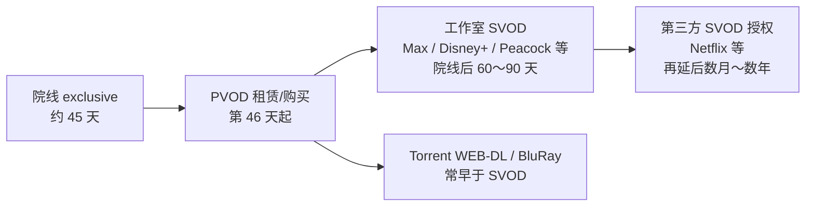

# 各国合法平台与其他渠道 · 上线节奏清单

> **版本：** v1.0  
> **创建日期：** 2026-07-09  
> **用途：** ReleaseMatch / PanMatch 选源、槽位优先级、跨区上线时间差建模的**行业参考基线**  
> **前置阅读：** [02-数据源技术方案](./02-数据源技术方案-详细展开.md)、[11-CN华语影视资源方案](./11-CN华语影视资源方案.md)  
> **说明：** 本文仅描述**公开可验证**的合法平台与行业惯例；「其他渠道」指 PVOD、广播 catch-up、BT/Torrent 生态等**元数据可观测**来源，不列举侵权流媒体站点。

---

## 〇、如何使用本文档

| 读者场景 | 建议阅读 |
|----------|----------|
| 判断某槽位「谁先上有资源」 | §一 全球时间轴 → §二 按地区查表 |
| 配置 `fetch_service` 区域路由 | §二 各地区「其他渠道」与 [02](./02-数据源技术方案-详细展开.md) Layer 对照 |
| 写页面「何时可看」文案 | §一.3 平台级上新时刻规律 |
| 追踪官方排期 | §四 监测工具 |

**速度分级（全文统一）：**

| 等级 | 含义 | 典型延迟 |
|------|------|----------|
| **S0** | 同步 / 同日 | 播出当晚或全球同一 UTC 时刻 |
| **S1** | 次日～3 日 | 周播剧下一集、院线后 PVOD |
| **S2** | 1～2 周 | 周播全集后 batch、部分 OTT 独家 |
| **S3** | 45～90 天 | 好莱坞院线窗 → SVOD |
| **S4** | 3～12 月+ | 二次授权、区域延后、老片轮转 |

---

## 一、全球上线节奏总览

### 1.1 好莱坞院线片 · 标准窗口链（2025–2026 行业基线）

| 阶段 | 合法最快触点 | 典型节奏 | 备注 |
|------|--------------|----------|------|
| 院线 exclusive | 影院 | **45 天**为 2026 年主流基线；迪士尼平均 **~62 天** 到 PVOD；爆款可延长 | Omdia / Frame Junkie 2025–2026 |
| PVOD | Apple TV / Amazon / Google Play / Vudu | 院线后 **第 46 天** 起，租 $5.99 / 买 $19.99 | **合法渠道里往往最先「在家看」** |
| 自有 SVOD | Max、Disney+、Peacock、Paramount+ | 院线后 **60～90 天** | WBD 片进 Max；环球进 Peacock |
| 授权 SVOD | Netflix、Prime Video（非自制） | 再延后 **数月** | 因授权谈判而异 |
| 免费 AVOD | Tubi、Pluto、Freevee | 更晚 | 长尾轮转 |

**Netflix 自制电影：** 通常 **全球同步** 上线 Netflix（无院线窗），锚定 **洛杉矶 0:00 PT**（见 §1.3）。

**Netflix 收购 WBD 后（若成交）：** Ted Sarandos 表态 WBD 院线片维持 **45 天院线窗** 再进流媒体（2026 行业新闻）。

### 1.2 剧集 · 按制作/发行模式

| 模式 | 合法最快平台 | 上新节奏 | 代表 |
|------|--------------|----------|------|
| **全球 OTT 原创 · 全集 drop** | 制作方 SVOD | 全球同一时刻全集上线 | Netflix 韩剧、Virgin River |
| **全球 OTT 原创 · 周播** | 制作方 SVOD | 每周固定日 1～多集 | Netflix 部分剧、Disney+ |
| **广播网同步 OTT** | 当地 SVOD + 电视台 | **播出后数小时～次日** | 韩剧 Netflix+地面台、美剧 Hulu/Peacock |
| **动漫 simulcast** | Crunchyroll | 日本播出后 **~1 小时内** 全球英文字幕 | JJK、季度新番 |
| **动漫 日本本土** | 电视台 + d/anime 系 | 日本 **深夜/清晨** 首播 | 比 Crunchyroll 早数小时 |
| **华语周播剧** | 爱奇艺/腾讯/优酷 + 国际版 | CN **晚 8 点档** 起；国际版常 **同步或 +0～1 天** | 见 §2.5 |
| **印度 OTT 原创** | JioHotstar / ZEE5 等 | 多集中在 **周五** 批量上新 | Herzindagi 等排期榜 |

### 1.3 主流全球平台 · 上新「钟点」规律

| 平台 | 原创内容上线锚点 | 授权/采购内容 | 对 ReleaseMatch 的含义 |
|------|------------------|---------------|------------------------|
| **Netflix** | 全球同步 = **洛杉矶 0:00 PT**（非固定本地午夜） | 各时区 **当地 0:00** | WEB-DL 常于 PT 清晨～午后出现 |
| **Disney+** | 多数 **0:00 当地** 或固定 UTC | 因地区而异 | 韩剧常与地面台 **同日** |
| **Prime Video** | 美国常 **0:00 PT**；全球原创同步 | 授权剧分散 | — |
| **Max (HBO)** | 美剧 **ET 9pm 直播** + Max 同步；部分 **0:00** batch | — | HBO 剧 torrent 晚于直播数小时 |
| **Apple TV+** | 全球同步，多 **0:00 PT** | — | — |
| **Crunchyroll** | simulcast **~9:00 AM PT**（日漫播出后） | — | Nyaa 常 **早于** CR 数小时（无字幕 raw） |

**时区换算示例（Netflix 全球原创 · 洛杉矶 0:00 PT）：**

| 地区 | 大约本地时间 |
|------|--------------|
| 美国东部 | 03:00 |
| 英国 | 08:00（夏令时） |
| 中欧 | 09:00 |
| 印度 | 12:30 |
| 中国 | 15:00 |
| 日本/韩国 | 16:00 |
| 澳洲东部 | 17:00 |

### 1.4 「其他渠道」· Torrent / BT 生态相对合法 OTT 的节奏

> 本节描述 **ReleaseMatch 可索引** 的公开来源节奏，供「谁先出现 magnet」建模，**不构成观看建议**。

| Release 类型 | 相对院线/首播 | 主要 Indexer / 层 | 备注 |
|--------------|---------------|-------------------|------|
| **CAM / TS / HDTS** | 院线 **0～14 天** | Jackett 公开站 | 质量差，通常不进入 Recommended |
| **WEB-DL / WEBRip** | OTT 上线 **0～48 小时** | EZTV、Jackett、Nyaa | 与平台片源同步，release 名含 `NF.WEB-DL` 等 |
| **HDTV / 广播 cap** | 直播 **数小时** | EZTV、Jackett | 美剧、韩剧地面台 cap |
| **BluRay / REMUX** | 实体碟 **0～7 天** | YTS（电影）、Jackett | 电影最终质量档 |
| **动漫 raw** | 日本播出 **<6 小时** | Nyaa `c=1_*` | 无字幕 |
| **动漫 中字** | raw 后 **12～48 小时** | DMHy、Nyaa、字幕组 | 见 [11-CN](./11-CN华语影视资源方案.md) |
| **华语剧 WEB-DL** | 大陆 OTT **0～24 小时** | DMHy、Nyaa LA `c=4_*` | 常见 `iQiyi`/`WETV` 片源标识 |
| **日韩真人** | 播出 **12～72 小时** | Nyaa LA、Kocowa rip | 见 [02](./02-数据源技术方案-详细展开.md) §七 |

**一般规律：** 对 **OTT 独占剧**，WEB-DL 档 torrent 往往是「非影院、非订阅」渠道里**最早可获取**的版本；对 **院线片**，PVOD 与 WEB-DL 谁早取决于是否有人 rip PVOD（不稳定）。

---

## 二、分地区清单

### 2.1 美国 / 加拿大

#### 合法平台（快 → 慢）

| 优先级 | 平台 | 内容强项 | 上新节奏 | 速度等级 |
|--------|------|----------|----------|----------|
| 1 | **Hulu**（迪士尼） | ABC/FX 当前季美剧 | 直播 **ET 当晚** 或次日 | **S0～S1** |
| 1 | **Peacock**（NBCUniversal） | NBC 当前季 | 次日上线 | **S1** |
| 1 | **Paramount+** | CBS / Paramount 片库 | 次日～周 batch | **S1** |
| 2 | **Max** | HBO / WBD 自制 + 院线窗后片 | HBO **周日 9pm ET** 直播；电影 **~60–90 天** | 剧 **S0** / 电影 **S3** |
| 2 | **Netflix** | 全球原创 + 授权长尾 | 见 §1.3 | 原创 **S0** |
| 2 | **Disney+** | 漫威/星战/迪士尼/ Hulu 捆绑 | 电影跟迪士尼窗 **~62 天+** | **S3** |
| 2 | **Prime Video** | 亚马逊自制 + MGM | 原创同步；授权分散 | 混合 |
| 3 | **Apple TV+** | 苹果原创电影/剧 | 全球同步 drop | **S0** |
| 4 | **PVOD**（Apple / Amazon / Google） | 新院线片 | **院线 +45 天** 起 | **S1**（合法在家最快） |
| 5 | **Tubi / Pluto TV** | AVOD 长尾 | 月～季后 | **S4** |

#### 其他渠道

| 类型 | 来源 | 节奏 | RM Layer |
|------|------|------|----------|
| Torrent 剧集 | EZTV、Jackett（1337x 等） | WEB-DL **OTT 后 0～2 天** | 2A / 1 |
| Torrent 电影 | YTS、Jackett | BluRay **碟片后**；部分 WEB-DL | 2B / 1 |
| 有线电视 VOD | 各运营商 | 与 PVOD 类似 | 不索引 |

**加拿大差异：** Crave 持 HBO 独家；院线窗节奏与美国基本一致。

---

### 2.2 英国 / 爱尔兰

#### 合法平台

| 优先级 | 平台 | 内容强项 | 上新节奏 | 速度等级 |
|--------|------|----------|----------|----------|
| 1 | **BBC iPlayer** | BBC 剧集/纪录片 | 播出 **即时～7 天 catch-up** | **S0** |
| 1 | **ITVX** | ITV 综艺/剧 | 播出后即时 | **S0** |
| 2 | **Channel 4 / My5** | 英剧/独立制作 | catch-up | **S0～S1** |
| 2 | **Sky Go / Now TV** | HBO/Sky 独家英剧 | 与美国 HBO **同日或 +1 天** | **S0～S1** |
| 3 | **Netflix UK / Prime UK / Disney+** | 全球片库 | 授权常 **晚于美国** | **S2～S4** |
| 4 | **BritBox** | BBC+ITV 经典库 | 非首播 | **S4** |

#### 其他渠道

| 类型 | 节奏 | RM Layer |
|------|------|----------|
| EZTV / Jackett | 美剧英播后 **24h** 内常见 HDTV | 2A / 1 |
| 院线 → PVOD | 通常 **45 天+**（同欧美） | — |

---

### 2.3 欧盟核心（德法意西等）

#### 合法平台

| 国家 | 本土最快 | 国际平台 | 典型节奏 |
|------|----------|----------|----------|
| **德国** | **RTL+**（原 TVNOW）、**Joyn** | Netflix DE、Prime DE、Disney+ | 本土剧 **播出次日**；好莱坞 **S3** |
| **法国** | **myCANAL**、**Salto**（合并中） | Netflix FR、Prime | Canal 独家剧 **S0**；院线 **S3** |
| **意大利** | **Mediaset Infinity**、**RaiPlay** | 同上 | Rai 剧 catch-up **S0** |
| **西班牙** | **Movistar+**、**Atresplayer** | 同上 | 足球/本土剧即时 |
| **北欧** | **Viaplay**、**TV2 Play** | HBO 授权 Nordic | 英美剧常 **与美国同期或 +1 天** |

**欧盟 portability：** 订阅用户在 **EEA 旅行** 可临时看本国订阅（无需 VPN）；出境欧盟则 geo-block。

#### 其他渠道

| 类型 | 节奏 | RM Layer |
|------|------|----------|
| Jackett 欧洲 indexer | 德/法/西语 WEB-DL | Layer 1 |
| 公开 torrent | 好莱坞片 **BluRay 后 1 周** 常见 | 1 / 2B |

---

### 2.4 日本

#### 合法平台

| 优先级 | 平台 | 内容强项 | 上新节奏 | 速度等级 |
|--------|------|----------|----------|----------|
| 1 | **テレビ局公式 / TVer** | 地上波剧、综艺 **免费 catch-up** | 播出 **即时～1 周** | **S0**（本土剧最快合法） |
| 1 | **ABEMA / NHK+** | 综艺、动画、新闻 | 直播 + 追播 | **S0** |
| 2 | **U-NEXT** | 本土最大库之一（2025 份额 ~17%） | 动画/剧 **与地面台同步或提前** | **S0～S1** |
| 2 | **Netflix Japan** | 日剧独家、动漫 | 独家剧 **全球同步**；采购剧分批 | 混合 |
| 2 | **Amazon Prime Video JP** | 日剧 bundle | 部分 **0:00 JST** 更新 | **S0～S1** |
| 3 | **Disney+ / Hulu JP** | 海外片 + 部分日剧 | — | **S2+** |
| 3 | **dアニメストア / DMM TV / TELASA** | 动画垂直 | 季番 **每周固定** | **S0～S1** |
| 4 | **Crunchyroll**（日区账户） | 动漫 simulcast | 比日本电视 **晚 ~1h**（英文字幕） | 动漫 **S1** |

**2025 市场参考（GEM Partners）：** Netflix 份额 **~27%** 首位；U-NEXT **~17%**；Prime **~12%**。

#### 其他渠道

| 类型 | 节奏 | RM Layer |
|------|------|----------|
| Nyaa 动画 raw | 播出 **<6h** | 2C |
| DMHy 中字动漫 | raw **+12～48h** | 2F |
| Nyaa Live Action | 日剧 **+24～72h** | 2D |

---

### 2.5 韩国

#### 合法平台

| 优先级 | 平台 | 内容强项 | 上新节奏 | 速度等级 |
|--------|------|----------|----------|----------|
| 1 | **地面台 + Wavve / TVING** | KBS/MBC/SBS 当前剧 | **播出当晚** VOD（部分 **同步直播**） | **S0** |
| 1 | **Coupang Play** | 独家综艺、HBO/Max 韩区代理 | 2025 起 **HBO/Max 韩区独家**；原创周播 | **S0～S1** |
| 2 | **Netflix Korea** | 韩剧全球独家 | **全集或周播**；常 **与地面台同日**（如金土剧） | **S0** |
| 2 | **Disney+ Korea** | 韩剧全球同步（如 MBC 合作剧） | 地面台播出 **当晚全球** | **S0** |
| 3 | **Kocowa+** | 韩流官方出海（北美等） | 地面台 **+0～1 天** | **S1** |
| 4 | **TVING ⟷ Wavve 互供** | 互换原创 | 2026 起 **每周一** 更新互换内容 | **S2** |

**韩剧周播惯例：** 月火 / 水木 / 金土档；Netflix 全球独家剧常见 **周五或周六 0:00（韩国）** 全集或双集。

#### 其他渠道

| 类型 | 节奏 | RM Layer |
|------|------|----------|
| Nyaa LA / 韩站 cap | 首播 **12～48h** WEB-DL/HDTV | 2D |
| 英文字幕 torrent | 常晚于 Kocowa **1～3 天** | 1 |

---

### 2.6 中国大陆 / 香港 / 台湾

#### 合法平台

| 区域 | 平台 | 内容强项 | 上新节奏 | 速度等级 |
|------|------|----------|----------|----------|
| **大陆** | **爱奇艺 / 腾讯 / 优酷 / 芒果 TV / B 站** | 国产剧、综艺、国漫 | 会员 **19:00～22:00** 档；大剧 **0:00** 抢跑 | **S0** |
| **大陆** | **央视频 / 各台 APP** | 央视/卫视直播 | 直播 **同步** | **S0** |
| **香港** | **Viu / myTV SUPER / Disney+** | 港剧、韩剧授权 | 港剧 **电视播出后即时** | **S0～S1** |
| **台湾** | **friDay / LiTV / KKTV / Netflix TW** | 台剧、陆剧授权 | 陆剧常 **晚大陆 0～数月**（授权） | **S1～S4** |
| **国际华语** | **iQIYI Intl / WeTV / Youku Intl** | 出海 C 剧 | 多数 **与大陆同步或 +1 天** | **S0～S1** |

**监管提示：** 大陆无 Netflix/Max 等全球平台；海外平台片库与大陆 **完全不同源**。

#### 其他渠道

| 类型 | 节奏 | RM Layer |
|------|------|----------|
| DMHy | 国漫/日漫中字 **最快** | 2F |
| Nyaa LA `WETV/iQiyi.WEB-DL` | 陆剧 **0～24h** | 2D |
| 私有 PT（M-Team / U2 等） | 港剧/冷门 **1～7 天** | 规划 Layer 2PT |
| 网盘搬运 | 大陆用户主流，**RM 不索引** | 见 PanMatch 平行项目 |

---

### 2.7 印度 / 南亚

#### 合法平台

| 优先级 | 平台 | 内容强项 | 上新节奏 | 速度等级 |
|--------|------|----------|----------|----------|
| 1 | **JioHotstar**（JioCinema+Hotstar 合并） | 宝莱坞、印地语、**IPL 体育** | **周五 bulk** 上新常见 | **S1** |
| 2 | **ZEE5 / Sony LIV** | 多语种区域剧 | 周五/分散 | **S1** |
| 3 | **Netflix India / Prime IN** | 印度原创 + 全球片 | 印度原创 **全球同步** | **S0** |
| 4 | **Sun NXT / aha / Hoichoi** | 泰卢固/泰米尔/孟加拉垂直 | 区域语言即时 | **S0～S1** |

**海外印度人：** 英国/加拿大有 **JioHotstar International**；美国无独立 Hotstar（内容分散在 Disney+/Hulu）。

#### 其他渠道

| 类型 | 节奏 | RM Layer |
|------|------|----------|
| 公开 torrent | 宝莱坞 **院线 +4～8 周** WEB-DL | Jackett |
| 区域剧 | 热度低于欧美/韩剧，覆盖 **稀疏** | — |

---

### 2.8 东南亚（新马泰印尼菲等）

#### 合法平台

| 平台 | 定位 | 上新节奏 |
|------|------|----------|
| **Netflix SEA** | 全球片库 + 本地原创 | 全球同步原创 **S0** |
| **Disney+ Hotstar**（部分市场） | 漫威/韩剧/本地 | 授权 **S2+** |
| **iQIYI / WeTV / Viu** | **华语剧出海主战场** | 与大陆 **同步 S0～S1** |
| **TrueID / Vidio / iflix 系** | 泰/印尼本土 | 本土剧 **S0** |

**华语剧在东南亚：** iQIYI 2025–2026 东南亚份额高，**WEB-DL 片源标识**常出现在 Nyaa/DMHy release 名中。

---

### 2.9 拉丁美洲

| 平台 | 节奏 |
|------|------|
| **Netflix LATAM** | 西班牙语音轨常 **全球同步**；好莱坞 **S0～S3** |
| **Prime Video / Disney+ / Max** | 院线窗后跟进，常 **晚于美国 0～30 天** |
| **Globoplay**（巴西） | 本土剧 **S0** |
| **Claro Video / Paramount+** | 区域授权 |

---

### 2.10 中东 / 北非 / 土耳其

| 平台 | 节奏 |
|------|------|
| **Shahid VIP** | 阿拉伯语原创 + 土耳其剧 dub | 本土 **S0** |
| **Starzplay / OSN+** | 好莱坞授权 | **S3+** |
| **Netflix TR / BluTV** | 土耳其剧 | 土剧全球热度高，**BluTV S0** |

---

### 2.11 澳大利亚 / 新西兰

| 平台 | 节奏 |
|------|------|
| **Stan** | 澳独家英美剧，常 **与美国同日或 +几小时** |
| **Binge / Foxtel** | HBO 澳区代理 | HBO **S0～S1** |
| **Netflix AU / Prime AU** | 全球库 | 原创 **S0**（本地时间傍晚） |
| **免费 catch-up** | ABC iview / 7plus / 9Now | 澳剧 **S0** |

---

## 三、按内容类型的「谁先更新」速查

| 内容类型 | 全球合法最快 | 次快合法 | 其他渠道（可观测） | 典型最慢 |
|----------|--------------|----------|-------------------|----------|
| 好莱坞新院线片 | 影院 | **PVOD +45d** | WEB-DL（不稳定） | Netflix 授权 **+6～18mo** |
| HBO 当前季 | **Max 直播** | — | WEB-DL +hours | — |
| Netflix 全球原创剧 | **Netflix 同步** | — | WEB-DL +0～2d | — |
| 日番（英文字幕） | **Crunchyroll simulcast** | — | Nyaa raw **更早** | Netflix _batch **数月后** |
| 韩剧（地面台） | **Wavve/TVING 当晚** | Netflix 同日 | HDTV/WEB-DL +1d | Kocowa 海外 +1d |
| 大陆热播剧 | **爱优腾芒会员** | iQIYI Intl | DMHy/Nyaa **+0～1d** | 台湾授权 **+数月** |
| 港剧 | **myTV SUPER** | Viu | PT **+1～7d** | 海外授权 |
| 宝莱坞新片 | 影院 | JioHotstar **~4～8w** | torrent WEB-DL | 全球 Netflix |
| 欧美周播剧 | Hulu/Peacock **次日** | — | EZTV **+hours** | 网飞国际授权 |

---

## 四、监测工具（官方排期 / 跨区可用性）

| 工具 | URL | 用途 |
|------|-----|------|
| **StreamCal** | https://streamcal.app | 各平台、各国上映日历 |
| **FlixPatrol** | https://flixpatrol.com | TOP10 + Coming Soon + 各国排期 |
| **PlatformTrack** | https://platformtrack.com | 17 平台 × 57 国片库周更 |
| **JustWatch** | https://www.justwatch.com | 跨平台「在哪能看」 |
| **Reelgood / TV Time** | 各官网 | 美国聚合排期 |
| **KD Mojo** | https://www.kdmojo.com | 韩剧流媒体排期 |
| **What's on Netflix** | https://www.whats-on-netflix.com | Netflix 上线时刻细则 |
| **TMDB** | https://www.themoviedb.org | `watch/providers` API，自动化友好 |

---

## 五、与 ReleaseMatch 数据层映射

| 地区路由 | 合法平台参考（写 trust 文案） | 优先 indexer / API |
|----------|------------------------------|-------------------|
| `us` / `en` | Netflix, Max, Hulu, PVOD | EZTV, YTS, Jackett 1337x |
| `jp` | TVer, U-NEXT, Netflix JP | Nyaa, Jackett |
| `kr` | Wavve, TVING, Netflix | Nyaa LA, Jackett |
| `cn` | iQIYI, WeTV, Youku | **DMHy**, Nyaa LA |
| `in` | JioHotstar, ZEE5 | Jackett（覆盖弱） |
| 全球电影 | PVOD → 工作室 SVOD | **YTS**, Jackett |

**槽位优先级建议：**

1. **S0 内容**（当日 OTT）：`fetch` 窗口 = 上线 **-6h ～ +72h**，WEB-DL 高峰  
2. **S3 院线片**：PVOD 日（+45d）与 BluRay 周（+90～120d）各拉一轮  
3. **跨区剧**：以 **制作国平台** 为 release 命名锚点（如 `NF.WEB-DL` = Netflix 片源）

---

## 六、变更记录

| 版本 | 日期 | 说明 |
|------|------|------|
| v1.0 | 2026-07-09 | 初版：10+ 地区合法平台、其他渠道节奏、全球窗口链、RM 映射 |

---

## 七、免责声明

- 平台排期、院线窗、授权关系 **随时变动**；以官方公告为准。  
- 「其他渠道」_timing 来自行业惯例与 ReleaseMatch 已接入 indexer 的观测，**不保证合法性与可用性**。  
- 本文 **不构成** 版权规避或侵权站点指引；产品仅索引 **torrent 元数据** 用于版本匹配导航。
