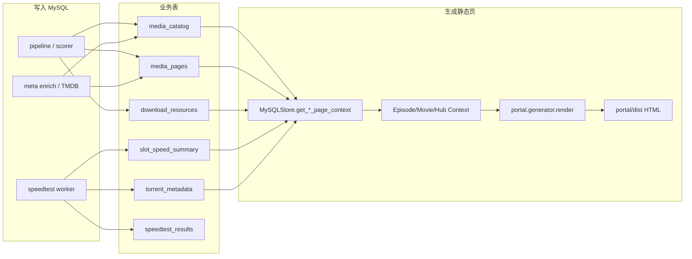

# 页面信息 ↔ 表字段 ↔ 写入脚本 ↔ 生成模块

> **版本：** v1.0 · 2026-07-21  
> **用途：** 查「页面上这块从哪张表来、谁写入、谁 bake 进 HTML」  
> **不是：** IG 产品分级（见 [IG信息登记册.md](./IG信息登记册.md)）；DDL 全字段（见 [05-存储与部署配置.md](./05-存储与部署配置.md) §五）

---

## 一、怎么用

| 你想知道 | 看 |
|----------|-----|
| 页面某区块对应库字段 | §三 对照总表 |
| 数据谁写进 MySQL | §四 写入路径 |
| 谁读库、谁渲染 HTML | §五 生成链路 |
| 现场核对模板变量 | `python -m workflow.run query page --page-id …` |

**口诀：** 多表事实 → `MySQLStore` 组装 Context → `to_template_context` → Jinja → `portal/dist`。

---

## 二、端到端数据流



| 页面类型 | 模板 | 读库入口 | 上下文类型 |
|----------|------|----------|------------|
| 单集 | `episode.html` | `get_episode_page_context` | `EpisodePageContext` |
| 电影 | `movie.html` | `get_movie_page_context` | `MoviePageContext` |
| Hub | `show_hub.html` | `get_show_hub_page_context` | `ShowHubPageContext` |
| 首页 | `home.html` | published 聚合 | `write_home_page` |
| Trust | `trust/page.html` | 文案模块（非槽位表） | `render_trust` |

CLI：`python -m workflow.run generate page --page-id …` / `generate all`  
编排：`portal/generator/generate_one.py` → `render.render_by_page_id` → 写盘 + `mark_page_generated`

---

## 三、对照总表（页面区块 → 模板变量 → 表.字段 → 写入 → 生成）

### 3.1 侧栏 / 作品主信息（剧集 · 电影 · Hub 共用 catalog）

| 页面信息 | 模板变量（代表） | 表.字段 | 写入 CLI / 脚本 | 读库 / 生成模块 |
|----------|------------------|---------|-----------------|-----------------|
| 标题 | `show_title` / `movie_title` | `media_catalog.title` | `pipeline slot/batch` → `ensure_slot_page`；`meta enrich` | `MySQLStore` → `to_template_context` → `episode.html` / `movie.html` |
| URL slug | `show_slug` | `media_catalog.slug` | 建槽时生成 | 同上 |
| 海报 | `poster_url` | `media_catalog.poster_path` | `meta enrich` / 建槽 TMDB | `MediaCatalog.poster_url()` |
| 简介 en/zh | `overview_en` / `overview_zh` | `media_pages.overview(_zh)` 优先，否则 `media_catalog.overview(_zh)` | 建槽 / enrich | Context 组装 |
| Watch On | `streaming_providers` | `media_catalog.streaming_providers` | enrich / 种子 | catalog |
| 电影年份 / 片长 | `year` / `runtime` | `media_catalog.year` / `runtime_minutes` | 建槽 | `MoviePageContext` |
| TMDB 外链 | `tmdb_url` | `media_catalog.tmdb_url`（单集可拼 season/episode） | 建槽 | Context |

### 3.2 槽位门禁 · SEO · 导航

| 页面信息 | 模板变量 | 表.字段 | 写入 | 生成 |
|----------|----------|---------|------|------|
| Canonical | `canonical_url` | `media_pages.canonical_path` + `SITE_ORIGIN` | `ensure_slot_page` / pipeline | Context |
| noindex | `robots_noindex` | `media_pages.page_status` / `magnet_count` / `robots_noindex` + 有无 Rec | `upsert_slot_resources` 更新门禁 | `MediaPage.is_indexable()` |
| 跨源 N/M | `cross_source_count` / `cross_source_total` | `media_pages.*` | pipeline；`recompute_cross_source_fuzzy.py` | Hero badge |
| 上/下集 | `prev_episode_url` / `next_*` | `media_pages.prev_*` / `next_*` | 建槽 / 导航回填 | `MediaPage.prev_episode_path` |
| 单集标题 / 播出日 | `episode_title` / `air_date` | `media_pages.episode_title` / `air_date` | 建槽 TMDB | episode 模板 |
| 字幕链 | `subtitle_url` | `media_pages.subtitle_url` | 建槽 / pattern | Context |
| bake 水位 | （不直接展示） | `media_pages.generated_at` | `generate_one.write_page_html` → `mark_page_generated` | 脏页检测用 |

### 3.3 Recommended Hero（`partials/recommended_block.html`）

| 页面信息 | 模板变量 | 表.字段 | 写入 | 生成 |
|----------|----------|---------|------|------|
| Recommended 行 | `recommended.*` | `download_resources` 且 `is_recommended=1` | `pipeline` → `scorer.rank_items` → `upsert_slot_resources` | `DownloadResource.to_template_dict` + `enrich_item_dict` |
| 推荐理由 | `recommended.recommend_reason` | `download_resources.recommend_reason` | scorer | Hero 文案 |
| 画质 / 片源 / 组 | `recommended_quality` / `_source` / `_group` | `resolution` / `source` / `release_group` | parser + scorer | Context 派生 |
| Group tier 标 | `recommended.group_tier` | `download_resources.group_tier`（权威逻辑见 `groups.yaml`） | scorer 冗余写入 | badge CSS |
| Magnet | `recommended.magnet_uri` | `download_resources.magnet_uri` | pipeline | Grab / 表列 |
| 体积 / seeders | `size_human` / `seeders` | `size_bytes` / `seeders` | indexer | `size_human` 派生 |
| Video/Audio 规格 | `video_spec` / `audio_spec` | 同名字段；空则 parser 运行时补 | parser / enrich | `enrich_item_dict(force_specs=True)` |

**写入主路径：**

```text
python -m workflow.run pipeline slot --fetch …
  → workflow/storage/pipeline.py
  → workflow/recommended/scorer.py
  → MySQLStore.upsert_slot_resources()
```

### 3.4 All Sources / All Versions

| 页面信息 | 模板变量 | 表.字段 | 写入 | 生成 |
|----------|----------|---------|------|------|
| 剧集 Sources 表 | `sources[]` | `download_resources`（通常滤掉 Rec 重复行由模板处理） | 同 pipeline | `episode_sources_table.html` |
| 电影 Versions | `sources[]` + `source_editions` | 同上 | 同 pipeline | `movie_editions.group_movie_sources` → `movie_edition_groups.html` |
| 单条跨源 Verify | `cross_source_count` / `confidence`（行内） | `download_resources.cross_*` | fetch + fuzzy | Sources 列 |
| Indexer 名 | `indexer` | `download_resources.indexer` | fetch | 表列 |

### 3.5 测速 · Grab · Torrent structure

| 页面信息 | 模板变量 | 表.字段 | 写入 | 生成 |
|----------|----------|---------|------|------|
| 速度条 / 可达性 | `speed_summary.recommended_speed` / `reachability` | `slot_speed_summary` | `speedtest_batch_worker.py --write` → `persist_speedtest_results` | `_build_speed_evidence_context` |
| 测速明细 | （证据面板） | `speedtest_results`（phase 1/2） | 同上 | `SpeedEvidenceContext` |
| Grab 指数 / 背书句 | `speed_evidence.*` / 注入 `recommended` | 由 summary + results **派生**（非独立业务表） | 测速写库后 generate 才进 HTML | `d1_models._enrich_recommended_with_speed` |
| Torrent structure | `torrent_metadata.*` | `torrent_metadata`（按 infohash） | Phase2 → `upsert_torrent_metadata` | `torrent_metadata_panel.html` |
| freshness | `updated_at` / `extracted_at` | summary / metadata | 测速 | 面板文案 |

**写入主路径：**

```text
python scripts/speedtest_batch_worker.py --all-published --write …
  → workflow/torrent_sources/speedtest/batch_service.py
  → store_service.persist_speedtest_results / persist_torrent_metadata
```

**注意：** 测速只写库；静态页须再 `generate` 或 `incremental_publish_worker`（见 [12 §5.4](./12-日常运营执行手册.md)）。

### 3.6 Hub 页特有

| 页面信息 | 来源 | 写入 | 生成 |
|----------|------|------|------|
| Hub 骨架行 | `media_pages` `page_type=show_hub` | `ensure_show_hub_page`（pipeline / Ops generate） | `get_show_hub_page_context` |
| 剧集列表 | 同 `catalog_id` 下 episode 页 | pipeline 扩槽 | Hub 模板聚合 |
| Hub 简介/海报 | `media_catalog` | enrich | Hub Hero |

### 3.7 非槽位静态页（简表）

| 页面 | 数据来源 | 生成模块 |
|------|----------|----------|
| 首页卡片 | published `media_pages` + catalog | `write_home_page` |
| sitemap | indexable pages | `portal/generator/sitemap.py` |
| Trust 六页 | `trust_content` 文案 | `render_trust` / `deploy` 壳同步 |
| 404/410 / static | 固定壳 | `static_shell.sync_static_shell` |

---

## 四、按表：谁写入

| 表 | 主要写入方 | 典型命令 |
|----|------------|----------|
| `media_catalog` | `ensure_slot_page` / `upsert_catalog_display_meta` | `pipeline slot`；`meta enrich --page-id` / `--all-empty` |
| `media_pages` | 建槽、pipeline 门禁、下线、generate 水位 | `pipeline`；Ops 下线；`mark_page_generated` |
| `download_resources` | pipeline 全量替换槽内 magnets | `pipeline slot/batch --fetch`；`refetch-all` |
| `slot_speed_summary` | 测速聚合 | `speedtest_batch_worker.py --write`；Ops 测速 |
| `speedtest_results` | 测速明细 | 同上 |
| `torrent_metadata` | Phase2 metadata | 同上；`speedtest_retest_no_refetch.py` |
| `release_groups` | 种子 / 运营（线上 tier 多冗余在 resources） | SQL / YAML 逻辑 |
| `tmdb_export_titles` | Ops 搜索库（**不直接进内容页**） | `ops tmdb-sync` |

跨源重算（不重拉）：`scripts/recompute_cross_source_fuzzy.py` → 更新 `media_pages` / resources 跨源字段。

---

## 五、生成模块清单

| 模块 | 路径 | 职责 |
|------|------|------|
| CLI 入口 | `workflow/run.py` → `generate` | 解析 `--page-id` / `all` |
| 写盘编排 | `portal/generator/generate_one.py` | `write_page_html` / `write_all_published` |
| 渲染 | `portal/generator/render.py` | `render_by_page_id` / Jinja |
| 读库组装 | `workflow/storage/mysql_store.py` | `get_*_page_context` |
| 模板变量契约 | `schema/d1_models.py` | `*PageContext.to_template_context` |
| i18n | `portal/generator/i18n*.py` | `merge_render_context` |
| 增量发布 | `scripts/incremental_publish_worker.py` | 脏页 → `prepare_dist_by_page_ids` |
| Ops 同源 | `workflow/ops/actions.py` | `run_generate` / `prepare_dist_by_page_ids` |
| 部署脚本 | `scripts/deploy_cf_pages.sh` | full / incremental / upload-only |

**模板目录：** `portal/generator/templates/`（`episode.html`、`movie.html`、`show_hub.html` + `partials/`）。

---

## 六、验收与排障

```bash
# 1) 看组装后的 Jinja 上下文（对照 §三 变量名）
python -m workflow.run query page --page-id tv:1396:s04e06

# 2) bake 单页
python -m workflow.run generate page --page-id tv:1396:s04e06

# 3) 库有测速、dist 无面板 → 未 generate
python scripts/incremental_publish_worker.py --dry-run
```

| 现象 | 常见原因 |
|------|----------|
| Hero 无 Recommended | `download_resources` 无 `is_recommended=1` → 重跑 pipeline/scorer |
| 有 summary、HTML 无测速块 | 测速后未 generate / 未跑增量发布 cron |
| 海报空 | `media_catalog.poster_path` 空 → `meta enrich` |
| Hub 404 | 缺 `tv:{id}:hub` 行 → `ensure_show_hub_page` + generate |

---

## 七、相关文档

| 文档 | 关系 |
|------|------|
| [05-存储与部署配置.md](./05-存储与部署配置.md) | 表 DDL 语义、§5.12 页面→表组合 |
| [IG信息登记册.md](./IG信息登记册.md) | IG 分级与展示策略 |
| [06-run-cli使用说明.md](./06-run-cli使用说明.md) | CLI 参数与脚本索引 |
| [12-日常运营执行手册.md](./12-日常运营执行手册.md) | 扩槽→测速→generate→cron |
| `schema/mysql_schema.sql` | 权威 DDL |
| `schema/d1_models.py` | 权威模板上下文字段 |

---

## 变更记录

| 版本 | 日期 | 说明 |
|------|------|------|
| v1.0 | 2026-07-21 | 初版：页面区块 ↔ 表字段 ↔ 写入脚本 ↔ 生成模块 |
