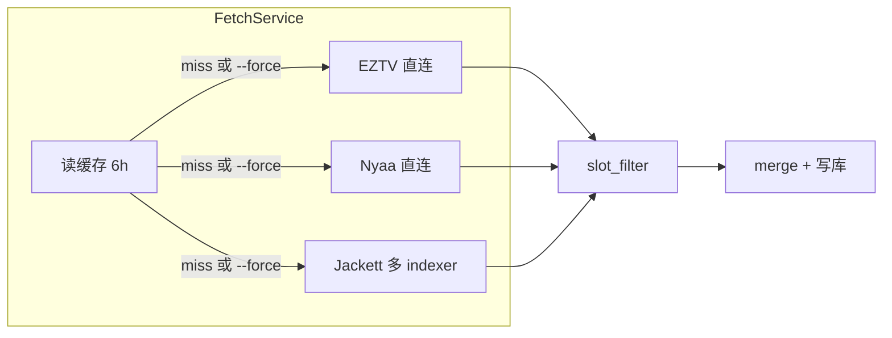

# Jackett 与种子拉取稳定性保障

> **适用：** 海外 VPS Jackett + FlareSolverr + 本机 ReleaseMatch workflow  
> **测试环境：** 日本 VPS `172.236.156.193`（见 [jackett-remote-linode.md](./jackett-remote-linode.md)）  
> **日期：** 2026-06-30

---

## 一、稳定性分层

稳定性分三层理解，任一层单点失败不应导致整站无数据：

```
┌─────────────────────────────────────────────────────────┐
│  Layer 3  ReleaseMatch 拉取管道（本机 / CI）             │
│  多源降级 · 缓存 · slot_filter · 限速                    │
├─────────────────────────────────────────────────────────┤
│  Layer 2  Jackett Indexer（VPS）                        │
│  单 indexer 轮询 · 1337x 依赖 FlareSolverr              │
├─────────────────────────────────────────────────────────┤
│  Layer 1  VPS 基础设施（Docker）                         │
│  jackett-net · restart 策略 · 内存 · 健康检查            │
└─────────────────────────────────────────────────────────┘
```

**核心原则：** 任何单源 / 单 indexer / 单次请求失败，其他源与本地缓存仍应产出可用页面。

---

## 二、应用层（ReleaseMatch 已有机制）

| 机制 | 实现位置 | 作用 |
|------|----------|------|
| 多源并行降级 | `fetch_service.py` | EZTV、Nyaa、Jackett 各自 `try/except`，单源失败不中断 |
| Jackett 多 indexer 轮询 | `fetch_service.py` | 逐个 indexer 搜索，一个 400/超时继续下一个 |
| 搜索策略 | `jackett_client.search_tv` | 优先 `q+season+ep`，tvdbid 仅无结果时兜底，减少误匹配 |
| 槽位过滤 | `slot_filter.py` | 标题 + 季集 + 作品 token，过滤 Jackett 误匹配 |
| 本地缓存 | `cache_index.py` | 默认 TTL 6h，Jackett 短暂不可用时仍可读缓存 |
| 请求限速 | 各 client | `rate_limit.min_interval_sec: 2.0`，降低封禁风险 |
| 镜像回退 | `yts_client.py`、`nyaa_client.py` | 主站失败自动试备用镜像 |
| 写库安全 | `mysql_store.py` | upsert 时删除不在本次结果中的旧 infohash，避免脏数据 |

---

## 三、推荐配置（accounts.local.json）

### 3.1 Indexer 列表：禁用 `all`

**不要在 `indexers.tv` / `indexers.movie` 中使用 `all`。**

| 问题 | 说明 |
|------|------|
| 慢 | `all` 触发全量聚合，单次可达 60s+ |
| 重复 | 与前面单 indexer 结果重复 |
| 脆弱 | 任一 indexer 失败可能拖垮整次请求 |

**推荐剧集 indexer 顺序（按稳定性 / 覆盖）：**

```json
"indexers": {
  "tv": ["torrentgalaxyclone", "1337x", "thepiratebay", "nyaasi"],
  "movie": ["yts", "1337x", "torrentgalaxyclone"]
}
```

| Indexer | 剧集 | 电影 | 备注 |
|---------|------|------|------|
| torrentgalaxyclone | ✅ 主力 | ✅ | 综合源，相对稳定 |
| 1337x | ✅ | ✅ | **必须** 配置 FlareSolverr |
| thepiratebay | ✅ 备用 | — | 公开源 |
| nyaasi | ✅ 动漫/日韩 | — | 与 Nyaa 直连互补 |
| yts | — | ✅ 主力 | 另有 Layer 2 直连 |
| ~~all~~ | ❌ | ❌ | 批补与生产均避免 |

### 3.2 限速与缓存

```json
"rate_limit": {
  "min_interval_sec": 2.0
},
"cache": {
  "seeders_ttl_hours": 6
}
```

| 场景 | 建议 |
|------|------|
| 日常 pipeline | 不加 `--force`，优先读 6h 缓存 |
| 调试 / 验收 | `--force` 强制刷新，单槽间隔仍受 client 限速 |
| 批补大量槽位 | 勿并发 `--force`；槽位间自然间隔 ≥ 2s |

---

## 四、VPS 基础设施

### 4.1 容器架构

```
日本 VPS 172.236.156.193
├── docker network: jackett-net
├── jackett        → 0.0.0.0:9117（Torznab + Dashboard）
├── flaresolverr   → 127.0.0.1:8191（仅本机，Jackett 容器内用 flaresolverr:8191）
└── 配置卷         → /opt/jackett/config
```

### 4.2 必检项

| 项 | 要求 | 检查命令 |
|----|------|----------|
| 内存 | VPS ≥ **2GB**（FlareSolverr 需启动 Chrome） | `free -h` |
| 重启策略 | `--restart unless-stopped` | `docker inspect jackett flaresolverr` |
| FlareSolverr URL | Jackett 内为 `http://flaresolverr:8191/` | Dashboard → System |
| 容器同网 | jackett、flaresolverr 均在 `jackett-net` | `docker network inspect jackett-net` |
| 1337x 依赖 | FlareSolverr 必须先于或随 Jackett 就绪 | 见 §4.4 |

### 4.3 VPS 健康检查脚本

在 VPS 上创建 `/opt/healthcheck.sh`（每 30 分钟 crontab 执行）：

```bash
#!/bin/bash
# /opt/healthcheck.sh — Jackett + FlareSolverr 存活探测，失败则重启

set -e

# FlareSolverr：1337x 等 Cloudflare 站点依赖
if ! curl -sf http://127.0.0.1:8191/ >/dev/null 2>&1; then
  echo "$(date -Iseconds) flaresolverr down, restarting"
  docker restart flaresolverr
  sleep 15
fi

# Jackett：Torznab API
if ! curl -sf http://127.0.0.1:9117/ >/dev/null 2>&1; then
  echo "$(date -Iseconds) jackett down, restarting"
  docker restart jackett
fi
```

```bash
chmod +x /opt/healthcheck.sh
# crontab -e
*/30 * * * * /opt/healthcheck.sh >> /var/log/jackett-healthcheck.log 2>&1
```

### 4.4 FlareSolverr 排错

| 现象 | 原因 | 处理 |
|------|------|------|
| `Challenge detected but FlareSolverr is not configured` | URL 未填或填 `127.0.0.1` | 改为 `http://flaresolverr:8191/`，`docker restart jackett` |
| Indexer Test 超时 | 内存不足 / 首次过盾慢 | `docker stats`；等待 30~60s 重试 |
| 容器不通 | 不在同一 Docker 网络 | `docker network connect jackett-net <name>` |
| 间歇性失败 | Cloudflare 规则变更 | `docker pull ghcr.io/flaresolverr/flaresolverr:latest && docker restart flaresolverr` |

### 4.5 定期维护

| 频率 | 动作 |
|------|------|
| 每月 | `docker pull` 更新 jackett、flaresolverr 镜像并 restart |
| 每周 | Jackett Dashboard 对各 indexer 点 **Test** |
| 变更后 | `docker restart flaresolverr jackett` |

---

## 五、Indexer 冗余策略

不要依赖单一源；按品类配置主力 + 备用：

| 品类 | Layer 2 直连 | Jackett indexer | 说明 |
|------|-------------|-----------------|------|
| 欧美剧集 | EZTV | torrentgalaxyclone, 1337x | EZTV 偶发 451；Jackett 备份 |
| 动漫 / 日韩 | Nyaa RSS | nyaasi, 1337x | 双路互补 |
| 电影 | YTS API | yts, 1337x, torrentgalaxyclone | YTS 直连优先 |

某 indexer Dashboard Test 持续失败时，从 `accounts.local.json` **暂时移除**，避免单次 fetch 被 45s 超时拖慢。

---

## 六、本机探测与验收

### 6.1 日常探测

```bash
cd releasematch

# Jackett 连通 + API Key 有效
python -m workflow.torrent_sources.run status
# 期望：has_valid_api_key=true, jackett_probe.reachable=true

# 四源 PoC（Layer 1 通道）
python scripts/poc_phase0.py

# 逐 indexer 诊断（可选）
python scripts/poc_jackett_indexers.py
```

### 6.2 固定基准槽位（发版前）

Breaking Bad S04E06（tmdb 1396）作为回归基准：

```bash
python -m workflow.torrent_sources.run test --tmdb 1396 --season 4 --episode 6 --force
python -m workflow.run pipeline slot --tmdb 1396 --season 4 --episode 6 --mode live --fetch
python -m workflow.run generate page --page-id tv:1396:s04e06
```

| 指标 | 期望（2026-06-30 基线） |
|------|-------------------------|
| 过滤前 Jackett 条数 | ~12（q+season+ep 策略） |
| slot_filter 后 | 与目标季集一致，无误杀 |
| 页面 All Sources | ~10+ 条，非 100+ 误匹配 |

审计 JSON 参考：`worklogs/2026-06-30/slot-filter-audit-bb-s04e06.json`

### 6.3 建议探测节奏

完整日常/每周/发版前清单见 [**12-日常运营执行手册.md**](./12-日常运营执行手册.md) §三 · §十 · §十一。

| 频率 | 动作 |
|------|------|
| 每天 | `workflow.torrent_sources.run status` |
| 每周 | `poc_phase0.py` + VPS `docker ps` / healthcheck 日志 |
| 发版前 | BB S04E06 完整 pipeline + 页面生成 |

---

## 七、运行策略摘要



1. **默认走缓存**，减少对 VPS 压力  
2. **单源失败静默跳过**，汇总可用结果  
3. **1337x 必须 FlareSolverr**，否则从列表临时移除  
4. **不用 `all` 聚合**，单 indexer 逐个请求  
5. **VPS healthcheck** 自动重启异常容器  

---

## 八、相关文件

| 路径 | 说明 |
|------|------|
| `docs/jackett-remote-linode.md` | VPS 部署与日本测试机 |
| `docs/05-Jackett详解与安装使用教程.md` | Jackett 概念与 FlareSolverr §九 |
| `workflow/torrent_sources/accounts.local.json` | 本机 Jackett URL + indexer 列表 |
| `workflow/torrent_sources/servers.local.json` | VPS SSH / Docker 详情（勿提交 Git） |
| `workflow/torrent_sources/fetch_service.py` | 多源拉取编排 |
| `workflow/torrent_sources/slot_filter.py` | 槽位质量过滤 |

---

## 变更记录

| 日期 | 说明 |
|------|------|
| 2026-06-30 | 初版：三层稳定性、配置规范、VPS healthcheck、探测与基准槽位 |
