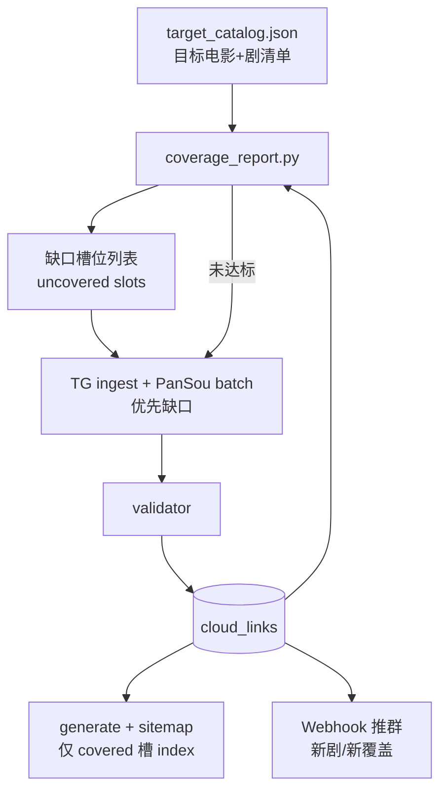
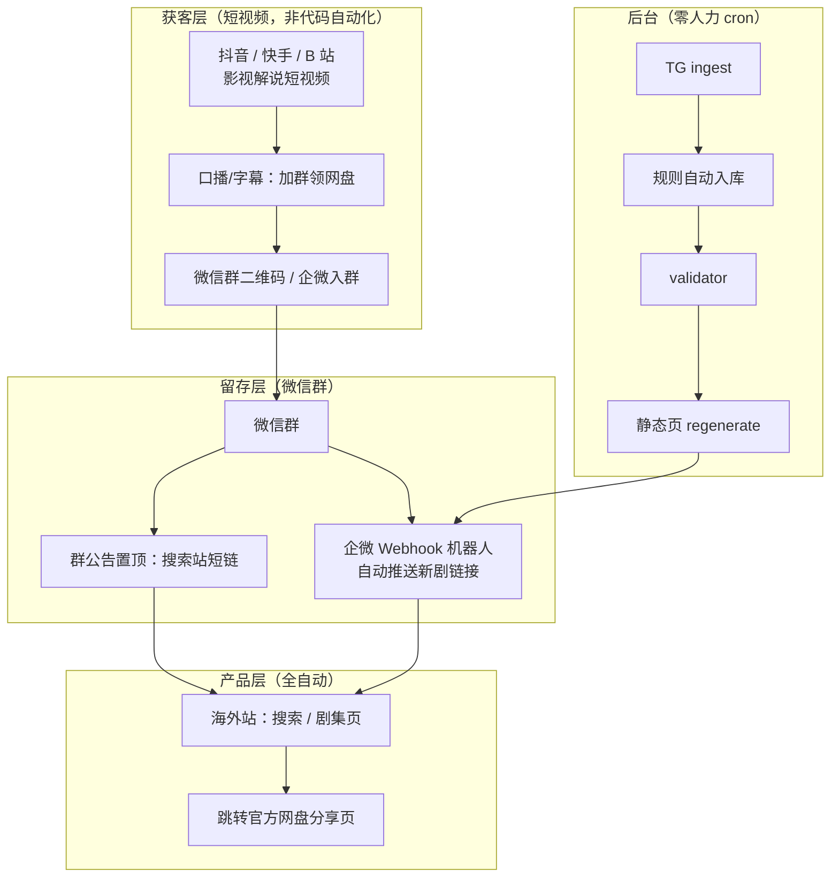
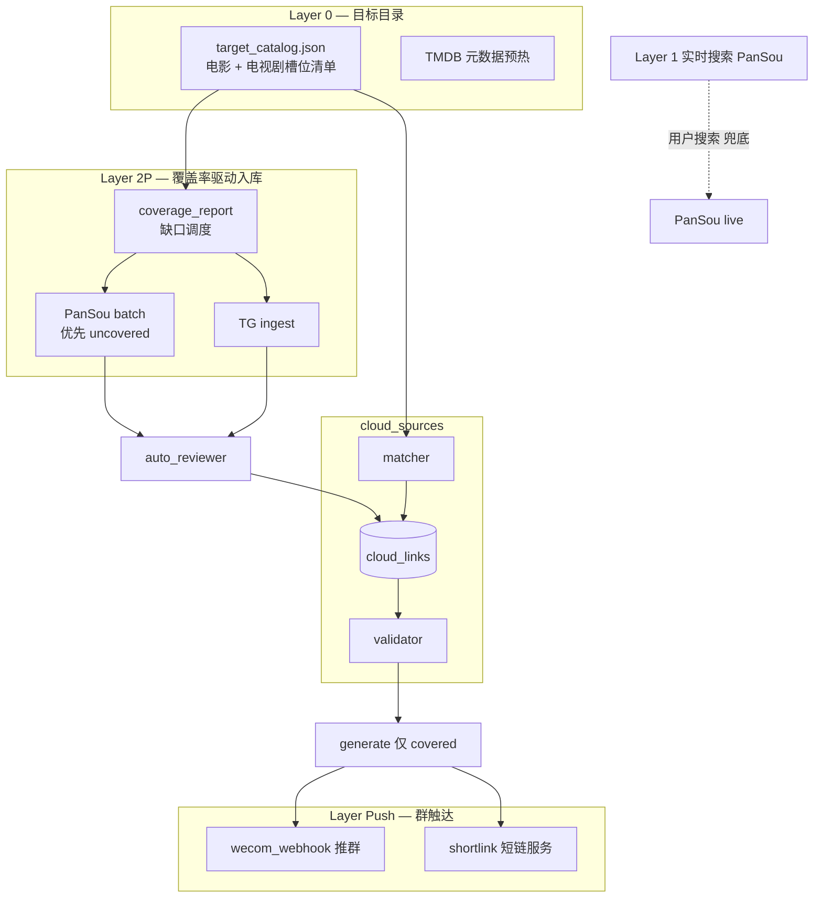
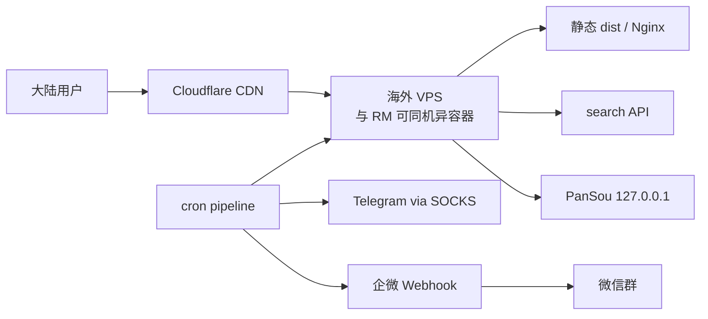

# 大陆站影视资源数据源技术方案（平行项目 · PanMatch）

> **版本：** v0.6  
> **北极星：** **电影 + 电视剧有效覆盖率**  
> **资源形态：** **不限于网盘**（magnet/ed2k 等均可计覆盖）· **优先网盘**（展示、回填、推群均网盘先行）  
> **资源原则：** 凡可免费、可自动化、能提升有效覆盖的获源方式均在范围内（插件化）  
> **ReleaseMatch 边界：** [11-CN华语影视资源方案.md](../11-CN华语影视资源方案.md) §2.6 网盘不纳入 RM 管道

---

## 〇、文档目的与项目边界

### 0.1 为什么单独立项

| 维度 | ReleaseMatch（releasematch.io） | 本项目（平行） |
|------|--------------------------------|----------------|
| 目标用户 | 全球英文 SERP + 海外华人 | **大陆追剧用户**（经私域触达） |
| 主数据源 | Magnet / BT | **网盘优先**；magnet/ed2k **补充**，均计覆盖 |
| **北极星 KPI** | Recommended 覆盖率 / 测速 bake | **电影 & 电视剧有效覆盖率** |
| 核心差异 | Recommended + 测速 | **覆盖率最大化** + 自动回填 |
| 域名 / 部署 | 海外 + Cloudflare | 海外 + Cloudflare（**不备案**） |
| 获客 | Google SEO（核心） | 短视频→微信群（**辅**）；**覆盖率**决定能否留住用户 |
| SEO 策略 | 英文 SERP 主攻 | 基线合规；**仅 index 已覆盖槽位** |
| 运维 | cron + 少量 QA | **纯 cron**；cron **按覆盖率缺口** 调度 |

**结论：** 与 RM 共享 **VPS / 行业调研** 即可；**不共享** 代码、DB、域名、generate 管道。

### 0.2 本文档覆盖范围

| 章节 | 主题 |
|------|------|
| 一 | 产品定位、**有效覆盖率北极星**、获客与用户路径 |
| 二 | 行业资源链路与上游来源 |
| 三 | 数据源分层（全自动 Layer 0~2P） |
| 四 | 核心模块（`cloud_sources/` + 群推送） |
| 五 | 数据模型与 API |
| 六 | 采集途径（自动化路径） |
| 七 | 链接存活与过期治理（自动） |
| 八 | TMDB 槽位、**目标目录**与自动匹配 |
| 九 | 海外部署、SEO 基线与合规 |
| 十 | 排期与 MVP |
| 十一 | 风险与禁止事项 |
| 十二 | 与 RM 协作边界 |
| 十三 | 可行性及成本评估 |
| 十四 | 关联开源参考 |

### 0.3 硬边界（写进 README）

```
✅ 允许：独立 repo / 海外域名 / CF Pages / 独立 DB / 全 cron 驱动
✅ 允许：企微/钉钉 Webhook 自动推群（无人工发帖）
✅ 允许：短视频侧人工拍剪（获客层，不进数据管道）
✅ 允许：SEO 基线（lang/title/meta/canonical/robots/sitemap≤**covered 槽**）
❌ 禁止：ICP 备案 / 国内 OSS 为主站
❌ 禁止：SEO 作为核心获客（百度主动推送/长尾铺页/买词）
❌ 禁止：网盘链写入 RM 任何表
❌ 禁止：日常人工审核、人工补链、人工推群
❌ 禁止：复用 RM Recommended / speedtest 语义
```

### 0.4 资源获取包容原则（v0.5）

> **一句话：只要能够免费、有效获得资源，都在方案范围内** — 不限于 TG / PanSou；通过 **统一 ingest 插件接口** 接入，由覆盖率缺口自动调度。

#### 0.4.1 「在范围内」须同时满足

| # | 条件 | 说明 |
|---|------|------|
| 1 | **免费** | 数据源无持续付费 API/会员/积分成本；**不含**用户自行开网盘会员 |
| 2 | **有效** | 能解析为可入库条目，且经 `validator` 探活后 **`status=active`**，计入覆盖率 |
| 3 | **可自动化** | cron 可跑，**零日常人力**；符合 `auto_reviewer` 规则 |
| 4 | **目标一致** | 服务于 `target_catalog` 内电影/电视剧槽位的 **有效覆盖率** |

满足以上四条 → **写入 `source_plugins.enabled`**，pipeline 对 uncovered 槽自动调用。

#### 0.4.2 典型在范围内（示例，非穷举）

| 类型 | 示例 | 接入方式 |
|------|------|----------|
| TG 频道 | 资源搬运号 | `ingest_tg.py` |
| 聚合搜索 | PanSou 及任意插件 | `ingest_pansou_batch.py` |
| 公开 RSS / 论坛白名单 | 固定版块 RSS | `ingest_rss.py` 插件 |
| 微博 / QQ 频道 | 公开时间线/API | `ingest_weibo.py` 等插件 |
| Magnet / BT | DMHy、Nyaa、公开 DHT | `ingest_magnet.py`（**L3 补充**，可选） |
| 开源搜索 API | 自托管 pansou/qupansou 类 | `ingest_plugin:{name}` |

**MVP 先上 TG + PanSou**；其余源 **按覆盖率缺口按需加插件**，不改核心架构。

#### 0.4.3 仍不在范围内

| 类型 | 原因 |
|------|------|
| 付费 API / 积分解锁（如影巢付费解锁） | 违反「免费」 |
| 自有网盘转存再发布 | 存储非免费 + 运维重（单独立项） |
| 全网论坛/TG 无白名单爬取 | 不可控、违反零运维 |
| 人工论坛蹲链、手抄链接 | 违反「可自动化」 |
| 直链解析 / 绕登录代下 | 产品与合规边界 |
| 写入 ReleaseMatch 管道 | 项目隔离 |

#### 0.4.4 插件注册（扩展点）

```yaml
# config/source_plugins.yaml
plugins:
  - id: tg_whitelist
    enabled: true
    priority: 1
    module: ingest_tg
  - id: pansou_batch
    enabled: true
    priority: 1
    module: ingest_pansou_batch
  - id: rss_cn_forum_x          # 示例：后续按需启用
    enabled: false
    priority: 2
    module: ingest_rss
    config: { feed_url: "..." }
```

`pipeline --prioritize uncovered` 按 **priority × 缺口** 依次调用已启用插件，直到槽位 covered 或本轮超时。

### 0.5 不限于网盘，优先网盘（v0.6）

> **形态：** 有效资源 = 网盘分享链 **或** magnet/ed2k 等可自动化条目。  
> **策略：** **优先** 获源与展示网盘；仅当网盘未覆盖或已过期时，才依赖 BT 类插件抬覆盖率。

#### 0.5.1 为何优先网盘

| 维度 | 网盘 | Magnet/BT |
|------|------|-----------|
| 大陆大众用户 | ✅ 主路径（夸克/阿里/百度 App） | ⚠️ 需客户端，门槛高 |
| 私域解说转化 | 「加群领网盘」话术自然 | 需额外说明 |
| 整季包 | 常见 | 有，但分散 |
| 探活 |  imperfect | infohash 相对稳定 |

#### 0.5.2 统一入库，分类展示

```
resource_links 表（原 cloud_links 泛化）
  link_type: cloud | magnet | ed2k
  platform:  aliyun | quark | baidu | … | magnet | ed2k

页面同一槽位：
  ┌─ 主区块：网盘链（link_type=cloud，按 last_checked_at 排序）
  └─ 副区块：BT 补充（link_type=magnet，折叠，nofollow）
```

**覆盖率计数：** 槽位只要 **任一类型** `active` 即 covered；报表 **分列** `cloud_coverage` / `magnet_coverage` / `composite`。

#### 0.5.3 pipeline 回填顺序（优先网盘）

```yaml
# config/source_plugins.yaml — priority 越小越先跑
plugins:
  - id: tg_whitelist          # 以网盘链为主
    priority: 1
    link_types: [cloud]
  - id: pansou_batch
    priority: 1
    link_types: [cloud]
    cloud_types: [aliyun, quark, baidu, 115, 123]
  - id: ingest_magnet         # 仅当 cloud 未 covered 或 cloud 全 expired
    priority: 3
    link_types: [magnet, ed2k]
    run_when: cloud_uncovered_or_expired
```

Webhook 推群：**默认只推网盘**；槽位 **仅 magnet 覆盖** 时推「BT 补充可用」模板（可配置）。

#### 0.5.4 有效槽位定义（修订）

> **有效槽位：** catalog 内 slot 存在 ≥1 条 `status=active` 的资源链（**网盘或 magnet 均可**）。  
> **优先展示：** 有网盘 active 时，页面与推群 **不主打** magnet；magnet 仅作副区块。

---

## 一、产品定位、获客与用户路径

### 1.1 一句话定位

**面向大陆用户的自动化影视资源索引站** — 以 **网盘为主、BT 为辅** 提升目标目录有效覆盖率；不限于网盘形态，但 ingest、展示、推群 **优先网盘**。

### 1.2 北极星：有效覆盖率

> **有效槽位：** catalog 内 slot 有 ≥1 条 `active` 资源链（**网盘或 magnet** 均可，见 §0.5）。报表区分 **网盘覆盖率** 与 **综合覆盖率**。

#### 1.2.1 指标定义

| 指标 | 公式 | 粒度 |
|------|------|------|
| **电影有效覆盖率（综合）** | 有任一 active 链的 movie 槽 / catalog movie | 部 |
| **电影网盘覆盖率** | 有 **cloud** active 的 movie 槽 / catalog movie | 部；**优先 KPI** |
| **电视剧有效覆盖率（剧级·综合）** | 至少 1 链的剧 / catalog 剧 | 整季包衍生规则不变 |
| **电视剧网盘覆盖率（剧级）** | 至少 1 **cloud** 链的剧 / catalog 剧 | 推群/主展示门禁 |
| **综合有效覆盖率** | 有效槽总数 / catalog 槽总数 | 扩 catalog 门禁 |
| **综合网盘覆盖率** | 有 cloud active 槽 / catalog 槽总数 | M2 建议 ≥35% |

**整季包覆盖规则（自动化）：**

```
若 cloud_links 存在 slot_id = tv:95842:s01（季包/全集）
  → 自动标记 tv:95842:s01e01 … s01eNN 为 covered（derived_coverage）
若仅有单集链 tv:95842:s01e03
  → 仅 s01e03 计为有效；剧级仍算「部分覆盖」
```

#### 1.2.2 目标阈值（门禁）

| 阶段 | 电影 | 电视剧（剧级） | 综合 | 扩 catalog 前提 |
|------|------|----------------|------|-----------------|
| **M1** | ≥30% | ≥25% | ≥28% | — |
| **M2** | ≥50% | ≥40% | ≥45% | 端到端私域验证 |
| **M3** | ≥60% | ≥50% | ≥55% | 可 +20 槽 |
| **M6** | ≥70% | ≥60% | ≥65% | 可 +50 槽 |

**原则：** catalog **不盲目扩页** — 与 RM C4「收录率门禁」同理，**当前 catalog 综合覆盖率未达标则不增槽**。

#### 1.2.3 覆盖率驱动闭环



```bash
# 每日覆盖率报告 + 缺口驱动的 batch 回填
python -m workflow.cloud_sources.coverage_report --json
python -m workflow.cloud_sources.run pipeline --prioritize uncovered
```

### 1.3 获客闭环（辅战略，服务于覆盖率转化）

**逻辑：** 覆盖率高 → 用户进群点链 **真能下到** → 留存；覆盖率低 → 私域流量浪费。获客不替代覆盖率，而是 **放大覆盖价值**。



| 层级 | 是否自动化 | 说明 |
|------|------------|------|
| 短视频解说 | ❌ 人工创作 | 获客素材；与 RM 一样 **不进 CI** |
| 微信群运营 | ⚠️ 半自动 | 建群/二维码需一次性配置；**日常推送全自动** |
| 资源 ingest | ✅ 全自动 | TG + PanSou cron |
| 页生成 / 推群 | ✅ 全自动 | regenerate + Webhook |

**优先级（v0.4）：**

```
P0  电影/电视剧有效覆盖率（北极星）
P1  pipeline 按缺口槽自动回填
P2  短视频 → 微信群（转化已覆盖内容）
P3  SEO 基线（仅 covered 页 index）
```

**SEO 定位：** 页面 **必须符合** 基础 SEO 规范（见 §9.3），cron 自动生成 sitemap；**不做** 百度站长主动推送、长尾铺页、SEO 导向的批量扩页。

### 1.4 用户画像

| 画像 | 来源 | 行为 | 产品响应 |
|------|------|------|----------|
| 解说视频观众 | 抖音/快手/B站 | 加群 → 点置顶链 | 移动端友好搜索页 |
| 群内活跃用户 | 微信群 | 等机器人推新剧 | Webhook 推送 + 短链 |
| 搜剧名用户 | 群内分享的链接 | 站内搜「庆余年」 | PanSou 实时聚合 |
| 资源党（次要） | 群内 | 115/123 偏好 | 平台 filter 参数 |

### 1.5 核心用户路径


### 1.6 与行业项目的差异

| 竞品 | 本项目 v0.4 |
|------|-------------|
| 爱盘 / PanSou：搜到即展示，无覆盖 KPI | **目标目录 + 覆盖率门禁** |
| 人工资源号 | Webhook 推 **新覆盖** 槽位 |
| SEO 铺量 | **只 index 已覆盖槽** |
| 备案大陆站 | 海外 CF |

### 1.7 用户价值与覆盖率关系

| 用户动作 | 需要覆盖率支撑 |
|----------|----------------|
| 群内点「庆余年」 | 剧级 ≥1 有效链，或集级目标集有链 |
| 搜索页实时搜 | PanSou 兜底（**不计入** catalog 覆盖率，计 **live 命中率**） |
| 解说视频推新剧 | catalog 必须先有覆盖或 pipeline 在 6h 内回填 |

---

## 二、行业资源链路与获源范围

**原则（v0.5）：** 上游形态 **不设固定清单**；行业调研中的 TG、PanSou、论坛、RSS、magnet 等均为 **候选插件**。是否启用只看 §0.4 四条。

| 获源方式 | 默认 MVP | 插件化 | 备注 |
|----------|----------|--------|------|
| TG 资源频道 | ✅ P0 | `ingest_tg` | 华语总水管，优先 |
| PanSou（含全部免费插件） | ✅ P0 | `ingest_pansou_batch` | 一次接入多第三方源 |
| 论坛/RSS 白名单 | 📋 按需 | `ingest_rss` | 满足四条即启用 |
| 微博/QQ 公开源 | 📋 按需 | 自定义 plugin | 参考 PanSou weibo/qqpd |
| Magnet / BT | 📋 L3 补充 | `ingest_magnet` | **计覆盖**；pipeline **网盘未覆盖时**再跑 |
| 付费解锁 / 人工 / 转存 | ❌ | — | §0.4.3 |

---

## 三、数据源分层架构（全自动）

### 3.1 架构总览



### 3.2 分层职责

| 层 | 职责 | 入库 | 触发 |
|----|------|------|------|
| L0 | **`target_catalog`** 电影+剧槽位清单 + TMDB | 元数据 | 扩 catalog 需过覆盖率门禁 |
| L1 | 实时搜索（**兜底**，不计 catalog 覆盖） | 否 | 用户请求 |
| L2P | TG + PanSou batch → **优先 uncovered 槽** | 是 | cron；**缺口多则缩短间隔** |
| Push | **新覆盖**槽位 → Webhook | — | 覆盖率提升事件 |

**原则：** 无人工队列；pipeline **先补缺口、再维护存量**。

### 3.3 target_catalog（目标目录）

`hot_slots.json` 升级为 **`target_catalog.json`** — 方案核心配置：

```json
{
  "movies": [
    {"slot_id": "movie:535167", "title_zh": "流浪地球", "priority": 1}
  ],
  "tv_shows": [
    {
      "show_id": "tv:95842",
      "title_zh": "庆余年",
      "priority": 1,
      "seasons": [
        {"season": 1, "episodes": 46, "accept_season_pack": true}
      ],
      "push_group": "default"
    }
  ],
  "coverage_policy": {
    "batch_interval_minutes": 30,
    "batch_interval_uncovered_minutes": 15,
    "min_composite_pct_to_expand": 45
  }
}
```

| 字段 | 说明 |
|------|------|
| `movies[]` | 电影槽，`movie:{tmdb_id}` |
| `tv_shows[].seasons[]` | 展开为 `tv:{id}:s{ss}e{ee}`；`accept_season_pack` 允许季包衍生覆盖 |
| `priority` | 1=解说主推/缺口 batch 优先 |
| `coverage_policy` | 未达标综合覆盖率 **禁止** 扩 catalog |

- 解说视频推新剧 → 写入 catalog 对应项（**改 JSON**，非日常运维）
- **Webhook 仅推** catalog 内 **新变为 covered** 的 slot

---

## 四、核心模块设计

### 4.1 仓库结构（v0.4）

```
panmatch/
├── workflow/cloud_sources/
│   ├── coverage_report.py         # ★ 覆盖率计算 + 缺口导出
│   ├── season_pack_derive.py      # ★ 季包 → 集 slot 衍生覆盖
│   ├── ingest_pansou_batch.py     # --prioritize uncovered
│   └── ...
├── config/
│   ├── target_catalog.json        # ★ 替代 hot_slots；电影+剧清单
│   └── coverage_thresholds.yaml   # ★ M1/M2/M3 门禁阈值
```

**移除 / 降级：**

| 模块 | v0.1 | v0.2 |
|------|------|------|
| `ingest_manual.py` | MVP 核心 | **仅 dev/debug**，不进生产 cron |
| `ingest_hdhive.py` | P2 | **不做** |
| 审核后台 | M1 交付 | **不做** |
| `cloud_links_pending` 人工 | 有 | 改为 **auto_queue 内存/transient**，秒级自动处理 |

### 4.2 coverage_report（北极星模块）

```python
def compute_coverage(catalog: dict, links: list[CloudLinkItem]) -> CoverageReport:
    """
    计算电影/电视剧/综合有效覆盖率。

    @param catalog: target_catalog.json 解析结果
    @param links: cloud_links 中 active 记录
    @returns: CoverageReport（movie_pct, tv_show_pct, tv_episode_pct, composite_pct, uncovered[]）
    """
    ...


def export_uncovered_slots(report: CoverageReport, limit: int = 50) -> list[str]:
    """
    导出缺口槽位，供 ingest_pansou_batch --prioritize 使用。

    @param report: compute_coverage 输出
    @param limit: 单次 batch 上限
    @returns: slot_id 列表，priority 高的在前
    """
    ...
```

**CLI：**

```bash
python -m workflow.cloud_sources.coverage_report
# 输出示例：
# movie: 12/20 = 60.0%
# tv_show: 8/15 = 53.3%
# tv_episode: 45/120 = 37.5%
# composite: 48.2%
# uncovered: 32 slots → pipeline will prioritize
```

### 4.3 auto_reviewer 规则（零人力）

```yaml
# config/auto_review_rules.yaml
auto_approve:
  min_match_score: 0.75          # matcher 置信度阈值
  required_platforms: []         # 空=不限；可设 [aliyun, quark]
  max_links_per_slot: 5          # 超出的按时间淘汰
  keyword_exclude: [广告, 注册, 博彩]
  keyword_include: []            # 空=不限；可设 [1080, WEB-DL, 全集]

auto_reject:
  max_match_score: 0.40          # 低于此直接丢弃
  duplicate_window_hours: 24     # 同 URL 去重

on_approve:
  push_wecom: true               # 仅 catalog 内且首次 covered
  regenerate_slot: true
  record_coverage_delta: true
```

```python
def auto_review(item: CloudLinkItem, match_score: float, rules: dict) -> str:
    """
    规则引擎：自动决定 approved / rejected，无人工介入。

    @param item: 待入库条目
    @param match_score: matcher 输出 0~1
    @param rules: auto_review_rules.yaml 加载结果
    @returns: 'approved' | 'rejected'
    """
    ...
```

### 4.4 企微 Webhook 推群（`wecom_webhook.py`）

```python
def push_new_links(slot_id: str, links: list[CloudLinkItem], webhook_url: str) -> bool:
    """
    新链 approved 后推送微信群（企业微信机器人）。

    @param slot_id: 槽位 ID
    @param links: 本次新增 approved 链
    @param webhook_url: 企微 Webhook，来自 wecom.webhook.json
    @returns: 推送是否成功
    """
    # 消息模板示例：
    # 【庆余年 更新】阿里云盘 | 1080p
    # 链接：https://panmatch.xxx/go/{short_id}
    # 提取码：abcd
    ...
```

**说明：** 个人微信群无官方 Bot API；生产用 **企业微信外部群 Webhook** 或 **钉钉机器人**。个人微信自动发消息违反 ToS，**不做**。

### 4.5 PanSou 自托管

Docker 内网部署；`ingest_pansou_batch.py` **仅对 `export_uncovered_slots()` 返回的槽位** 发起搜索，其次按 `priority` 维护存量。

---

## 五、数据模型与 API

### 5.1 核心表 `resource_links`（v0.6，原 cloud_links 泛化）

```sql
-- @table resource_links — 网盘 + magnet/ed2k 统一入库
CREATE TABLE resource_links (
    id              INTEGER PRIMARY KEY AUTOINCREMENT,
    slot_id         VARCHAR(64)  NOT NULL,
    link_type       VARCHAR(16)  NOT NULL COMMENT 'cloud|magnet|ed2k',
    platform        VARCHAR(16)  NOT NULL COMMENT 'aliyun|quark|…|magnet|ed2k',
    share_url       VARCHAR(512) NOT NULL COMMENT '网盘 URL 或 magnet:?xt=…',
    share_url_normalized VARCHAR(512) NOT NULL,
    extract_code    VARCHAR(16)  DEFAULT '',
    title_raw       VARCHAR(512) NOT NULL,
    quality_hint    VARCHAR(32)  DEFAULT '',
    source_type     VARCHAR(16)  NOT NULL COMMENT 'tg|pansou_batch|pansou_live',
    source_ref      VARCHAR(128) DEFAULT '',
    match_score     REAL DEFAULT 0 COMMENT 'matcher 置信度，供自动审核',
    review_status   VARCHAR(16)  DEFAULT 'approved' COMMENT '仅 approved|rejected 历史',
    status          VARCHAR(16)  DEFAULT 'active' COMMENT 'active|expired',
    pushed_at       DATETIME     NULL COMMENT '上次 Webhook 推送时间',
    last_checked_at DATETIME     NULL,
    check_fail_count INTEGER     DEFAULT 0,
    created_at      DATETIME     DEFAULT CURRENT_TIMESTAMP,
    updated_at      DATETIME     DEFAULT CURRENT_TIMESTAMP,
    UNIQUE(slot_id, platform, share_url_normalized)
);
```

**移除：** 长期 `cloud_links_pending` 表；未过规则的消息 **不落库**（可选 debug 日志文件）。

### 5.2 对外 API（极简）

| 方法 | 路径 | 说明 |
|------|------|------|
| GET | `/search?q=` | PanSou 代理（移动页主入口） |
| GET | `/s/{slot_slug}/` | 自动生成的剧集/电影页 |
| GET | `/go/{id}` | 短链跳转网盘（统计 optional） |
| GET | `/health` | 监控 |

**移除：** 人工 admin 录入/审核 API（生产环境）。

---

## 六、采集途径（插件化，按需扩展）

> **不在此表「封死」来源** — 新源 = 新插件 + `source_plugins.yaml` 启用 + 满足 §0.4。

### 6.1 MVP 已规划插件

| 插件 ID | 状态 | 机制 |
|---------|------|------|
| `tg_whitelist` | ✅ P0 | cron → parse → match → auto_reviewer |
| `pansou_live` | ✅ P0 | 用户搜索页实时聚合 |
| `pansou_batch` | ✅ P0 | **uncovered 优先** batch |
| `ingest_manual` | 🔧 dev | 本地调试，不进 cron |

### 6.2 可按覆盖率缺口启用的插件（均在范围内）

| 插件 ID | 条件满足时 |
|---------|------------|
| `ingest_rss` | 有稳定免费 RSS 白名单 |
| `ingest_weibo` | 公开 API/爬取可 cron |
| `ingest_magnet` | 需提升覆盖且 magnet 可匹配 slot |
| `ingest_*`（PanSou 新插件） | PanSou `ENABLED_PLUGINS` 增配即可 |

### 6.3 明确排除（见 §0.4.3）

付费解锁、人工补链、自有转存、全网无白名单爬虫、直链解析。

### 6.4 插件接入契约

```python
class SourcePlugin(Protocol):
    """
    统一 ingest 插件接口；凡免费有效源均实现此协议。

    @method fetch_for_slot(slot_id, title_zh, metadata) -> list[CloudLinkItem]
    @method fetch_batch(slot_ids) -> list[CloudLinkItem]  # 可选，batch 优化
    """

    plugin_id: str
    priority: int  # 缺口回填时序
```

新插件 checklist：实现 Protocol → `source_plugins.yaml` → `coverage_report` 验证 → 生产启用。

---

## 七、链接存活与过期治理（自动）

### 7.1 cron 流水线（全自动一日循环）

```bash
# 每 15~30 分钟（有 uncovered 时 15min）：覆盖率驱动 pipeline
*/15 * * * * python -m workflow.cloud_sources.run pipeline --prioritize uncovered

# 每日 08:00：覆盖率报告归档（worklogs/coverage-YYYY-MM-DD.json）
0 8 * * * python -m workflow.cloud_sources.coverage_report --save

# 每 6 小时：validator
0 */6 * * * python -m workflow.cloud_sources.validator --recheck-active
```

`pipeline`：`coverage_report` → `ingest_tg` → `ingest_pansou_batch --prioritize uncovered` → `auto_reviewer` → `season_pack_derive` → `validator` → `generate delta`（**仅 covered**）→ `sitemap` → `push wecom`（**新 covered**）

### 7.2 页面规则（UX + SEO 基线）

| 条件 | UX 行为 | SEO 行为 |
|------|---------|----------|
| 0 条 active | 「暂无资源」+ 引导搜索页 | `noindex,follow`（薄页门禁，**自动**） |
| ≥1 条 active | 列表按 `last_checked_at` 排序 | `index,follow` + 独立 title/meta |
| 全部 expired | 触发 batch 回填 | 回退 `noindex` 直至有新链 |

**原则：** SEO 规则 **写入 generate 模板/cron**，与 UX 同源自动化，**无需人工 SEO 运营**。

### 7.3 北极星 KPI（覆盖率优先）

| 指标 | M1 | M2 | M6 | 说明 |
|------|----|----|-----|------|
| **电影有效覆盖率** | ≥30% | ≥50% | ≥70% | §1.2.2 |
| **电视剧有效覆盖率（剧级）** | ≥25% | ≥40% | ≥60% | 整季包算覆盖 |
| **综合有效覆盖率** | ≥28% | ≥45% | ≥65% | 扩 catalog 门禁 |
| pipeline cron 成功率 | ≥95% | ≥95% | ≥95% | |
| 缺口槽回填延迟 | <6h | <3h | <2h | uncovered→首次 covered |
| 7 日链存活率 | ≥25% | ≥30% | ≥35% | 低于阈值 ↑ batch 频率 |

**次要指标（不驱动扩 catalog）：** Webhook 延迟、SEO 收录、live 搜索命中率。

---

## 八、目标目录、TMDB 槽位与自动匹配

### 8.1 slot_id 命名

`tv:{tmdb_id}:s{ss}e{ee}` · `movie:{tmdb_id}` · 季包槽 `tv:{tmdb_id}:s{ss}`（无 e 后缀）

### 8.2 catalog 展开与季包衍生

```python
def derive_episode_coverage_from_season_pack(
    season_slot_id: str,
    episode_count: int,
    active_links: list[CloudLinkItem],
) -> set[str]:
    """
    整季/全集包覆盖衍生：标记 s01e01..s01eN 为 covered。

    @param season_slot_id: 如 tv:95842:s01
    @param episode_count: catalog 中该季集数
    @param active_links: 含季包链的 active 记录
    @returns: 衍生 covered 的 episode slot_id 集合
    """
    ...
```

### 8.3 matcher（全自动）

```python
def match_slot_id(title_raw: str, metadata: dict) -> tuple[str | None, float]:
    """
    @returns: (slot_id, confidence)
    @note confidence < auto_reject.max → 丢弃；≥ min_match_score → approved
    """
    ...
```

低置信 **直接丢弃**，不进入人工队列——这是零人力策略的核心取舍。

---

## 九、海外部署与合规

### 9.1 部署架构（不备案）



| 组件 | 方案 |
|------|------|
| 域名 | `.io` / `.com` 海外注册，**Cloudflare DNS** |
| 静态站 | CF Pages 或 VPS Nginx + CF 代理 |
| 服务器 | 海外 VPS（日本/新加坡；可与 RM `172.237.11.232` 同机） |
| TG ingest | SOCKS 隧道（复用 RM 经验，**独立进程**） |
| 备案 | **不做** |
| 字体 | 系统字体栈 / 国内 CDN 镜像，不用 Google Fonts |
| 移动端 | **优先**；群内用户几乎全 mobile |

### 9.2 GFW 访问预期

| 现象 | 缓解 |
|------|------|
| 偶发慢/不可达 | CF 橙云；备选香港节点 |
| 群内链打不开 | 短链域名备用的第二个 CF 域名 |
| SEO 非核心 | 收录慢可接受；私域为主力 |

### 9.3 SEO 基线（必须做，非核心获客）

> **定位：** 与 ReleaseMatch C2 SEO 同级 **技术门禁**，但 **不投运营资源**。页面可被自然收录，不依赖收录换量。

#### 9.3.1 必须项（generate 模板 + cron 自动）

| # | 项 | 实现 | 自动化 |
|---|-----|------|--------|
| S-01 | `lang="zh-CN"` | `base.html` | ✅ 模板 |
| S-02 | 独立 `<title>` | `{剧名} 网盘资源 {清晰度} \| {品牌}` | ✅ 生成器 |
| S-03 | `meta description` | 中文，含剧名+平台，≤160 字 | ✅ 生成器 |
| S-04 | `canonical` + trailing slash | 每页唯一 | ✅ 生成器 |
| S-05 | `robots` | 有 active 链 `index,follow`；无链 `noindex,follow` | ✅ §7.2 规则 |
| S-06 | `robots.txt` | Allow /；Disallow `/api/` | ✅ 静态 |
| S-07 | `sitemap.xml` | **仅 catalog 内 covered 槽位 URL** | ✅ pipeline regenerate |
| S-08 | 移动端 viewport | 移动优先 CSS | ✅ 模板 |
| S-09 | 404 / 410 | 下架槽位 410 Gone | ✅ 静态 |
| S-10 | 出站链 | 网盘链 `rel="nofollow noopener"` | ✅ 模板 |

#### 9.3.2 可选项（M2+，仍自动化）

| # | 项 | 说明 |
|---|-----|------|
| S-11 | Open Graph | 分享卡片（微信群转发预览） |
| S-12 | JSON-LD `Movie` / `TVSeries` | 结构化数据；**不编造 rating** |
| S-13 | 百度 / Bing 被动收录 | 不主动推送；海外域收录慢属预期 |

#### 9.3.3  deliberate 不做（SEO 运营层）

| 项 | 原因 |
|----|------|
| 百度站长 **主动** URL 推送 | 非核心获客；海外未备案域收益低 |
| 按 TMDB pop **批量扩页** 换收录 | 死链率高 + 与零人力冲突 |
| 关键词堆砌 / 隐藏文本 | 合规风险 |
| 为 SEO 单独维护「原创长文」 | 需人力，违反零运维 |
| 熊掌号 / 百家号矩阵 | 运营过重 |

#### 9.3.4 sitemap 范围

```
纳入：catalog 内且 covered（含季包衍生）的槽位页 + 首页/search + Trust
不纳入：uncovered 槽（noindex）、实时搜索页、超 catalog 范围
```

**预期：** sitemap 规模 = **有效覆盖槽位数**（非 catalog 总数）；M2 目标 **~20 电影 + ~15 剧级 covered**。

### 9.4 合规文案（简版）

- 本站索引公开分享链接，不存储视频
- 链接可能失效，请自行判断是否使用
- 侵权通知邮箱 + 自动 410 下架脚本（**邮件触发 cron，无人工**）

### 9.5 明确不做

- ❌ ICP 备案 / 国内主机为主站
- ❌ SEO 导向的批量扩页 / 百度 SEO 运营投入
- ❌ 个人微信协议外挂自动发消息

---

## 十、排期与 MVP（v0.4）

### 10.1 里程碑

| 阶段 | 周期 | 交付 | 覆盖率门禁 |
|------|------|------|------------|
| **M0** | 1.5w | repo + `target_catalog` + PanSou + `/search` + SEO 基线 | — |
| **M1** | 1.5w | TG ingest + auto_reviewer + **coverage_report** + pipeline | **综合 ≥28%** |
| **M1.5** | 1w | 槽位页 + 季包衍生 + sitemap（仅 covered） | 电影 ≥30% |
| **M2** | 1w | Webhook + 私域端到端 | **综合 ≥45%** |
| **M3** | — | 扩 catalog +20 槽（过门禁后） | **≥55%** 再扩 |

### 10.2 M2 验收标准

```bash
# 1. 覆盖率达标（北极星）
python -m workflow.cloud_sources.coverage_report --min-composite 45

# 2. pipeline 缺口优先跑通
python -m workflow.cloud_sources.run pipeline --prioritize uncovered

# 3. uncovered 槽位均为 noindex；covered 为 index
python -m portal.generator.run verify-robots --catalog config/target_catalog.json

# 4. Webhook 仅在新 covered 时触发
python -m workflow.push.wecom_webhook --test --expect-new-coverage-only

# 5. 私域端到端（一次性）
# 解说视频 → 入群 → 点链 → catalog 内剧可下到网盘
```

### 10.3 人力模型（v0.2）

| 类型 | 频率 | 说明 |
|------|------|------|
| **开发** | M0~M2 约 **20~28 人日** | 一次性 |
| **日常运维** | **0** | 全靠 cron |
| **解说视频** | 按获客需求 | **内容创作**，非资源运维；可不做了停更 |
| **catalog 变更** | 推新剧时改 target_catalog | 分钟级 |
| **catalog 扩容** | 仅当综合覆盖率 ≥ 门禁 | 自动拒绝扩槽脚本 |

---

## 十一、风险与禁止事项

| 风险 | 缓解 |
|------|------|
| **覆盖率低** | ↑ batch 频率；收窄 catalog；季包衍生 |
| 自动匹配误入库 | ↑ `min_match_score`；误匹配降低覆盖率质量 |
| 剧有链但集不全 | 集级 KPI 单独看；推群注明「整季包」 |
| 死链导致覆盖回落 | validator + 自动 noindex；触发 uncovered 回填 |
| TG 频道失效 | PanSou 插件兜底；channels 列表可 cron 健康检查 |
| GFW 打不开 | 双域名 + CF；群内备「搜 `{剧名}`」文字指引 |
| 企微 Webhook 限流 | 合并推送；单 slot 每日推送 cap |
| 版权 | 410 自动下架 + 独立域名 |
| SEO 收录慢 | **预期内**；不阻塞产品；私域为主 |
| 与 RM 混淆 | §0.3 硬边界 |

**禁止清单：**

- ❌ 未达覆盖率门禁仍扩 catalog / index 新槽
- ❌ 以 SEO 或获客为 KPI 替代覆盖率
- ❌ SEO 导向批量扩页
- ❌ 生产环境人工审核/补链

---

## 十二、与 ReleaseMatch 的可选协作

| 项 | 方式 |
|----|------|
| VPS / SOCKS | 同机异容器 |
| TMDB slot_id 命名 | 文档对齐 |
| RM 互链 | 海外站页脚可选 |
| **不协作** | DB、generate batch、RM speedtest；**SEO 清单独立**（中文 vs 英文） |

---

## 十三、可行性及成本评估（v0.4）

### 13.1 技术可行性

| 模块 | 评级 | 说明 |
|------|------|------|
| **coverage_report + 缺口调度** | ★★★★☆ | 纯 SQL/JSON 逻辑 |
| 季包衍生覆盖 | ★★★☆☆ | 规则需调优 |
| PanSou + TG ingest | ★★★★☆ | 上游决定覆盖率上限 |
| 零人力 + 覆盖率闭环 | ★★★★☆ | **可行**；瓶颈在源而非代码 |

**总评：** 以覆盖率为核心后，**成功标准可量化**；M2 综合 45% 在华语网盘源下 **有挑战但可验证**。

### 13.2 成本估算

（与 v0.3 相同：infra **¥10~80/月**，开发 **20~28 人日**，日常人力 **¥0**）

### 13.3 版本演进

| 维度 | v0.3 | v0.4 |
|------|------|------|
| 北极星 | — | **电影+剧有效覆盖率** |
| catalog | hot_slots | **target_catalog**（电影+季+集） |
| pipeline | 定时 batch | **uncovered 优先** |
| 扩槽 | 随意 | **覆盖率门禁** |
| 获客/SEO | 辅 | 仍为辅；**覆盖率为先** |

---

## 十四、关联开源参考

| 项目 | 借鉴 |
|------|------|
| [fish2018/pansou](https://github.com/fish2018/pansou) | 搜索 + TG 源 |
| [power721/tg-search](https://github.com/power721/tg-search) | TG 索引 |
| [goodmen001/tgto123-public-](https://github.com/goodmen001/tgto123-public-) | 频道监控 cron 模式 |
| 企微文档 | Webhook 机器人群消息 |

---

## 变更记录

| 版本 | 日期 | 说明 |
|------|------|------|
| v0.1 | 2026-07-05 | 初稿：备案 SEO、人工 curation、精品槽 |
| v0.2 | 2026-07-05 | 海外不备案；短视频→微信群；纯自动化；企微 Webhook |
| v0.3 | 2026-07-05 | SEO 基线合规（辅） |
| v0.4 | 2026-07-05 | 北极星：有效覆盖率；target_catalog；uncovered 优先 |
| v0.5 | 2026-07-05 | 资源包容原则；source_plugins 插件化 |
| v0.6 | 2026-07-05 | **不限于网盘、优先网盘**；resource_links 泛化；分列 cloud/composite 覆盖率 |

---

*文档维护：新 ingest 插件、link_type 策略或覆盖率阈值变更时升版本。*
