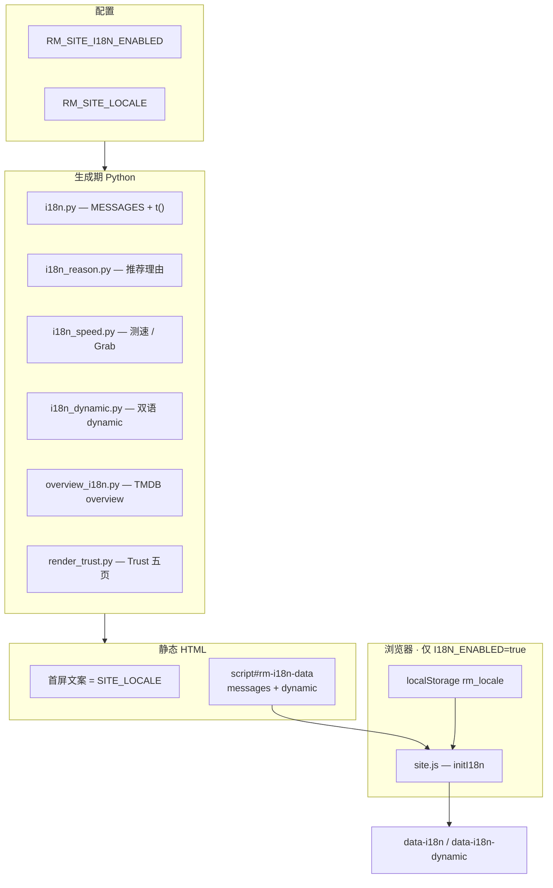

# ReleaseMatch 页面 UI 国际化方案（en / zh）

> **状态：** 已落地（2026-07-05）  
> **关联：** T3 生成器 · T-SEO-06 · `portal/generator/`  
> **语言：** 站点 UI 支持 **English / 中文**；Release 标题、magnet 名等数据源原文不翻译

---

## 1. 设计目标

| 目标 | 说明 |
|------|------|
| 全球 SEO | 默认英文 UI + 英文 meta；中文作为可选切换或独立部署语言 |
| 静态站点友好 | 不引入运行时 Node/SSR；沿用 **Jinja2 → `portal/dist/`** 生成链路 |
| IG 文案可切换 | `recommend_reason`、测速背书、Grab 摘要等在切换语言时同步更新 |
| MySQL 零迁移 | DB 仍存 scorer 产出的中文 `recommend_reason`；英文在**渲染期**由结构化字段重建 |

---

## 2. 总体架构



**范式：** SSG + 可选客户端切换（非 next-intl / 非双份 dist）。

---

## 3. 环境变量

| 变量 | 默认 | 说明 |
|------|------|------|
| `RM_SITE_I18N_ENABLED` | `false` | `true`：渲染默认语言 + 顶栏 **EN / 中文** 切换器，并注入双语 `dynamic` payload |
| `RM_SITE_LOCALE` | `en` | `en` \| `zh`；关闭 i18n 时为**整站唯一** UI 语言；开启时为**首屏默认**语言 |

配置读取：`workflow/config.py` → `SITE_I18N_ENABLED` / `SITE_LOCALE`。

### 3.1 两种运行模式

| 模式 | 配置示例 | 用户行为 |
|------|----------|----------|
| **固定语言** | `I18N_ENABLED=false` + `LOCALE=en` | 无切换器；全站英文（或全站中文） |
| **用户可切换** | `I18N_ENABLED=true` + `LOCALE=en` | 顶栏切换；偏好写入 `localStorage: rm_locale` |

本地示例（`.env`）：

```bash
RM_SITE_I18N_ENABLED=false   # 或 true
RM_SITE_LOCALE=en            # en | zh
```

生效方式：修改 `.env` 后 **必须重新生成** 静态页：

```bash
cd releasematch
source .env   # 或 export $(grep -v '^#' .env | xargs)
python -m workflow.run generate all
```

---

## 4. 文案三层模型

### 4.1 静态 UI 壳 — `portal/generator/i18n.py`

- 文案表：`MESSAGES: Dict[str, Dict[str, str]]`，键如 `nav.home`、`table.action`、`speed.panel.title`
- Jinja 调用：`{{ t('nav.home') }}`
- 开启切换时：元素加 `data-i18n="nav.home"`（可选 `data-i18n-vars='{"count": 12}'`）
- 注入前端：`i18n_catalog` → `rm-i18n-data.messages`

覆盖：导航、页脚、表头、Badge 标签、测速面板**字段名**、首页模块标题等。

### 4.2 动态业务正文 — 渲染期重建

| 模块 | 文件 | 职责 |
|------|------|------|
| 推荐理由 | `workflow/recommended/reason_i18n.py` | 片段文案（Verified Group、seeders、跨源等） |
| 推荐理由组装 | `workflow/recommended/scorer.py` | `build_recommend_reason(..., locale=)` |
| 渲染重建 | `portal/generator/i18n_reason.py` | 从 `recommended` 结构化字段按 locale 重写 `recommend_reason` |
| 测速 / Grab | `portal/generator/i18n_speed.py` | 背书句、freshness、reachability、Grab summary、`index_vs_measured` 等 |
| 双语 payload | `portal/generator/i18n_dynamic.py` | 对 en/zh 各跑一遍 `apply_page_locale()`，抽出 ~20 个 dynamic 字段 |
| TMDB 简介 | `portal/generator/overview_i18n.py` | TMDB API `en-US` / `zh-CN` overview；失败则按 CJK 推断回退 |

模板标记：`data-i18n-dynamic="recommend_reason"`（HTML 片段用 `data-i18n-html="1"`）。

**英文固定语言模式**（`I18N_ENABLED=false` + `LOCALE=en`）：仅执行 `localize_page_variables()`，不注入 `dynamic`。

**切换模式**（`I18N_ENABLED=true`）：额外生成 `rm-i18n-data.dynamic`，供前端在切换时更新 DOM。

### 4.3 前端切换 — 内联 bootstrap + `site.js`

**内联 bootstrap**（`partials/i18n_bootstrap.js`，经 `i18n_script.html` 注入）：

1. 读取 `#rm-i18n-data` JSON（`defaultLocale`、`messages`、`dynamic`）
2. `localStorage.rm_locale` 优先，否则用 `defaultLocale`
3. `applyLocale()`：
   - `[data-i18n]` → `messages[locale][key]`
   - `[data-i18n-dynamic]` → `dynamic[key][locale]`
   - `[data-i18n-aria-label]` → 无障碍标签
   - 更新 `document.documentElement.lang`（`en` / `zh-CN`）
4. 派发 `rm-locale-change` 自定义事件

**`portal/static/js/site.js`（增强层）：**

- 若页面已存在 `window.RM_I18N`（内联 bootstrap 已初始化），则跳过重复绑定
- 补充 `data-i18n-aria-label` 与 `initResponsiveTables()`（切换后刷新移动端 `data-label`）

纯静态预览（`serve-static` 或 `http.server` 以 `dist/` 为根）时，**即使 `/static/js/site.js` 404，内联 bootstrap 仍可完成双语切换**；完整样式与表格增强仍须 `dist/static/` 已同步（`generate all` 末尾或 `serve-static` 启动时自动执行）。

---

## 5. 生成流水线接入

```
workflow.run generate all
  │
  ├─ render_by_page_id() / render_home_page()
  │    └─ context_to_template_vars()
  │         └─ merge_render_context()          # portal/generator/i18n.py
  │              ├─ [I18N_ENABLED] build_i18n_dynamic()
  │              └─ localize_page_variables()   # en 固定模式时英文化动态字段
  │
  ├─ write_all_published() → portal/dist/**/index.html
  ├─ write_home_page()     → portal/dist/index.html
  ├─ write_all_show_hubs()
  ├─ write_trust_pages()   → portal/dist/trust/*/index.html（六页，含 speed-and-grab）
  ├─ write_sitemap()
  └─ sync_static_shell()   → portal/dist/static/、404.html、410.html
```

Trust 六页以 **`render_trust.py` + `trust_content.py`** 为准，随 `generate all` 写入 `dist/trust/`（含测速 / Grab 说明页 `speed-and-grab`）。

---

## 6. 代码与模板清单

| 路径 | 说明 |
|------|------|
| `workflow/config.py` | `SITE_I18N_ENABLED` / `SITE_LOCALE` |
| `portal/generator/i18n.py` | `MESSAGES`、`t()`、`merge_render_context()` |
| `portal/generator/i18n_reason.py` | 推荐理由渲染期重建 |
| `portal/generator/i18n_speed.py` | 测速 / Grab / 背书句本地化 |
| `portal/generator/i18n_dynamic.py` | 双语 `dynamic` payload |
| `portal/generator/overview_i18n.py` | TMDB 双语 overview |
| `portal/generator/trust_content.py` | Trust 五页 en/zh HTML 正文 |
| `portal/generator/render_trust.py` | Trust 页生成 |
| `workflow/recommended/reason_i18n.py` | scorer 推荐理由片段表 |
| `workflow/recommended/scorer.py` | `build_recommend_reason(..., locale=)` |
| `portal/generator/templates/partials/lang_switcher.html` | EN / 中文 按钮 |
| `portal/generator/templates/partials/i18n_script.html` | 注入 `rm-i18n-data` + 内联 bootstrap |
| `portal/generator/templates/partials/i18n_bootstrap.js` | 内联 i18n 切换逻辑（不依赖 site.js） |
| `portal/generator/static_shell.py` | `generate all` 末尾同步 static 壳到 dist |
| `portal/generator/templates/trust/page.html` | Trust 页 Jinja 壳 |
| `portal/static/js/site.js` | `initI18n()` |
| `portal/static/css/design-system.css` | `.rm-lang-switch` 样式 |
| `schema/d1_models.py` | 模板上下文含 `tmdb_id` / `media_kind`（overview 拉取） |

主要改过的模板：`base.html`、`header.html`、`*_sources_table.html`、`recommended_*`、`speed_*`、`grab_index_hero.html`、`episode.html`、`movie.html`、`show_hub.html`、`home.html`。

---

## 7. `dynamic` 字段一览（切换模式）

| `data-i18n-dynamic` 键 | 内容 |
|------------------------|------|
| `recommend_reason` | 推荐理由全文 |
| `speed_endorsement` | S-07 实测背书句 |
| `grab_index_summary` / `grab_index_tier_label` | Grab 摘要 / 等级 |
| `episode_overview` / `movie_overview` / `show_overview` / `tmdb_overview` | TMDB 简介 |
| `speed_panel_summary` | 测速面板 `<summary>` |
| `speed_method_note` | libtorrent 片段说明 |
| `speed_freshness_*` | 时效标签、说明、可信度行 |
| `speed_reachability_*` | 可达性展示与详情 |
| `speed_index_vs_measured` | A-10 索引 vs 实测 |
| `speed_footnote` | 面板脚注（HTML） |
| `speed_facts_time_sub` / `speed_connect_rate_display` 等 | 六项指标副文案 |
| `trust_body` | Trust 五页正文（HTML） |

Grab 名称 / 分项标签等静态键仍走 `data-i18n="speed.grab.*"`（`messages` catalog）。

---

## 8. 刻意不切换的内容

| 项 | 原因 |
|----|------|
| `<title>`、`meta description`、Open Graph | SEO / 分享卡片稳定；生成时固定为 `SITE_LOCALE` |
| JSON-LD（`schema_ld`） | 与 Google 富摘要语言一致 |
| Release 标题、infohash、magnet URI | 数据源原文 |
| `recommend_reason` MySQL 存储值 | 仍以 scorer 中文为主；展示层重建，不写回库 |

---

## 9. 验收清单

### 固定英文

```bash
RM_SITE_I18N_ENABLED=false RM_SITE_LOCALE=en python -m workflow.run generate page --page-id tv:1396:s04e06
```

- 页面 `lang="en"`，无顶栏切换器
- Recommended 区 `recommend_reason` 为英文
- 测速面板标签为英文（如 `Peer reachability`、`Action`）

### 可切换模式

```bash
RM_SITE_I18N_ENABLED=true RM_SITE_LOCALE=en python -m workflow.run generate page --page-id tv:1396:s04e06
```

- 存在 `.rm-lang-switch` 与 `script#rm-i18n-data`
- JSON 内 `dynamic.recommend_reason.en` / `.zh` 均有内容
- 浏览器切换 EN ↔ 中文：`recommend_reason`、测速 summary、hero overview 随切换变化
- Trust：`/trust/about/`、`/trust/speed-and-grab/` 正文随切换变化

**静态 dist 预览（部署同源）：**

```bash
RM_SITE_I18N_ENABLED=true python -m workflow.run generate all
python -m workflow.run serve-static --port 8080
# 打开 http://127.0.0.1:8080/breaking-bad/s4e6/ ，点击顶栏「中文」
```

### Trust 与 sitemap

`generate all` 后确认：

- `portal/dist/trust/{about,contact,dmca,privacy,how-matching-works,speed-and-grab}/index.html` 存在
- `portal/dist/static/js/site.js` 存在（`static_shell` 已同步）
- `scripts/seo_c2_checklist.py` Trust 描述门禁仍通过

---

## 10. 扩展新文案

1. **静态 UI**：在 `i18n.py` 的 `MESSAGES` 增加 `{ en, zh }`，模板用 `{{ t('your.key') }}`；若需前端切换，加 `data-i18n="your.key"`。
2. **动态句**：在 `i18n_speed.py` / `reason_i18n.py` 增加逻辑；若需切换，在 `i18n_dynamic.py` 的 `_DYNAMIC_EXTRACTORS` 注册键，模板加 `data-i18n-dynamic`。
3. **新 Trust 页**：在 `trust_content.py` 的 `TRUST_PAGES` 追加条目，并在 `i18n.py` 增加 `trust.*.title/meta/heading` 键。

改完后执行 `generate all` 刷新 `portal/dist/`。

---

## 11. 常见问题

**Q：改了 `.env` 但页面语言没变？**  
A：环境变量只影响**生成**；必须重新 `python -m workflow.run generate all`（或 `generate page`）。

**Q：开启切换后 meta 仍是英文？**  
A：符合设计；仅 UI 壳与 dynamic 正文切换，SEO meta 保持 `SITE_LOCALE`。

**Q：overview 中文页仍显示英文？**  
A：检查 `RM_TMDB_API_KEY` 与网络；`overview_i18n.py` 会尝试 API 双语拉取，失败时回退已存简介。

**Q：静态预览时点击「中文」无反应？**  
A：确认已 `generate all`（含 `static_shell`）或使用 `python -m workflow.run serve-static`。若用 `http.server` 直接 serve `dist/`，须保证 `dist/static/` 存在；HTML 内联 bootstrap 在 `site.js` 404 时仍应能切换——若完全无效，检查页面是否含 `script#rm-i18n-data` 且 `RM_SITE_I18N_ENABLED=true` 生成。

**Q：能否只部署中文站？**  
A：`RM_SITE_I18N_ENABLED=false` + `RM_SITE_LOCALE=zh` 即可，无需切换器。

---

## 12. 变更记录

| 日期 | 内容 |
|------|------|
| 2026-07-05 | 初版：MESSAGES + 固定 locale + 测速/理由英文化 |
| 2026-07-05 | `i18n_dynamic` + Trust Jinja 生成 + TMDB 双语 overview；切换器覆盖动态正文 |
| 2026-07-10 | 内联 `i18n_bootstrap.js`；`generate all` 自动 `static_shell`；`serve-static`；Trust `speed-and-grab` 说明页 |
