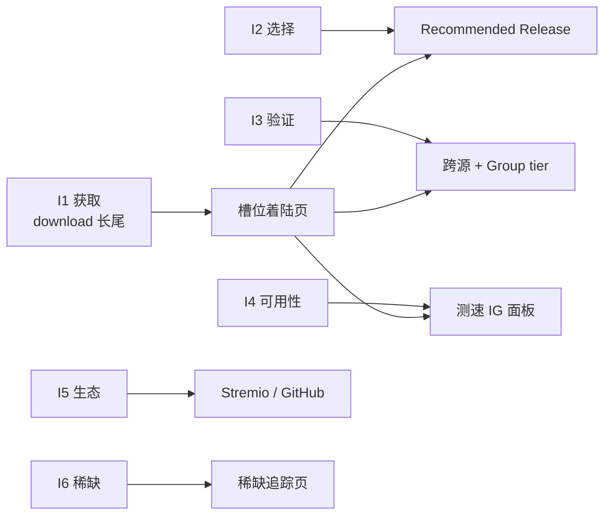
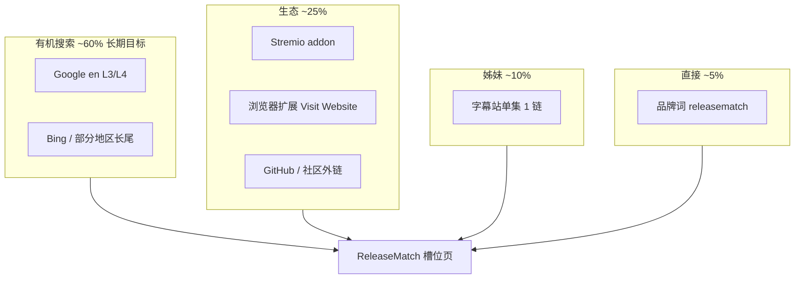
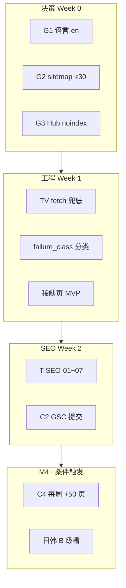

# 全球 SEO 流量定位（影视资源视角）

> **版本：** v1.0  
> **创建日期：** 2026-07-03  
> **状态：** 📋 **战略文档** — 指导 C2~C4 选槽、关键词、语言与市场优先级  
> **前置阅读：** [01-分支定位与流量获取.md](./01-分支定位与流量获取.md) §六~§八、[04-方案全景分析与优先级重评.md](./04-方案全景分析与优先级重评.md)、[IG信息登记册.md](./IG信息登记册.md)  
> **关联文档：** [10-稀缺槽与用户求片通知方案.md](./10-稀缺槽与用户求片通知方案.md)、[worklogs/2026-07-03/页面SEO分析与优化方向.md](../worklogs/2026-07-03/页面SEO分析与优化方向.md)、[worklogs/2026-07-03/页面UX分析与优化方向.md](../worklogs/2026-07-03/页面UX分析与优化方向.md)  
> **关联代码：** `portal/generator/templates/`、`workflow/metadata/tmdb_export_slots.py`、`workflow/torrent_sources/fetch_service.py`

---

## 目录

| 章节 | 主题 |
|------|------|
| 〇 | 文档目的与边界 |
| 一 | 流量本质：Release 决策站，非下载农场 |
| 二 | 全球搜索意图分层（I1~I6） |
| 三 | 全球影视资源地图（内容类型 × 索引生态） |
| 四 | 地理市场与语言策略 |
| 五 | 全球 SERP 竞品格局 |
| 六 | 关键词体系（L1~L4 + 语义簇 A~F） |
| 七 | 流量渠道组合（SEO 非唯一盘） |
| 八 | 内容 Portfolio 选槽标准 |
| 九 | 稀缺性与区域资源的 SEO 叙事 |
| 十 | 页面类型 × URL × 关键词映射 |
| 十一 | 技术 SEO 的全球交叉项 |
| 十二 | KPI 与北极星指标 |
| 十三 | 与当前 114 页的差距与动作 |
| 十四 | 待决策项 |
| 十五 | 执行顺序建议 |
| 十六 | 关键文件速查 |

---

## 〇、文档目的与边界

### 0.1 本文档回答什么

在 [01-分支定位与流量获取.md](./01-分支定位与流量获取.md) 已定义 L3/L4 英文长尾与冷启动节奏的基础上，本文档从 **全球影视资源生态** 出发，回答：

1. **谁在搜、用什么语言、搜什么意图**
2. **ReleaseMatch 在全球 SERP 中与谁竞争、不拼什么**
3. **114+ 槽位应按什么标准选、先 index 什么**
4. **有机搜索之外，Stremio / 扩展 / 姊妹站如何组合成流量盘**
5. **稀缺槽如何成为第二 SEO 叙事**

### 0.2 边界声明

| 本文档负责 | 本文档不负责 |
|------------|--------------|
| 全球流量战略、选槽、关键词簇、市场优先级 | C2 具体 head 任务（见 worklog SEO 文档 T-SEO-01~07） |
| 与 IG 登记册对齐的「词义差异化」 | IG 引擎算法细节（见 IG 登记册） |
| 与 10 号文档衔接的稀缺叙事 | 求片 / probe / notify 实现 |

### 0.3 当前基线（2026-07-03）

| 指标 | 数值 |
|------|------|
| published 槽位 | 114 |
| 首页目录卡片 | 107 |
| active 失败槽（draft） | 17 |
| GSC 提交 | **未启动**（C2 门禁） |
| 主模板语言 | `lang="zh-CN"` + 英文 title/H1（待统一） |

---

## 一、流量本质：Release 决策站，非下载农场

### 1.1 产品心智与 SEO 的关系

[04-方案全景分析与优先级重评.md](./04-方案全景分析与优先级重评.md) 定义：ReleaseMatch 是 **Release 导航站**，不是典型 magnet 聚合站。

| 维度 | magnet 聚合站（全球竞品） | ReleaseMatch |
|------|---------------------------|--------------|
| 页面主语 | 「这集有多少链接」 | 「这集该下哪个 release、为什么」 |
| SERP 点击动机 | 链接数量 | Recommended + 对版 + 测速 |
| 2026 IG 要求 | 与 TOP10 同源 → 零增益 | 多三层独有事实 |
| 规模策略 | 6 万+ 薄页 | M12 **5K~10K** 精品页 |
| M12 日 UV（中性） | — | **500~1,200**（01 文档 §12.8） |

**SEO 定位一句话：**

> 用 **「download / sources」长尾拿点击**，用 **Recommended + 测速 + Group 信誉拿排名与停留**；  
> 不跟 1337x 镜像站拼链接数，不做 L1 泛词铺量。

### 1.2 用户真正搜的词 vs 站点提供的价值

用户 query 表面是 **I1 获取**（download/torrent），Google 2026 排名看的是页面是否回答 **I2~I4**（选择、验证、可用性）。ReleaseMatch 的 SEO 必须 **同时覆盖 query 字面与决策深度**。

---

## 二、全球搜索意图分层（I1~I6）

| 层级 | 用户问题 | 典型 query（英文为主） | 全球普适 | ReleaseMatch 承接 |
|------|----------|------------------------|----------|-------------------|
| **I1 获取** | 从哪下？ | `{show} s04e06 download` | ✅ | L3 单集/电影页 |
| **I2 选择** | 下哪个 release？ | `{show} s04e06 1080p web-dl best` | ✅ | Recommended 卡片 |
| **I3 验证** | 会不会错版/枪版？ | `{show} s04e06 proper web-dl` | ✅ PT 文化圈 | 对版说明 + 跨源 badge |
| **I4 可用性** | 还能下吗、快吗？ | `{show} s04e06 fast torrent` | ✅ | libtorrent 测速 IG |
| **I5 生态** | Stremio/Plex 怎么配？ | `stremio addon quality torrent` | ✅ | T4 Stremio + 外链 |
| **I6 稀缺** | 冷门/区域独占从哪找？ | `{k-drama} english sub torrent` | ✅ 区域 | 稀缺追踪页（S-Scarcity） |



**流量策略：** I1 决定 **title/URL 关键词**；I2~I4 决定 **能否在 2026 SERP 存活**；I5~I6 决定 **差异化赛道与第二曲线**。

---

## 三、全球影视资源地图（内容类型 × 索引生态）

全球 BT 资源按 **内容类型** 分裂，SEO 页必须与 **数据源覆盖** 对齐，否则 index 后高 bounce → 损害全站。

| 内容类型 | 主要索引生态 | 全球搜索语言 | RM 页型 | SEO 优先级 | 数据源 Layer |
|----------|--------------|--------------|---------|------------|--------------|
| **欧美剧集** | EZTV、1337x、TPB、TorrentGalaxy | en | `episode.html` | **P0** | L2A + L1 Jackett |
| **欧美电影** | YTS、1337x、RARBG 遗产命名 | en | `movie.html` | **P0** | L2B + L1 |
| **动漫** | Nyaa `c=1_*` | en / ja | episode | P1 | L2C Nyaa |
| **日韩真人剧** | Nyaa LA `c=4_*`、1337x | en + ko/ja | episode 双语 title | P1 | L2D + [nyaa-proxy-asia.md](./nyaa-proxy-asia.md) |
| **印度/拉美/欧陆本土** | 1337x 全球 WEB-DL | 本地语 + en | 英文 slug | P2 | L1 1337x |
| **新片 hype / 未上映** | 常 0 源或 CAM | en | **不 index** | 稀缺追踪 | pipeline 易 fail |
| **TMDB pop 污染** | 非目标 adult 等 | — | **换槽** | ❌ | 登记册 `tmdb_pollution` |

### 3.1 索引生态与关键词的对应关系

| 生态特征 | 用户常搜修饰词 | 页面应体现的 IG |
|----------|----------------|-----------------|
| Scene WEB-DL 主导（EZTV/1337x） | `1080p web-dl`、`x264`、`proper` | Group tier、跨源 2/3 |
| YTS 电影 | `yify`、`yts`、`720p` | 多版本对比；YTS 标 L3 |
| Nyaa 动漫 | `batch`、`v2`、`subs` | 单集 vs batch 说明 |
| 韩剧 Netflix 国际版 | `netflix web-dl`、`english sub` | 双语 title |

### 3.2 当前 114 槽与全球地图的偏差

2026-07-03 TMDB popularity 批量选槽导致：

- **欧美 EZTV 稳槽**（BB、Inception 等）✅ 符合 P0
- **The Bear、Grey's Anatomy 等 fetch_gap** ⚠️ 假稀缺，损害 SERP 信任
- **5+ adult 高 pop 槽** ❌ 应 `tmdb_pollution` 换槽
- **6+ 日韩槽 0 magnet** ⚠️ 需 region_gap 源扩展后再 index

**全球 SEO 原则：** index 的每一页必须 **数据源可稳定维持 ≥2 magnet**，否则 noindex 或稀缺追踪，不进 sitemap。

---

## 四、地理市场与语言策略

### 4.1 市场优先级矩阵

| 市场 | 相对搜索体量 | 主搜索语言 | URL slug | title/H1 | hreflang（远期） |
|------|--------------|------------|----------|----------|------------------|
| **北美** | ★★★★★ | en | 英文 `{slug}/s4e6/` | `{Show} S04E06 Sources` | `en-US` |
| **英澳** | ★★★★ | en | 同上 | 同上 | `en-GB` |
| **西欧** | ★★★★ | en + de/fr/es | 英文 slug | 英文为主 | `de`/`fr`/`es` 可选 |
| **南亚/东南亚** | ★★★ | en（搜 Hollywood） | 英文 slug | 英文 | `en-IN` 可选 |
| **韩国** | ★★★ | ko + en | 英文 slug | 英 + 韩副标题 | `ko` + `en` |
| **日本** | ★★★ | ja + en | 英文 slug | 英 + 日副标题 | `ja` + `en` |
| **拉美** | ★★★ | es/pt + en | 英文 slug | 英文（西语 query 进 en 页） | `es`/`pt-BR` 远期 |

### 4.2 为什么默认战场是英文

1. EZTV / YTS / 1337x release 命名 **全球统一英文**
2. `{title} download` SERP **80%+ 英文结果页**
3. 新域沙盒 **crawl budget 有限**，一种语言打透优于多语言薄页
4. 模板已用英文 title/H1（`Release-Matched Sources`），与 SEO 意图一致

### 4.3 日韩第二战场（不另建站）

[01-分支定位与流量获取.md](./01-分支定位与流量获取.md) §十五：

| 维度 | 欧美 | 日韩 |
|------|------|------|
| URL | `/breaking-bad/s4e6/` | `/crash-landing-on-you/s1e1/` |
| Title | `Breaking Bad S04E06 Sources` | `Crash Landing On You S01E01 — 사랑의 불시착 1화` |
| 关键词 | English L3/L4 | **双语长尾** |
| hreflang | `en` | `en` + `ko` / `ja` |

[02-数据源技术方案](./02-数据源技术方案-详细展开.md) §七补充可选 SEO 扩展：

- 日文：`{作品名} ダウンロード`
- 韩文：`{작품명} 다운로드`
- 由 TMDB `translations` 驱动，**同一 canonical URL**

### 4.4 语言待决策（与 SEO worklog D1 一致）

| 选项 | 做法 | 全球 SEO 影响 |
|------|------|---------------|
| **A（推荐）** | `lang="en"` + UI/title/description 英文化 | 与 SERP query 一致，减少 bounce |
| B | 保持 `zh-CN` UI，仅 title 英文 | 语言信号混乱（当前状态） |
| C | `/en/`、`/ko/` 分路径 | M12 后考虑，成本高 |

---

## 五、全球 SERP 竞品格局

### 5.1 SERP 占位者分析

| SERP 类型 | 典型占位 | 提供价值 | **不拼** | **应拼** |
|-----------|----------|----------|----------|----------|
| Magnet 聚合 | 1337x 镜像、TPB、TG 克隆 | 链接列表 | 数量、更新速度 | Recommended + 理由 |
| 合法聚合 | JustWatch、Reelgood | 流媒体订阅 | 正版片源 | 「无 streaming 时的 release 导航」 |
| 社区单次帖 | Reddit、论坛 | 问答 | 实时 spike | **结构化可索引** 答案 |
| Stremio 生态 | Torrentio、Comet | 插件内流 | 插件内 Debrid 秒开 | **站外 SEO 页** + GitHub 外链 |
| Debrid 教程 | RD 配置站 | 缓存播放 | 秒开体验 | 「先选对 release 再送 RD」 |
| AI 洗稿站 | 2026 重灾区 | 长文无增量 | 任何 Skyscraper 量产 | 实测数据 IG |

### 5.2 Torrentio 生态缺口（全球 Stremio 用户）

[09-Stremio插件价值分析.md](./09-Stremio插件价值分析.md)：

| 指标 | 数值 |
|------|------|
| Stremio 月访问 | ~15.33M |
| 总用户声称 | 30M+ |
| Torrent 类 addon | **无 release 推荐逻辑** |

**全球定位衔接：** Stremio addon 不直接产生 Google 流量，但带来 **引用域、品牌词、高意图回访** —— 与 SEO 互补。

### 5.3 2026 Information Gain 下的竞争等式

```
竞品页价值 ≈ magnet 列表（同源）
ReleaseMatch 价值 ≈ magnet 列表
                  + Recommended（scorer）
                  + 跨源 confidence（2/3、3/3）
                  + Group tier（L0~L4）
                  + libtorrent 测速（S-06/S-07）
                  + 对版/推荐理由文案
```

Google 排名看 **后者多出来的层** 是否无法从 TOP10 拼凑获得。

---

## 六、关键词体系（L1~L4 + 语义簇 A~F）

### 6.1 层级矩阵（01 文档 §8.1 扩展）

| 层级 | 是否主攻 | 全球示例 | 切入时机 | 页均 UV 预期（M12） |
|------|----------|----------|----------|---------------------|
| **L4 超长尾** | ✅ | `breaking bad s04e06 1080p web-dl scene` | M1 | 低但高 CTR |
| **L3 分集/电影** | ✅ **核心** | `breaking bad s04e06 download` | M1~M4+ | 主量 |
| **L2 实体** | ⚠️ 后期 | `breaking bad torrent` | M8+ | 中 |
| **L1 泛词** | ❌ | `torrent download`、`free movie download` | **放弃** | — |
| **Brand** | ✅ 积累 | `releasematch`、`releasematch breaking bad` | M6+ | 高 CVR |

### 6.2 语义簇 A — 剧集单集（~70% indexable 页）

```
{show} s{ss}e{ee} download
{show} season {s} episode {e} torrent
{show} s{ss}e{ee} 1080p web-dl
{show} s{ss}e{ee} 720p web-dl
{show} s{ss}e{ee} x264 scene
{show} s{ss}e{ee} proper / repack
{release_group} {show} s{ss}e{ee}
{show} s{ss}e{ee} magnet link
```

**冷启动锚点（C1/C2）：** Breaking Bad S04 全季、Inception、Matrix 等 **EZTV + recommended + 测速** 完整页。

### 6.3 语义簇 B — 电影（~25%）

```
{movie} {year} download
{movie} {year} torrent
{movie} 1080p bluray remux
{movie} web-dl vs bluray
{movie} yify / yts          ← 搜索量大，Group L3，需在页内说明 tier
{movie} {year} magnet
```

**页面差异：** movie.html 强调 **All Versions** 多版本对比，title 用 `Sources` 强化品牌。

### 6.4 语义簇 C — 画质 / 编码 / Group（L4，高 IG）

```
{show} s{ss}e{ee} ddp5.1 web-dl
{show} s{ss}e{ee} hevc x265
{show} s{ss}e{ee} av1
{group_name} release quality
scene vs p2p web-dl difference
```

与 [IG信息登记册.md](./IG信息登记册.md) Group tier、编码分析直接对齐。

### 6.5 语义簇 D — 区域 / 双语（日韩 P1）

```
{english_title} s01e01 download
{native_title} 다운로드
{native_title} ダウンロード
{k-drama} english subtitles torrent
{anime} {english_title} batch 1080p
```

**实现：** TMDB API 预热 + `build_search_titles` + title 双语；hreflang 远期。

### 6.6 语义簇 E — 品牌 + 工具（M6+）

```
releasematch
releasematch addon stremio
release matched torrent sources
how to choose web-dl release
torrent release group tier explained
```

承接页：`/trust/how-matching-works/`、Stremio GitHub README。

### 6.7 语义簇 F — 稀缺 / 长尾（第二曲线）

```
{obscure film title} download
{regional show} torrent english
{classic art house} web-dl
{year} cult movie magnet
```

对应 `failed_slots` active、`genuine_scarcity` —— **低竞争、高粘性**；index 策略见 §九。

### 6.8 明确放弃的全球词

| 词类 | 示例 | 原因 |
|------|------|------|
| L1 泛词 | `free movies online`、`torrent sites` | 竞争 + Scaled Content 风险 |
| 误导播放 | `watch {title} online free` | 与「非托管」冲突，Manual Action 风险 |
| 平台侵权暗示 | `netflix download {title}` | 误导 + DMCA 敏感 |
| 6 万页铺量 | 全 TMDB 导出无 IG | 2026 Core Update 反制 |
| 无 magnet index | magnet=0 | 薄页门禁 |

### 6.9 关键词切入顺序（01 §6.3）

```
Phase 1 — M1：品牌 + 超长尾
  releasematch breaking bad s04e06
  breaking bad s04e6 web-dl sources matched

Phase 2 — M4+：L3 分集长尾
  breaking bad s04e06 1080p web-dl download

Phase 3 — M8+：L2 实体
  breaking bad download sources

Phase 4 — 永不主攻 L1
```

---

## 七、流量渠道组合（SEO 非唯一盘）

### 7.1 渠道结构



### 7.2 各渠道全球特点

| 渠道 | 全球特点 | 与 SEO 关系 | 轨道 |
|------|----------|-------------|------|
| **Google Organic** | 沙盒 3~6 月；Pirate demotion -89% | **主战场** | C2~C4 |
| **Bing / Yandex** | 部分市场 BT 词竞争更低 | 同一静态 HTML，无需 duplicate | 被动受益 |
| **Stremio** | 15M+ 月访；无 release 推荐 addon | 引用域 + 品牌 + 高意图用户 | T4-1 |
| **浏览器扩展** | CWS 全球分发 | 「Visit Website」直接 UV | T4-3 |
| **字幕姊妹站** | 1 链/页，禁止 sitewide | 意图匹配 > PageRank | 01 §七 |
| **Reddit / 论坛** | spike 流量 | 链接诱饵 → how-matching-works | 外链 M3~M4 |
| **Real-Debrid 圈** | 高付费用户 | v2 Debrid 集成前，SEO 页教育「先选对 release」 | T5 远期 |

### 7.3 外链与品牌（01 §10）

| 阶段 | 来源 | 目标引用域 |
|------|------|-----------|
| M1~M2 | Stremio 插件 GitHub | 5~10 |
| M3~M4 | `/how-matching-works` | 10~20 |
| M5~M8 | Bazarr/Plex 集成叙事 | 20~40 |
| M9~M12 | API 公开 | 40~80 |

---

## 八、内容 Portfolio 选槽标准

### 8.1 全球 indexable 价值评分（选槽用）

| 等级 | 选槽标准 | 示例 | index |
|------|----------|------|-------|
| **S** | 欧美剧 + EZTV 稳 + recommended + 测速 | BB S04E01~08 | ✅ C2 首批 |
| **A** | 全球 blockbuster 电影 + YTS/1337x | Inception, Shawshank | ✅ |
| **A** | 流媒体热门欧美剧 S01E01 | GoT, Mandalorian, The Bear* | ✅ *需修 fetch |
| **B** | Netflix 国际韩剧 + Nyaa LA | Crash Landing on You | ✅ 双语 title |
| **B** | 热门动漫 S01 | 需 Nyaa 源 | ✅ 双语 |
| **C** | 有 magnet 但无 recommended | S04E03/E05 | **noindex** |
| **D** | draft 0 magnet 真稀缺 | Poppea, CHILL CLUB | 稀缺页 / noindex |
| **X** | TMDB 污染 / hype 未上映 | 登记册 adult 项 | **换槽** |

### 8.2 不应按 TMDB popularity  alone 扩页

`scripts/tmdb_select_benchmark_slots.py` 当前逻辑按 pop 选取，全球 SEO 需叠加：

| 过滤规则 | 目的 |
|----------|------|
| `vote_count >= N` | 去掉无评分 hype |
| 标题/adult 黑名单 | 去掉污染槽 |
| `failure_class != tmdb_pollution` | 登记册联动 |
| 数据源预检：EZTV/YTS/Nyaa 至少 1 源有 hit | 避免 index 后空页 |
| 锚点 70% + 稀缺/区域 30% | Portfolio 平衡 |

### 8.3 页面规模与 crawl budget（04 C4）

| 里程碑 | 页数 | 前提 |
|--------|------|------|
| C2 首批 sitemap | **≤30** indexable + Trust + 首页 | T-SEO-01，见 worklog |
| M3 | 150~300 | 收录率 ≥20% |
| M6 | 1K~2K | 收录率 ≥35% |
| M12 | **5K~10K** | 收录率 ≥45%，**非 6 万** |

---

## 九、稀缺性与区域资源的 SEO 叙事

### 9.1 全球稀缺类型

| 稀缺类型 | 全球场景 | SERP 竞争 | 页面策略 |
|----------|----------|-----------|----------|
| **索引稀缺** | 艺术片、老片、区域独占 | 低 | index 或 scarcity；「RM 追踪命中」 |
| **选择稀缺** | 同集 40 个 release | 高 | **主战场** — Recommended |
| **区域稀缺** | 韩剧无 EZTV | 中 | 双语 title + Nyaa |
| **时效稀缺** | 新集 aired 24h | spike | `lastmod` + cron fetch |

### 9.2 与 S-Scarcity 的 SEO 衔接

[10-稀缺槽与用户求片通知方案.md](./10-稀缺槽与用户求片通知方案.md)：

| 状态 | SEO 处理 |
|------|----------|
| `published` ≥2 magnet | index + sitemap |
| `thin` 1 magnet | noindex |
| `draft` / `scarcity` 0 magnet | 默认 **noindex**；首页「稀缺追踪」分区 **follow 内链** |
| `genuine_scarcity` 长期 0 | 可选 index **叙事页**（无 magnet 列表，有追踪状态）— 低量长尾 |

**英文叙事示例：**

- 常规定位：`Release-Matched Sources — verified releases, not just magnet lists`
- 稀缺定位：`Tracked scarcity — no public indexer match yet; RM monitoring`

### 9.3 求片（S-Request）的 SEO 价值

求片不产生 bulk 页，但强化 **I6 意图** 与回访；命中后「RM 率先发现」可成为 **UGC 叙事**（邮件/通知），间接推高品牌搜索。

---

## 十、页面类型 × URL × 关键词映射

| 页面类型 | URL 示例 | 主关键词簇 | title 模式 | robots（沙盒期） |
|----------|----------|------------|------------|------------------|
| 首页 | `/` | 品牌 + 目录 | `ReleaseMatch — Release 导航站` | index |
| 单集 L3 ⭐ | `/breaking-bad/s4e6/` | 簇 A | `{Show} S04E06 Sources — {quality} \| ReleaseMatch` | index（≥2 magnet） |
| 电影 | `/inception-2010/` | 簇 B | `{Movie} ({Year}) Sources — {quality} \| ReleaseMatch` | index |
| Hub | `/breaking-bad/` | L2 后期 | `{Show} — All Episodes Release Guide` | **noindex,follow**（D2 推荐） |
| Trust | `/trust/about/` | E-E-A-T | 各页独立 description | index |
| 稀缺追踪 | `/…/ scarcity`（规划） | 簇 F | `{Title} — Tracked Scarcity \| ReleaseMatch` | noindex 默认 |
| 404 | `/404.html` | — | — | noindex |
| 410 | `/410.html`（待建） | — | — | gone |

**内链网络（01 §8.3）：** 首页 → Hub（noindex 仍传递 follow）→ L3；L3 prev/next 串联同季。

---

## 十一、技术 SEO 的全球交叉项

| 项 | 全球影响 | 任务引用 |
|----|----------|----------|
| `lang=en` 统一 | 英文 query 匹配 ↑ | SEO D1 / T-SEO-06 |
| canonical + trailing slash | 避免地区 duplicate | 已实施 |
| sitemap 分批 ≤500 URL | crawl budget | T-SEO-01 |
| TVEpisode / Movie Schema | 欧美 rich result | T-SEO-04 |
| OG / Twitter Card | Reddit/TG 全球分享 | T-SEO-05 |
| CWV LCP < 2.5s | 新兴市场 mobile 占比高 | UX-12 字体本地化 |
| magnet `rel="nofollow"` | 全球合规 | 已实施 |
| 410 DMCA | Pirate demotion 隔离 | T-SEO-02 |
| `RM_SHOW_IG_DEBUG=false` 生产 | 防全站 noindex | §六检查清单 |

---

## 十二、KPI 与北极星指标

### 12.1 有机流量 KPI（01 §12.8 中性情景）

| 指标 | M3 | M6 | M9 | M12 |
|------|-----|-----|-----|------|
| 上线页 | 150~300 | 1K~2K | 3K~5K | 5K~10K |
| GSC 收录率 | 20~25% | 35~40% | 40~50% | 45~55% |
| **有机日 UV** | 10~20 | 80~150 | 200~500 | **500~1,200** |
| 品牌 impression/月 | 100+ | 1K+ | 3K+ | 5K+ |
| 引用域 | 10 | 30 | 50 | 80 |

**单页日均 UV 健康值：** indexable 页 **0.1~0.3 UV/页/日**（M12）— 勿用农场 KPI。

### 12.2 全球 SEO 北极星（优先级排序）

1. **收录率 ≥25%** — C4 扩页门禁  
2. **C1 验证集 Top 20 有 impression** — 模式验证  
3. **indexable 页 Recommended 覆盖率 ≥80%** — IG 门禁  
4. **品牌词 `releasematch` Top 10** — M6+  
5. **引用域 M12 ≥80** — Stremio + how-matching-works  
6. **Manual Action = 0** — 全球红线  

### 12.3 C3 观察期铁律（04 文档）

收录率 <25% 时：**不增 SEO 页**，查 IG / CWV / thin content —— 与全球扩页冲动对抗。

---

## 十三、与当前 114 页的差距与动作

| 现状 | 全球 SEO 问题 | 动作 | 负责 |
|------|---------------|------|------|
| TMDB pop 选槽 | 污染 + 区域 mismatch | 换槽 + `failure_class` | pipeline + 登记册 |
| 114 页拟全进 sitemap | 沙盒过载 | C2 仅 ≤30 URL（D3） | T-SEO-01 |
| lang 中英混 | bounce ↑ | 决策 D1 → T-SEO-06 | 模板 |
| 17 draft 不可见 | 丢失 I6 叙事 | S-Scarcity + 首页分区 | UX-06 |
| The Bear 等 0 源 | 假稀缺 | TV `search_text` 兜底 | fetch_service |
| 无 GSC | 零 organic 数据 | C2 门禁后提交 | 运营 |
| Hub 缺 head | Hub 词误 index | T-SEO-03 + D2 noindex | show_hub.html |

---

## 十四、待决策项

| ID | 决策 | 选项 | 建议 |
|----|------|------|------|
| **G1** | 默认语言市场 | A en 全站 / B 中文 UI / C 分路径 | **A** |
| **G2** | C2 sitemap 范围 | ≤30 验证集 / 全 114 | **≤30** |
| **G3** | Hub index | index / noindex | 沙盒期 **noindex,follow** |
| **G4** | 稀缺页 index | 全 noindex / genuine 少量 index | 默认 noindex；genuine 个案 |
| **G5** | 日韩扩页时机 | T5 按需 / C4 同步 | 源稳定后再 B 级 index |
| **G6** | Stremio 与 SEO 主推市场 | 全球 en / 分区 | 全球 en，插件描述英文化 |

---

## 十五、执行顺序建议



**与双轨对齐：**

| 轨道 | 阶段 | 本文档动作 |
|------|------|------------|
| T | T3 ✅ | 生成器已产出 IG 页 |
| T | fetch 兜底 | 消除假稀缺 |
| C | C2 | G2 + T-SEO + GSC |
| C | C3 | 观察 KPI §12，不增页 |
| C | C4 | 按 §8 Portfolio 扩页 |
| S | S-Scarcity | §9 稀缺叙事 |

---

## 十六、关键文件速查

```
docs/01-分支定位与流量获取.md          # L1~L4、冷启动、KPI
docs/04-方案全景分析与优先级重评.md    # C0~C4、竞品对照
docs/IG信息登记册.md                   # Group/跨源/测速 IG
docs/02-数据源技术方案-详细展开.md     # 全球源覆盖 §七
docs/09-Stremio插件价值分析.md         # 生态流量
docs/10-稀缺槽与用户求片通知方案.md    # I6 稀缺叙事
docs/nyaa-proxy-asia.md                # 日韩源
worklogs/2026-07-03/页面SEO分析与优化方向.md   # C2 任务
worklogs/2026-07-03/页面UX分析与优化方向.md    # 主路径 UX
portal/generator/templates/episode.html
portal/generator/templates/movie.html
workflow/metadata/tmdb_export_slots.py
data/failed_slots/registry.json
```

---

## 变更记录

| 版本 | 日期 | 说明 |
|------|------|------|
| v1.0 | 2026-07-03 | 初版：全球影视资源视角 SEO 流量定位；归档于 docs |
