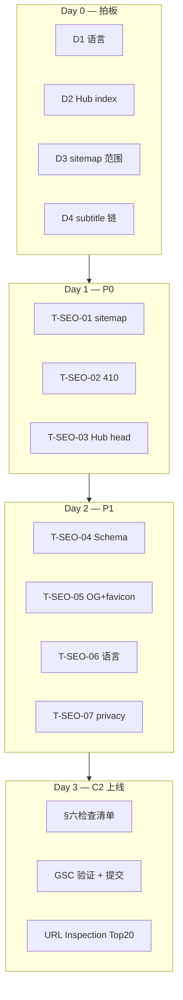

# 页面 SEO 分析与优化方向

> **版本：** v1.0  
> **日期：** 2026-07-03  
> **归属：** `worklogs/2026-07-03/`  
> **状态：** 📋 **下次工作方向** — 承接 C1 验证集完成，目标 C2 GSC 冷启动  
> **前置阅读：** [01-分支定位与流量获取.md](../../docs/01-分支定位与流量获取.md) §九、[04-方案全景分析与优先级重评.md](../../docs/04-方案全景分析与优先级重评.md) §C2  
> **关联代码：** `portal/generator/templates/`、`schema/d1_models.py`、`scripts/deploy_cf_pages.sh`  
> **当日验收：** [今日验收清单.md](./今日验收清单.md)

---

## 〇、文档目的

2026-07-03 对 ReleaseMatch Portal 全站 SEO 现状做了审计（模板、生成器、Trust 页、robots、Schema、与战略文档对照）。本文档将审计结论 **固化为可执行任务清单**，作为 **C2 阶段（GSC + sitemap + URL Inspection）** 的实施依据。

**边界声明：**

- 本文档 **不替代** [01-分支定位与流量获取.md](../../docs/01-分支定位与流量获取.md) 的 SEO 战略；只落地「技术 SEO + 页面 head 补齐 + 提交策略」。
- **Information Gain 内容层** 以 [IG信息登记册.md](../../docs/IG信息登记册.md) 为准；本文档仅标注 IG 相关的 SEO 风险点，不重写 IG 引擎。
- **C2 前不提交 GSC**（与 04 文档一致）；本文档任务完成后才启动 GSC。

---

## 一、当前基线（2026-07-03）

### 1.1 架构与部署

| 项 | 现状 | 评价 |
|----|------|------|
| 渲染 | Jinja2 SSG → `portal/dist/` | ✅ 爬虫友好 |
| 托管 | Cloudflare Pages（`wrangler.toml`） | ✅ 静态首屏 |
| URL | DB `canonical_path`，强制 trailing slash | ✅ |
| Canonical origin | `RM_SITE_ORIGIN`（默认 `https://releasematch.io`） | ✅ |
| 开发预览 | `workflow.run serve` 动态渲染 | ⚠️ 非生产，SEO 以 dist 为准 |

### 1.2 页面规模

| 指标 | 数值 | 说明 |
|------|------|------|
| published 槽位 | **114** | 07-03 pipeline batch 后 |
| `generate all` 验证 | **22/22 OK** | 见 [validation-pages.json](./validation-pages.json) |
| 无 recommended 页 | S04E03、S04E05 等 | 应保持 noindex 或暂不 index |
| Trust 页 | 4 页 | `/trust/about/` 等 |

### 1.3 路由与模板映射

| 页面类型 | URL 示例 | 模板 | SEO 角色 |
|----------|----------|------|----------|
| 首页 | `/` | `home.html` | 品牌 + 目录入口 |
| 剧集 Hub | `/breaking-bad/` | `show_hub.html` | 内链枢纽（策略待定） |
| **单集 L3** ⭐ | `/breaking-bad/s4e6/` | `episode.html` | **核心 SEO 着陆页** |
| 电影 | `/inception-2010/` | `movie.html` | 长尾词着陆页 |
| Trust | `/trust/*/` | 静态 HTML | E-E-A-T |
| 404 | `/404.html` | 静态 | noindex |

---

## 二、分页面 SEO 审计矩阵

| 页面 | Title | Description | Robots | Canonical | Schema | 内链 | 综合 |
|------|-------|-------------|--------|-----------|--------|------|------|
| 单集 L3 | ✅ | ✅ 动态 | ✅ 薄页门禁 | ✅ | ⚠️ 仅 WebPage | ✅ prev/next + 面包屑 | **A-** |
| 电影 | ✅ | ✅ | ✅ | ✅ | ❌ | 面包屑 | **B** |
| 剧集 Hub | ✅ | ❌ 继承通用 | ❌ 未覆盖 | ✅ | ❌ | 集芯片 | **C+** |
| 首页 | ✅ | ✅ | ❌ 未显式 | ✅ | ❌ | 目录网格 | **B-** |
| Trust 四页 | ✅ | ⚠️ privacy 缺 | ❌ | ✅ | ❌ | footer | **B** |
| 404 | ✅ | ❌ | ✅ noindex | ❌ | ❌ | — | **B** |

### 2.1 已达标项（保持，勿回退）

1. **薄页门禁** — `MediaPage.is_indexable()`：`magnet_count >= 2` 且非 `robots_noindex` 才 index  
   - 代码：`schema/d1_models.py`  
   - 模板：`episode.html` / `movie.html` 的 `meta_robots` 块

2. **单集页 head 较完整** — 英文关键词型 title、`index/noindex` 分支、JSON-LD、`rel=prev/next`

3. **Magnet 出站** — 全站 `rel="nofollow"`（`recommended_block.html`、`episode.html` 表格）

4. **Trust / E-E-A-T** — About、DMCA、Privacy、How-matching-works + footer 合规声明

5. **IG 模块已 bake 进页面** — Recommended Release、Group tier、测速证据（S-06/S-07）

### 2.2 关键缺口汇总

| 优先级 | 缺口 | 阻塞 C2？ | 涉及文件 |
|--------|------|-----------|----------|
| **P0** | `sitemap.xml` 未实现（robots 已引用） | ✅ 是 | 新增生成器模块 |
| **P0** | 410 Gone 模板缺失 | ✅ 是（DMCA） | `portal/410.html` + 生成器 |
| **P0** | Hub 页缺独立 description / robots | ⚠️ 部分 | `show_hub.html` |
| **P1** | Schema 与文档不符（应 TVEpisode） | 否 | `episode.html`、`movie.html` |
| **P1** | Open Graph / Twitter Card 全缺 | 否 | `base.html` |
| **P1** | favicon 未声明 | 否 | `base.html` + static |
| **P1** | 语言信号混乱（zh-CN + 英文 title） | ⚠️ 策略待定 | 全模板 |
| **P2** | BreadcrumbList JSON-LD | 否 | 各内容模板 |
| **P2** | Google Fonts 影响 LCP | 否 | `base.html` |
| **P2** | subtitle 跨站链 nofollow 策略未定义 | 否 | `episode.html` |

---

## 三、内容 SEO 风险（IG 视角）

> 2026 年排名以 **Information Gain** 为主信号；技术 meta 是基座，不能替代内容差异。详见 [01 §1.1](../../docs/01-分支定位与流量获取.md)。

| 风险 | 表现 | 缓解动作 | 负责 |
|------|------|----------|------|
| TMDB 复述 | 侧边栏 `tmdb_overview` 与竞品雷同 | 缩短或折叠；主内容区以本站分析为主 | 模板 |
| 无 recommended 页被 index | 空 IG 区块 | 保持 `noindex`；sitemap 排除 | 生成器 |
| Hub 页价值薄 | 仅集数芯片 | 加「本剧 release 概况」或 Hub noindex | 模板 + 策略 |
| 规模扩张过早 | 114 页 > C1 验证集 20 页 | C2 分批提交 sitemap；C3 观察收录率 | 运营 |
| 模板化 magnet 列表 | 与 TOP10 同源 | 强化推荐理由、测速、Group 差异 | IG 引擎（已有） |

---

## 四、待决策项（实施前须拍板）

### 决策 D1：语言与市场

| 选项 | 做法 | 适用场景 |
|------|------|----------|
| **A（推荐）** | `lang="en"` + title/description 英文化 | 主攻 `S04E06 download/sources` 英文长尾 |
| B | 保持 `lang="zh-CN"`，仅 title 英文 | 现状；语言信号混乱 |
| C | `/en/`、`/zh/` 分路径 | M12 后考虑 |

**建议：** 选 A。当前 title/H1 已是英文（`Sources — Release-Matched`），与 `lang=en` 一致；UI 文案可暂保留中文或逐步英文化。

> **✅ 2026-07-04 已定：选 A** — `base.html` 已设 `lang="en"`。

### 决策 D2：Hub 页是否 index

| 选项 | 优点 | 缺点 |
|------|------|------|
| **index,follow** | 内链传递、系列词覆盖 | 需独立 description + 少量 IG |
| **noindex,follow** | 权重集中到 L3；沙盒期更保守 | Hub 词不参与排名 |

**建议：** C2 沙盒期选 **noindex,follow**；C3 收录率 >25% 后再改 index 并补 IG 文案。

> **✅ 2026-07-04 已定：选 noindex,follow** — `show_hub.html` 已落地。

### 决策 D3：C2 sitemap 提交范围

| 选项 | URL 数 | 风险 |
|------|--------|------|
| **A（推荐）** | 首批 ~20 高质量 indexable 页 + Trust 4 页 + 首页 | 低；符合 C1 验证集初衷 |
| B | 全部 114 published 页 | 高；沙盒期易低收录率 |
| C | 仅 indexable 且 `recommended` 非空的页 | 最低；规模小 |

**建议：** 选 A 或 C。从 [validation-pages.json](./validation-pages.json) / DB 筛 `is_indexable() AND has_recommended` 生成首批 sitemap。

> **✅ 2026-07-04 已定：选 A** — sitemap 首批 ≤30 indexable 内容页 + Trust 4 + 首页；实现见 `portal/generator/sitemap.py`。

### 决策 D4：subtitle 跨站链

`episode.html` 中 `SubtitlePortal →` 链接：

- 是否加 `rel="nofollow"`？（04 文档要求跨站互链节制）
- 是否仅在 `recommended` 存在时展示？

**建议：** 加 `rel="nofollow ugc"`；仅 recommended 存在时展示。

> **✅ 2026-07-04 已定** — `episode.html` 已加 `nofollow ugc`；仅 `recommended` 存在时展示 SubtitlePortal。

---

## 五、任务清单（下次 Sprint）

### 5.1 P0 — C2 阻塞项（预估 1~1.5 人天）

#### T-SEO-01：sitemap 生成器

| 字段 | 内容 |
|------|------|
| **目标** | `generate all` 后输出 `portal/dist/sitemap.xml`（及必要时 sitemap index） |
| **纳入 URL** | 首页、`is_indexable()` 内容页、Trust 四页 |
| **排除** | `robots_noindex` 页、404、410、IG debug 模式 |
| **格式** | `<loc>` + `<lastmod>`（取 DB `updated_at` ISO8601）；单文件 ≤500 URL，超出用 sitemap index |
| **入口** | `python -m workflow.run generate all` 末尾调用；`deploy_cf_pages.sh` 确保复制到 dist 根 |
| **验收** | `curl https://releasematch.io/sitemap.xml` 返回 200；URL 数与 DB indexable 一致 |

#### T-SEO-02：410 Gone 页 + DMCA 流程

| 字段 | 内容 |
|------|------|
| **目标** | DMCA 命中 URL 返回 HTTP 410（CF Pages 配置或静态 410 页） |
| **交付** | `portal/410.html`；生成器剔除对应 dist 文件；sitemap 生成器同步排除 |
| **验收** | 模拟 DMCA 槽位 → dist 无该路径 → sitemap 无该 URL |

#### T-SEO-03：Hub 页 head 补齐

| 字段 | 内容 |
|------|------|
| **目标** | `show_hub.html` 增加独立 `meta_description` 与 `meta_robots` |
| **内容示例** | `{{ show_title }} 全部集数 Release 导航：逐集 Recommended Release 与多源对比入口。` |
| **robots** | 按决策 D2：默认 `noindex,follow`（沙盒期） |
| **验收** | 生成 Hub 页 view-source 可见独立 description + robots |

### 5.2 P1 — C2 同期增强（预估 0.5~1 人天）

#### T-SEO-04：Schema.org 升级

| 页面 | 目标 Schema |
|------|-------------|
| episode | `TVEpisode` + `partOfSeries`（TVSeries） |
| movie | `Movie` + `datePublished`（year） |
| 首页 | `WebSite`（可选 `SearchAction`） |

参考 [01 §9.2](../../docs/01-分支定位与流量获取.md) 示例。验收：Google Rich Results Test 无致命错误。

#### T-SEO-05：Open Graph + favicon

| 字段 | 内容 |
|------|------|
| **位置** | `base.html` 新增 ``；episode/movie 覆盖 |
| **字段** | `og:title`、`og:description`、`og:url`、`og:type`、`og:site_name`；Twitter `summary` |
| **favicon** | `/static/favicon.ico` + `<link rel="icon">` |
| **验收** | Facebook Sharing Debugger / Twitter Card Validator 预览正常 |

#### T-SEO-06：语言策略落地（依赖 D1）

| 字段 | 内容 |
|------|------|
| **若选 A** | `base.html` `lang="en"`；`meta_description` 块英文化 |
| **验收** | 抽查 3 页 view-source：`lang`、title、description 语言一致 |

#### T-SEO-07：Trust privacy 补 description

| 字段 | 内容 |
|------|------|
| **文件** | `portal/trust/privacy/index.html` |
| **验收** | 与其他 Trust 页一致的 head 结构 |

### 5.3 P2 — C3 观察期前（可延后）

| ID | 任务 | 说明 |
|----|------|------|
| T-SEO-08 | BreadcrumbList JSON-LD | 与 HTML 面包屑同步 |
| T-SEO-09 | 字体本地化 / 系统栈 | 降低 LCP；对齐 01 §9.3 |
| T-SEO-10 | Hub IG 文案模块 | D2 改 index 时再做 |
| T-SEO-11 | 首页 `WebSite` Schema | 品牌词强化 |
| T-SEO-12 | GSC 监控脚本 / 文档 | 收录率、Crawl stats 周报模板 |

---

## 六、C2 上线检查清单（GSC 提交前必过）

> 全部 ✅ 后才执行 GSC 属性验证与 sitemap 提交。

### 6.1 技术 SEO

- [ ] `https://releasematch.io/robots.txt` 可访问，`Sitemap:` 指向有效 sitemap
- [ ] `sitemap.xml` 200，URL 仅含 indexable 页 + Trust + 首页
- [ ] 抽查 10 页：canonical 唯一、trailing slash 一致
- [ ] 404 页 `noindex`；410 流程可演示
- [ ] `RM_SHOW_IG_DEBUG` 生产环境为 false（防全站 noindex）
- [ ] HTTPS + HSTS（CF 默认）

### 6.2 页面 head

- [ ] 单集 / 电影：title、description、robots、canonical、OG 齐全
- [ ] Hub：description + robots 按 D2 决策
- [ ] Trust 四页：均有 description
- [ ] favicon 可加载

### 6.3 内容与 IG

- [ ] sitemap 内每页：`magnet_count >= 2`
- [ ] sitemap 内每页：有 Recommended Release 或明确 noindex 排除
- [ ] magnet 链接均为 `rel="nofollow"`
- [ ] 无冒牌播放器、无托管视频

### 6.4 GSC 操作（C2-2）

1. 添加属性 `releasematch.io`（DNS TXT 推荐）
2. 提交 sitemap（首批按 D3 决策，建议 ≤30 URL）
3. URL Inspection：验证集 Top 20 手动「请求编入索引」
4. 记录 baseline：Coverage、Crawl stats、Core Web Vitals

---

## 七、C3 观察期 KPI

| 指标 | 健康阈值 | 不健康时动作 |
|------|----------|--------------|
| 收录率（已提交 URL） | **>25%** | 暂停 C4 扩页；检查 IG / thin content |
| 索引页有展现 | 2 周内 Top 20 至少部分有 impression | URL Inspection 复查 |
| Crawl 4xx/5xx | 接近 0 | 修 canonical / 404 链 |
| Manual Action | 无 | 立即 410 + 移 sitemap |
| 平均排名（品牌词） | `releasematch` 进 Top 10 | 正常冷启动预期 |

**C3 铁律（04 文档）：** 观察期 **不增新 SEO 页**，仅监控 GSC。

---

## 八、实施顺序建议



---

## 九、关键文件速查

```
portal/generator/templates/base.html       # head 骨架、OG 扩展点
portal/generator/templates/episode.html    # 核心 SEO 页、Schema
portal/generator/templates/movie.html
portal/generator/templates/show_hub.html   # Hub head 待补
portal/generator/templates/home.html
portal/generator/generate_one.py           # sitemap 挂钩点
portal/static/robots.txt
portal/404.html                            # 410 待新增
portal/trust/*/index.html
schema/d1_models.py                        # is_indexable()
scripts/deploy_cf_pages.sh                 # dist 同步
workflow/config.py                         # RM_SITE_ORIGIN
docs/01-分支定位与流量获取.md              # SEO 战略
docs/04-方案全景分析与优先级重评.md        # C2 里程碑
```

---

## 十、与双轨路线图对齐

| 轨道 | 阶段 | 本文档对应 |
|------|------|------------|
| T | T3 ✅ | 生成器已产出 IG 页 |
| C | C1 ✅ | 114 published；22 页 generate 验证 |
| C | **C2 ← 本文档** | T-SEO-01~07 + §六检查清单 + GSC |
| C | C3 | §七 KPI 观察；T-SEO-08~12 可选 |
| C | C4 | 收录率 >25% 后才扩页至 5K~10K |

---

## 十一、变更记录

| 版本 | 日期 | 说明 |
|------|------|------|
| v1.0 | 2026-07-03 | 初版：全站 SEO 审计 + C2 任务清单 + 四项待决策；归档于 worklogs |
