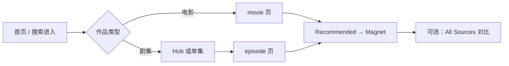
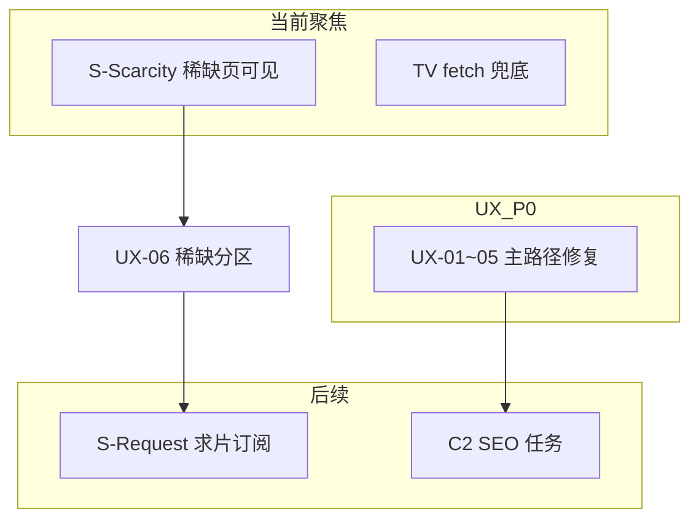

# 页面 UX 分析与优化方向

> **版本：** v1.0  
> **日期：** 2026-07-03  
> **归属：** `worklogs/2026-07-03/`  
> **状态：** 📋 **下次工作方向** — 承接 T3 页面生成与 IG bake，优化主路径「30 秒拿到 magnet」  
> **前置阅读：** [10-稀缺槽与用户求片通知方案.md](../../docs/10-稀缺槽与用户求片通知方案.md)、[页面SEO分析与优化方向.md](./页面SEO分析与优化方向.md)  
> **关联代码：** `portal/generator/templates/`、`portal/static/css/design-system.css`、`portal/static/js/site.js`  
> **当日验收：** [今日验收清单.md](./今日验收清单.md)

---

## 〇、文档目的

2026-07-03 对 ReleaseMatch Portal 全站 **用户体验** 做了审计（首页目录、单集/电影核心页、Hub、测速 IG 模块、移动端、可访问性）。本文档将结论 **固化为可执行任务清单**，作为 UX 改进与 S-Scarcity 产品化的实施依据。

**边界声明：**

- 本文档 **不替代** [IG信息登记册.md](../../docs/IG信息登记册.md) 的 IG 内容策略；只讨论 **信息呈现层级** 与 **任务完成路径**。
- **SEO 技术项**（sitemap、Schema、OG）以 [页面SEO分析与优化方向.md](./页面SEO分析与优化方向.md) 为准；本文仅标注 SEO/UX 交叉点（语言、Hub、空页）。
- **稀缺槽 / 求片** 产品规划以 [10-稀缺槽与用户求片通知方案.md](../../docs/10-稀缺槽与用户求片通知方案.md) 为准。

---

## 一、当前基线（2026-07-03）

| 指标 | 数值 | UX 含义 |
|------|------|---------|
| published 槽位 | **114** | 可生成内容页 |
| 首页目录卡片 | **107** | 按 catalog 聚合入口 |
| active 失败槽（draft） | **17** | **对用户不可见** |
| 核心模板 | episode / movie / home / show_hub | Jinja2 SSG |
| 交互脚本 | `site.js` | 移动导航 + 响应式表格 |

**站点定位（UX 优势）：** Hero 与 footer 明确「Release 导航站 · 非下载托管」，合规预期清晰。

---

## 二、用户画像与核心任务

| 用户类型 | 核心任务 | 成功标准 |
|----------|----------|----------|
| **找 magnet 的普通用户** | 搜到某集/某片 → 点推荐 → 下载 | 30 秒内拿到可信 magnet |
| **选 release 的进阶用户** | 对比 Group / 画质 / 音轨 / 测速 | 看懂差异并做选择 |
| **从首页探索的用户** | 浏览目录 → 进入作品 | 找到目标入口、不迷路 |

---

## 三、核心用户旅程



### 3.1 首页（`home.html`）

**做得好的：**

- Hero 价值主张清晰：「选对 Release，而不只是找到 Magnet」
- 三列能力说明（Recommended / 多源 / 测速）降低首次访问认知门槛
- 107 张卡片 + 海报网格，暗色设计系统视觉统一

**问题：**

| 问题 | 影响 | 严重度 |
|------|------|--------|
| **107 卡片无搜索/筛选/分页** | 找特定作品需滚动 + 肉眼扫 | **P0** |
| **仅按标题字母排序** | 热门/最近更新不可见 | P1 |
| **17 个 draft 稀缺槽不可见** | 用户以为「没有这部片」 | **P0** |
| **无「最近测速 / 新收录」** | 回访用户无增量感 | P2 |

### 3.2 单集页（`episode.html`）— 核心体验

**信息层级（自上而下 · 2026-07-05 已调整）：**

1. 面包屑 → Hero（H1 + 跨源 badge）
2. **Recommended Release**（`recommended_block.html`）
   - Hero 表格（Magnet 首屏可点）
   - 推荐理由 → RM Grab 指数 → 实测背书
   - **展开测速证据**（折叠，无重复 Grab）
3. All Sources 表格（**不含** Hero REC 重复行）
4. 上/下集导航
5. 侧边栏：TMDB / Watch On / 字幕

**做得好的：**

- Hero 表格与 All Sources **列结构一致**，Magnet 无需滚到下方表
- Recommended 信息分层：理由 → Grab → 背书 → 进阶测速折叠
- 表格行 `is-recommended` 仅在 Hero 高亮；移动端 `rm-table--responsive` + JS 注入 `data-label`
- 集间 `prev/next` 导航符合 binge 场景
- sticky header + 面包屑，长页不丢上下文

**问题：**

| 问题 | 影响 | 严重度 |
|------|------|--------|
| **测速面板信息过载** | 折叠区内仍含六项指标 + 可达性 + freshness | **P1**（Grab 重复已去除） |
| **内部代号外露**（S-06、A-02、libtorrent） | 普通用户看不懂，像开发文档 | **P0** |
| **主 CTA 被推到视口下方** | ~~首屏大量测速内容~~ → **已修复**：Magnet 在 Hero 表格 | ~~P0~~ ✅ UX-02 |
| **`复制 Magnet` 按钮无 JS 实现** | Hero 改表格 Magnet 链；复制按钮已移除 | **P1** |
| **H1/title 英文 + 正文中文混排** | 语言信号混乱，阅读节奏断裂 | P1 |
| **All Sources 列名全英文** | 与中文 UI 不一致 | P1 |
| **无 recommended 时** | 整页缺主模块（如 S04E03），体验空洞 | P1 |

### 3.3 电影页（`movie.html`）

与单集页 Hero 结构一致；差异：无集导航、**All Versions 按 edition 分组**（WEB-DL / REMUX / BluRay 等），Sources 表含 **Source · Video · Audio** 列。

**已落地（2026-07-05）：** `release_parser` 回填 spec · `movie_editions` 分组 · 组内「本组最佳」按 seeders（Grab 仍仅 Hero REC）。

**待改进：** 侧边栏 TMDB 复述占比高；per-edition Grab 需多 hash 测速（规划）。

### 3.4 剧集 Hub（`show_hub.html`）

**做得好的：** 季 → 集芯片网格，路径清晰。

**问题：**

| 问题 | 影响 | 严重度 |
|------|------|--------|
| **多数剧无 Hub** | 首页卡片常直链单集，多集剧缺少「选集」入口 | **P0** |
| **芯片仅 S01E01 编号** | 无集标题，辨识度低 | P1 |
| **缺独立 description / robots** | 与 SEO 文档 T-SEO-03 交叉 | P1 |

---

## 四、语言与认知负荷

当前：`base.html` 设 `lang="zh-CN"`，但：

- `<title>` / H1：`Release-Matched Sources`（英文 SEO 型）
- 导航、Hero、footer：中文
- 表格、部分 badge：英文
- 测速模块：中文标题 + 英文/内部代号混合

**待决策（与 SEO 文档 D1 对齐）：**

| 选项 | 做法 |
|------|------|
| **A（SEO 推荐）** | `lang="en"` + UI 英文化一致 |
| **B** | 保持中文 UI，title/H1/表头中文化 |
| **C** | `/en/`、`/zh/` 分路径（远期） |

---

## 五、测速 / IG 模块：差异化 vs 可读性

**当前信息架构（2026-07-05）：**

```
Hero 表格（Magnet）
  ↓
推荐理由
  ↓
RM Grab 指数
  ↓
实测背书
  ↓
展开测速证据（六项指标 · 无重复 Grab）
```

**理想信息架构（已基本对齐）：**

| 层级 | 展示 | 受众 |
|------|------|------|
| **L1 首屏** | Hero 表格 + 理由 + Grab + Magnet | 所有人 |
| **L2 展开** | 实测背书 + 展开测速证据（六项指标） | 进阶用户 |
| **L3 调试** | IG badge、A-01 规则、索引 vs 实测 | `?ig_debug=1` 或 debug 面板 |

---

## 六、移动端体验

| 项 | 评价 |
|----|------|
| 顶栏 hamburger + `rm-nav-mobile` | ✅ 基础可用 |
| 表格卡片化（≤640px） | ✅ |
| 首页海报网格 `minmax(160px, 1fr)` | ✅ |
| 测速 + Recommended 纵向堆叠 | ⚠️ Magnet 可能在 2–3 屏以下 |
| Google Fonts 远程加载 | ⚠️ 弱网 FOIT/FOUT |

---

## 七、可访问性与微交互

**达标：**

- `role="banner"` / `contentinfo`、面包屑 `aria-label`
- magnet 链 `rel="nofollow"`

**缺口：**

| 项 | 说明 |
|----|------|
| **复制 Magnet 无反馈** | 无 toast / `aria-live` |
| **emoji 作图标** | 部分缺 `aria-hidden` |
| **Hub 芯片** | 无含集名的 `aria-label` |

---

## 八、信任与预期管理

**做得好：** 非托管声明、Trust 四页、薄页 `noindex` 门禁。

**风险点：**

| 场景 | 用户感受 |
|------|----------|
| 首页找不到某热门片（17 draft） | 「站不完整」 |
| 无 Recommended 页（S04E03 等） | 「站坏了」— 需空状态文案 |
| SubtitlePortal 跨站链 | 目的不清 |
| 测速 vs Jackett seeders 不一致 | 需一句人话置顶解释 |

---

## 九、UX 综合评分

| 维度 | 评分 | 说明 |
|------|------|------|
| 视觉与设计系统 | **A-** | 暗色、层次、组件一致 |
| 核心任务（拿 magnet） | **B-** | Recommended 好；首屏被测速挤占；复制按钮坏 |
| 信息架构 / 导航 | **C+** | 首页缺检索；Hub 覆盖不足；稀缺槽不可见 |
| 可读性 / 语言 | **C** | 中英混排 + 内部代号 |
| 移动端 | **B** | 表格适配好，长页滚动多 |
| 信任与透明 | **B+** | 合规文案好，空页说明不足 |

**整体：B-** — 设计底子好、IG 已 bake，但 **「30 秒拿到 magnet」** 主路径仍被信息过载和目录能力拖后腿。

---

## 十、任务清单（下次 Sprint）

### 10.1 P0 — 主路径与 Bug（预估 0.5~1 人天）

#### UX-01：实现复制 Magnet

| 字段 | 内容 |
|------|------|
| **文件** | `portal/static/js/site.js` |
| **行为** | 监听 `[data-copy-magnet]` → `navigator.clipboard.writeText` → toast + `aria-live` |
| **验收** | Chrome/Safari 点击「复制 Magnet」有成功提示 |

#### UX-02：Recommended 优先于测速面板

| 字段 | 内容 |
|------|------|
| **状态** | ✅ **2026-07-05** |
| **文件** | `recommended_block.html` · `speed_evidence_panel.html` |
| **做法** | Hero 表格置顶；测速 `<details>` 移至实测背书下方；折叠内去除重复 Grab |
| **验收** | 1280×720 首屏可见 Hero 表格 **Magnet** 链 |

#### UX-03：测速单层展示

| 字段 | 内容 |
|------|------|
| **状态** | ✅ **2026-07-05**（Grab 去重；折叠区保留六项指标） |
| **文件** | `recommended_block.html` · `speed_evidence_panel.html` |
| **做法** | Grab 仅 Hero 卡片一处；折叠 panel 不再含 `grab_index_hero` |
| **验收** | 同页 RM Grab 模块不重复出现 |

#### UX-04：首页客户端搜索

| 字段 | 内容 |
|------|------|
| **文件** | `home.html` + `site.js` |
| **做法** | 搜索框 filter `.rm-show-card` 标题（无需后端） |
| **验收** | 输入「Breaking」即时过滤至 BB 卡片 |

#### UX-05：无 Recommended 空状态

| 字段 | 内容 |
|------|------|
| **文件** | `episode.html`、`movie.html` |
| **文案示例** | 「Indexer 暂不足 2 条 release，本站持续追踪；当前仅展示已匹配源。」 |
| **验收** | S04E03 等页有明确说明区块，非空白 |

### 10.2 P1 — 与稀缺槽 / 架构对齐（预估 1~2 人天）

| ID | 任务 | 关联 |
|----|------|------|
| UX-06 | 首页「稀缺追踪」分区 | S-Scarcity |
| UX-07 | 批量生成 `show_hub`，多集剧统一 Hub 入口 | 生成器 |
| UX-08 | 语言策略拍板并全站一致 | SEO D1 |
| UX-09 | 测速面板隐藏 S-xx / A-xx，改用户向文案 | IG 登记册 |

### 10.3 P2 — Polish（可延后）

| ID | 任务 |
|----|------|
| UX-10 | 首页：最近更新 / 有测速证据排序 |
| UX-11 | All Sources 客户端排序（Seed / Size / tier） |
| UX-12 | 字体本地化，降 LCP |
| UX-13 | Hub 芯片 tooltip 显示集标题 |

---

## 十一、与路线图对齐



**建议执行顺序：**

1. **UX-01~03**（半天）— 立刻改善核心页
2. **S-Scarcity** — 与 UX-06 合并
3. **UX-04 / UX-08** — 与 C2 前语言决策一并做
4. SEO 任务 — 不替代 UX-02/03

---

## 十二、关键文件速查

```
portal/generator/templates/base.html
portal/generator/templates/home.html
portal/generator/templates/episode.html
portal/generator/templates/movie.html
portal/generator/templates/show_hub.html
portal/generator/templates/partials/recommended_block.html
portal/generator/templates/partials/speed_evidence_panel.html
portal/static/css/design-system.css
portal/static/js/site.js
docs/10-稀缺槽与用户求片通知方案.md
worklogs/2026-07-03/页面SEO分析与优化方向.md
```

---

## 十三、变更记录

| 版本 | 日期 | 说明 |
|------|------|------|
| v1.0 | 2026-07-03 | 初版：全站 UX 审计 + UX-01~13 任务清单；归档于 worklogs |
